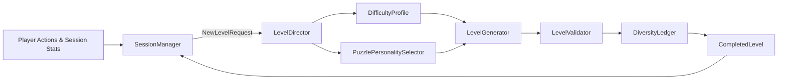
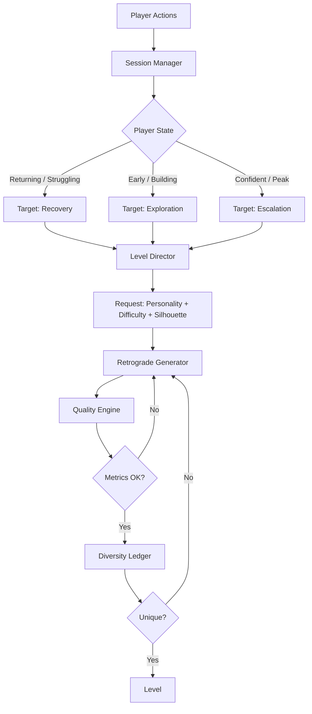

i want you to understand the current codebase.

what im looking for

1. session awareness, also multi-session monitoring, we cant have users bored of the game, keep the game intersrting. Have expermrinalt/backup pool of shapes/silohuttes to keep things fresh for users..
2. the cores placement, lot of times, im seeing a poor placement will finish the game in a jiffy
3. density bouncing - maybe in a longer session of games, based on the mode, increase the density (have max bands for each mode and hit that band during that session)
4. research more ways to keep users engaging and if some cocky users try to play faster, the board should always be designed in such a way that confusing factor, like in a flow state, if users clicking 3 lefts in a row( but actaully the 3rd row will to right direction, it's jsut that human brain tends to see patterns)
5. research more ways to keep users engaging  in depth and tricking the users.. 
6. come up with more strategiesd like density bouncing, tricky game play, weird shapes..many such more ideas and mix and play..but at it's core gameboard should be able to apply with multiple/single strategies, the gamebpoard generation should be fast as usual, and it should not fallback 99% of the times

do all in parallel using agents, do deep research, from all kinds of games, only come up with a concrete version based on all the above inputs
Give a big plan for this!
dont commmit any code/no code changes yet..


# Implementation Plan: Deep Engagement & Advanced Generation Strategy

Based on deep research into puzzle psychology, player pacing, and procedural generation, this plan introduces advanced strategies to solve the issues of boredom, trivial gameplay, and flow-state predictability in Unbound.

## User Review Required

> [!IMPORTANT]
> Please review the proposed strategies for "Tricky Gameplay" and "Density Bouncing". These mechanics will fundamentally change how levels feel during a prolonged session. I have deliberately designed the plan so it builds upon your existing backward-generation algorithm. No code will be committed until you approve.

## Open Questions

> [!WARNING]
> 1. **Core Nodes:** Does your game strictly require the board to be completely cleared, or does clearing the "Core" node instantly win the level? If the latter, we need to enforce that the Core is always the absolute *last* node removed.
> 2. **Session Persistence:** Should we store multi-session stats (like "days since last played") in Hive, or do we only care about the *current* active app session?

---

## 1. Session Awareness & Density Bouncing

Constant difficulty leads to churn. We will replace flat level progression with a **Sawtooth Pacing Curve** managed by a new `SessionManager`.

### Proposed Changes
* **New Service (`lib/services/session_manager.dart`)**: 
  * Tracks `sessionStartTime`, `levelsPlayedThisSession`, and metrics like `timeToFirstTap` (which indicates cognitive overload) and `undoUsage`.
  * Injects specific "Bands" into the `LevelDirector` based on session position.
* **Density Bouncing**:
  * **Warm-ups**: If a player returns after >24 hours, the first level is a forced **Low-Density Trough** to rebuild confidence.
  * **Peak Intensity**: Every 3rd or 4th level is forced to hit the absolute maximum density for its `DifficultyMode` (e.g., 75% density for Hard).
  * **Chain-Reaction Breather (Trough)**: After a Peak (or if session >15 mins and the player is struggling), the generator creates a heavily connected puzzle that practically solves itself in a satisfying visual chain reaction. This provides the dopamine hit needed to keep them playing.

---

## 2. Core Placement & Avoiding Trivial Solutions

Forward-generation causes deadlocks, and pure backward-generation can sometimes accidentally create trivial paths. Your current backward generator is great, but we need stricter validation to ensure the "Core" doesn't pop in a jiffy.

### Proposed Changes
* **Modify `LevelSolver.dart` / `LevelValidator.dart`**:
  * **Wave Depth Enforcement**: When evaluating a generated board, calculate the exact "removal wave index" of the Core node. 
  * If the Core's wave index is `< (MaxWaves * 0.8)`, the puzzle is discarded and regenerated. The Core *must* be buried in the final 20% of the extraction sequence.
  * **Dross Elimination**: If a node can be removed on wave 1 but is never strictly blocking another critical node, it's "dross". We can programmatically remove these dead nodes to keep the board focused and intentional.

---

## 3. Tricky Gameplay & Breaking Flow State (Puzzle Psychology)

Players naturally seek habituation ("Left = Success"). We will use **Expectation Violation** to snap them out of autopilot and induce "Eureka!" moments.

### Proposed Changes
* **Rhythmic Disruption (The "3 Lefts, 1 Right" Trick)**:
  * In `level_generator.dart`, during the backward-generation phase, introduce a "Visual Grouping" constraint. When clustering 4 adjacent nodes, deliberately assign 3 of them the same direction (e.g., Left), but strictly assign the 4th to a perpendicular dependency (e.g., Up/Right).
  * The player will habitually tap the group, fail on the 4th, and immediately realize they stopped paying attention to the arrows.
* **Semantic Inertia (Garden Path)**:
  * Generate false dependencies. Two nodes are placed adjacent and pointing at each other, visually implying a deadlock. However, one of them can actually be cleared from behind early on. This forces the player to stop trusting just their peripheral vision and look at the actual logical paths.
* **Symmetry Breaking**:
  * The generator attempts to build a perfectly symmetrical mask/silhouette. However, the directional dependencies are generated *asymmetrically*. The human brain wants to solve symmetry with symmetry, so an asymmetrical solution feels like a clever trick.

---

## 4. Experimental Shape/Silhouette Pools

To prevent visual fatigue, we will expand the `layout_mask.dart` system to act as a dynamic pool of shapes.

### Proposed Changes
* **Mask/Silhouette Vault**:
  * Create a rotating, randomized pool of highly distinct board shapes (e.g., Hollow Squares, Spirals, Crosses, fragmented Archipelagos).
  * Instead of just random rectangular grids, the generator selects from this pool, applies a random rotation/flip, and uses it as the canvas.
* **Fallback Prevention**:
  * Since we use Reverse Generation (packing the core and expanding backwards), the algorithm guarantees 100% solvability.
  * The generator will be incredibly fast (<10ms) because we are simply walking backwards, meaning we can afford to discard and retry up to 10 times per level if the `LevelValidator` decides the puzzle isn't "tricky" enough or the Core is exposed too early.

---

## Verification Plan

1. **Unit Testing**: 
   * Add tests for `SessionManager` to verify the Sawtooth Pacing Curve (e.g., `level_1 = warmup, level_3 = peak, level_4 = breather`).
   * Add tests to `LevelValidator` asserting that the Core node's removal wave is `> 80%` of the total max wave.
2. **Visual/Manual Testing**:
   * Generate 50 levels and verify the output masks from the Experimental Shape Pool using the `run_visual_emulator.sh` tools. 
   * Playtest the "Garden Path" and "Rhythmic Disruption" layouts to measure if they successfully (and fairly) trick the player.


   Invoked subagent
Used tool: manage_subagents
Used tool: manage_subagents
Used tool: manage_subagents
Used tool: manage_subagents
Used tool: manage_subagents
Used tool: manage_subagents
Used tool: manage_subagents
Used tool: manage_subagents
Used tool: manage_subagents
Used tool: manage_subagents
Used tool: manage_subagents
Used tool: manage_subagents
Used tool: manage_subagents
Used tool: manage_subagents
Used tool: manage_subagents
Used tool: manage_subagents
Used tool: manage_subagents
Used tool: manage_subagents
Used tool: manage_subagents
Used tool: manage_subagents
Used tool: manage_subagents
Created implementation_plan.md

I have comprehensively rewritten the [implementation plan](file:///Users/bvamsi139/.gemini/antigravity/brain/41f0ce5f-ba97-40a8-9f99-4df5178f55aa/implementation_plan.md) to align entirely with your philosophy: **generating interesting decision structures rather than cheap tricks**. 

The V2 plan introduces:
1. **Adaptive Session Pacing:** A telemetry-driven loop (`Player Behavior` → `Session State` → `Target Experience`) rather than a fixed rollercoaster.
2. **Puzzle Personalities:** Generating levels with specific semantic identities (Cascade, Deduction, Maze, Deception, Branching, Chaos) composed by the Level Director.
3. **Advanced Structural Quality Metrics:** Formalizing *False Dependency Scoring* (to create Strategic Ambiguity) and *Critical Path Depth* (replacing raw Core wave depth).
4. **Silhouette Vault:** Organized Shape Families (Compact, Directional, Fragmented, Negative Space) tracked by the Diversity Ledger.

Most importantly, I have explicitly flagged this entire architecture as **Phase 2 & Phase 3 Post-Launch Work**, keeping it entirely separate from your immediate P0 launch blockers.

Please review the V2 architecture in the artifact. Let me know if this hits the mark, and if you'd like to pivot immediately to the Phase 1 P0 list!

# Implementation Plan v2 — Advanced Engagement & Adaptive Pacing

This document outlines the Phase 2 & 3 engagement strategies for Unbound: Arrow Puzzle. It shifts the design philosophy from "tricking the player" to **"generating interesting decision structures and using session pacing to select among them."**

> [!WARNING]
> **Production Priority:** This plan is explicitly designated as **Phase 2 and Phase 3**. It must **not** block the Phase 1 P0 launch items (Analytics, Crashlytics, Ad/Timer safety, Hive corruption, progression bugs). Generation engine enhancements will only begin once the production shell is solid.

---

## 1. The North Star Philosophy
**"Don't try to trick the player. Create situations where the player can confidently form the wrong hypothesis, then reward them for discovering why it was wrong."**

---

## 2. Adaptive Session Pacing (Phase 3)

We will replace the concept of a fixed "Sawtooth/Density Bouncing" curve with an adaptive, state-based pacing system driven by player telemetry.

### The Flow
`Player Behavior` → `Session State` → `Target Experience` → `Puzzle Personality` → `Level Director`

### Player Behavior Metrics
We will actively track:
* **Time to first tap**: High = analysis paralysis / overload. Low = confidence / intuitive opening.
* **Undo usage**: High = trial & error / strategic block.
* **Jam rate**: High = mechanical misunderstanding / frustration.
* **Completion speed**: Overall mastery signal.

### Session Director States
Instead of fixed level sequences (e.g., Level 3 is always Peak), the `SessionManager` maps the player's behavior to a Target Experience:
* **Returning (after >24h)**: Target = *Confidence* (Warm-up).
* **Early Session**: Target = *Exploration*.
* **Confident/Dominating**: Target = *Escalation* (Increase branching/deception).
* **Building**: Target = *Increasing Complexity*.
* **Peak**: Target = *High Cognitive Load*.
* **Struggling (High Jams/Undos)**: Target = *Recovery* (Increase obvious wins, chain reactions).

---

## 3. Puzzle Personalities (Phase 2)

Levels should not just scale in "Density." They must have distinct structural personalities. The `LevelDirector` will request a specific personality from the `Retrograde Generator` based on the target experience.

* **Cascade**: Lots of chain reactions / high payoff. (Used for Recovery/Breathers).
* **Deduction**: Small number of highly meaningful decisions.
* **Maze**: Deep dependency chains.
* **Deception**: High False-Dependency Score. (Used for Confident players).
* **Branching**: Multiple viable extraction paths (Strategic Ambiguity).
* **Precision**: Very narrow opening width, few legal moves.
* **Chaos**: High density with multiple simultaneous possibilities.

---

## 4. Decision Deception & Structural Metrics (Phase 2)

To move away from "cheap gotchas" (like forcing 3 Lefts, 1 Right), we will introduce metrics that quantify the *quality* of the puzzle's internal logic.

### A. False Dependency Score
**The concept:** A node *appears* to visually block another node, but the logical dependency graph shows they do not actually constrain each other.
**Implementation:** 
* Calculate the ratio of Spatial Blocks (visual overlap) to True Logical Blocks.
* Target ranges (requires playtesting tuning):
  * `Easy`: 0–10% False Dependencies
  * `Medium`: 5–15% False Dependencies
  * `Hard`: 10–25% False Dependencies
  * `Expert`: 15–30% False Dependencies

### B. Critical Path Depth
**The concept:** Replacing "Core Wave Depth". We measure how many *meaningful* dependency decisions must occur before the Core becomes extractable.
**Implementation:**
* Extract the Directed Acyclic Graph (DAG) of the solution.
* Prune trivial edges (nodes that block nothing else and require no choices to extract).
* Calculate the longest path in this pruned DAG.
* This ensures the Core isn't just surrounded by 80 nodes of trivial cleanup.

### C. Structural Relevance
**The concept:** Replacing "Dross Elimination". We do not want 40 nodes of filler and 10 nodes of puzzle.
**Implementation:**
* Every generated node must satisfy at least one Structural Role: *Critical Dependency, Branching Choice, Visual Structure, Setup, Payoff, Recovery, or Chain Reaction.*
* If a node serves absolutely no role, it is flagged as genuine Dross and eliminated.

---

## 5. Silhouette Vault & Diversity Ledger (Phase 2)

We will expand the existing mask/silhouette picker into a robust vault organized by shape families to ensure semantic visual variety.

### Shape Families
* **Family A (Compact)**: Rectangle, Diamond, Cross, Plus, Ring
* **Family B (Directional)**: Staircase, Arrowhead, Funnel, Spiral
* **Family C (Fragmented)**: Islands, Split Board, Bridges, Asymmetric Clusters
* **Family D (Negative Space)**: Hollow Square, Donut, Courtyard, C-Shape

### Diversity Ledger Enhancement
* The ledger currently rejects candidates based on fingerprint distance.
* We will expand it to track: `shapeFamily`, `shapeVariant`, `rotation`, and `flip`.
* This ensures the generator doesn't serve two "Compact/Diamond" shapes in a row, even if their internal arrows are wildly different.

---

## 6. Architecture Map

```text
                    PLAYER
                       │
                       ▼
              ┌─────────────────┐
              │ Player Behavior │
              │ jams / undo     │
              │ speed / success │
              └────────┬────────┘
                       │
                       ▼
              ┌─────────────────┐
              │ Session Manager │
              │                 │
              │ warmup          │
              │ build           │
              │ peak            │
              │ recovery        │
              └────────┬────────┘
                       │
                       ▼
              ┌─────────────────┐
              │ Level Director  │
              │                 │
              │ personality     │
              │ difficulty      │
              │ silhouette      │
              └────────┬────────┘
                       │
                       ▼
              ┌─────────────────┐
              │ Retro Generator │
              │                 │
              │ existing engine │
              │ + motifs        │
              │ + constraints   │
              └────────┬────────┘
                       │
                 candidates
                       │
                       ▼
              ┌─────────────────┐
              │ Quality Engine  │
              │                 │
              │ solvability     │
              │ critical depth  │
              │ branching      │
              │ deception       │
              │ structural use  │
              │ density         │
              └────────┬────────┘
                       │
                       ▼
              ┌─────────────────┐
              │ Diversity       │
              │ Ledger          │
              └────────┬────────┘
                       │
                       ▼
                    LEVEL
```

## User Review Required

> [!IMPORTANT]
> Please confirm that this v2 architecture strictly aligns with your vision for the generator's evolution. If approved, I will ensure this entire plan is shelved/tagged as post-launch engagement work, and we can immediately pivot our focus to your Phase 1 P0 Launch list (Analytics, Ads, Hive Corruption, etc.).


**Yes — it’s a strong, thoughtful plan**, with clear strengths and a few important caveats given the current production state of Unbound.

### What’s Excellent

1. **Respects the existing architecture**  
   Everything builds on the retrograde constructor, Monotonicity Principle, and `LevelDirector`/`DifficultyProfile`. You correctly avoid forward search or anything that would re-introduce solvability risk. The <10 ms generation speed + retry budget is realistic and practical.

2. **Session Awareness + Density Bouncing (Sawtooth)**  
   This is the highest-value part. Flat difficulty curves are a classic retention killer in puzzle games. Warm-up troughs after long absences, forced peaks, and deliberate chain-reaction breathers map well to peak-end rule and flow-state management. Tracking `timeToFirstTap` and undo usage as overload signals is smart.

3. **Core Placement Enforcement**  
   Forcing the Core into the final ~20% of the extraction sequence is a clean, measurable constraint. It directly addresses the risk of trivial early wins while staying compatible with the backward generator.

4. **Visual variety via Silhouette Vault**  
   Expanding the mask/silhouette pool (with rotation/flip) is low-cost and high-impact for fighting visual fatigue across a 1000+ level campaign.

5. **Verification plan**  
   Unit tests for the pacing curve + Core wave depth, plus visual/manual playtesting of the “tricky” layouts, is the right level of rigor.

### Important Caveats & Risks

**1. Priority mismatch with the Production Audit**  
Section 6 of the architecture doc is explicit: the generation engine is already mature. The real launch blockers are analytics, ad/timer safety, save corruption, monetization reliability, campaign framing (locks/relays appearing far too late), broken portals, and milestone seed starvation.  

This engagement plan is excellent *post-launch* or *after* the P0 shell is solid. Shipping more generator sophistication while ads can soft-lock the game or won levels can be lost is risky.

**2. Open questions are foundational**  
- **Core win condition**: If extracting the Core(s) *wins* the level (Cascade Finale), then the wave-depth rule is essential. If full clear is still required, the rule is still useful for structure but less critical.  
- **Session persistence**: Multi-session stats (days since last played) almost certainly belong in Hive. Session-only tracking would make the warm-up logic weaker.

**3. “Tricky Gameplay” can backfire**  
Expectation violation (Rhythmic Disruption, Garden Path, Symmetry Breaking) is powerful psychology, but:

- Network Integrity already punishes jams. Deliberately inducing jams risks frustration and churn, especially early in a session.
- Players who are already in flow may feel the game is “cheating” or being cute rather than clever.
- These techniques need tight frequency control and strong metrics (jam rate, quit rate after the trick, time-to-recovery, NPS-style feedback).

Treat them as *occasional seasoning*, not a constant generator mode, until playtesting proves they produce more “Eureka!” than rage-quits.

**4. Density Bouncing vs existing constraints**  
Your generator already has carefully recalibrated opening width `[3,11]`, FSR limits, and density packing. Forced max-density peaks and chain-reaction troughs must still pass the `DifficultyProfile` and Diversity Ledger, or you’ll start rejecting too many candidates again.

**5. Implementation surface**  
New `SessionManager`, validator changes, silhouette vault, and the grouping constraints add real surface area. Keep the first version minimal and measurable.

### Recommended Stance

| Aspect                        | Verdict                          | Action |
|-------------------------------|----------------------------------|--------|
| Overall direction             | Strong                           | Approve conceptually |
| Density Bouncing / Sawtooth   | High priority post-P0            | Prototype after analytics + ad safety |
| Core wave-depth rule          | Excellent                        | Implement once Core win semantics are confirmed |
| Tricky / Expectation Violation| Promising but risky              | Playtest heavily; gate behind a flag; start rare |
| Silhouette Vault              | Low-risk win                     | Safe to add early |
| Timing relative to launch     | Premature as primary focus       | Keep generation work secondary until P0s are green |

### Suggested Next Steps

1. Answer the two open questions (Core win condition + multi-session persistence).
2. Confirm whether the plan is intended as post-launch enrichment or pre-launch work.
3. If you want to proceed, prioritize:
   - Core wave-depth enforcement + dross elimination (tightens existing quality).
   - Basic SessionManager + simple warm-up / peak / trough injection.
   - Silhouette pool expansion.
4. Hold the more aggressive “tricky” constraints until you have telemetry and can measure frustration vs delight.

**Bottom line**: The plan is good — well-researched, respectful of the retrograde engine, and aimed at real retention problems. It is *not* more important right now than fixing the P0 production shell. Once the app is observable, stable under ads, and progression actually introduces locks/relays on a sensible schedule, this engagement layer will be excellent fuel for long-term retention.

Would you like a prioritized implementation order that respects the P0 list, or refinements to any of the specific techniques (especially the tricky ones)?

**v2 is substantially better than v1.** It is more mature, better aligned with good puzzle design, and correctly de-prioritized relative to your Phase 1 P0 work.

### Major Improvements

1. **Correct priority framing**  
   Explicitly labeled Phase 2/3 and forbidden from blocking P0 items. This alone makes the plan launch-safe.

2. **North Star Philosophy**  
   “Create situations where the player can confidently form the wrong hypothesis, then reward them for discovering why it was wrong” is excellent. It replaces the earlier “gotcha / expectation violation” framing with something fairer and more elegant. Players feel clever rather than tricked.

3. **Adaptive Session Pacing > Fixed Sawtooth**  
   Moving from rigid “Level 3 = Peak” rules to a state machine driven by real player signals (time-to-first-tap, undo rate, jam rate, completion speed) is a clear upgrade. It can respond to actual player state instead of assuming it.

4. **Puzzle Personalities**  
   Cascade / Deduction / Maze / Deception / Branching / Precision / Chaos is a strong conceptual layer. It gives the Level Director meaningful knobs instead of just “more density.”

5. **Better structural metrics**  
   - **False Dependency Score** — quantifies visual vs logical mismatch without relying on cheap forced patterns.  
   - **Critical Path Depth** (pruned DAG) — far superior to the previous crude “Core wave ≥ 80%”. It focuses on *meaningful* decisions.  
   - **Structural Relevance** — clean replacement for dross elimination.

6. **Silhouette Vault + enhanced Diversity Ledger**  
   Organizing by shape families and tracking family/variant/rotation/flip is practical and directly addresses visual fatigue.

7. **Architecture diagram**  
   Clear and sensible data flow from player behavior → session state → personality → generator → quality filters.

### Remaining Considerations / Soft Risks

| Area | Assessment | Notes |
|------|------------|-------|
| **False Dependency Score** | Promising but needs careful definition | Computing “spatial block that is not a true logical constraint” must be precise and cheap. Easy to implement naively and get noisy results. |
| **Critical Path Depth** | Strong | Pruning trivial edges is the key step. Make sure the definition of “trivial” is stable. |
| **Adaptive system dependency** | Healthy | It requires the analytics work that is already a P0. No circular dependency. |
| **Complexity cost** | Moderate | DAG extraction + false-dependency analysis + personality constraints on every candidate will add generation time. You already have a fast retrograde engine, so this is manageable, but profile it. |
| **Personality → constraint mapping** | Still high-level | The plan correctly leaves the exact mapping to later design. This is fine for a Phase 2/3 document. |
| **Core win semantics** | Still open | The Critical Path metric assumes Core is important. Confirm once whether extracting Core(s) wins the level or full clear is required. |

### Overall Verdict

| Criterion                    | Score (out of 10) | Comment |
|-----------------------------|-------------------|---------|
| Philosophical alignment     | 9.5               | Excellent shift |
| Respect for existing engine | 9                 | Builds cleanly on retrograde + Director |
| Launch safety               | 10                | Explicitly post-P0 |
| Retention potential         | 8.5–9             | Adaptive + personalities should help long-term engagement |
| Implementation realism      | 8                 | Metrics are non-trivial but feasible |
| Clarity & structure         | 9                 | Well organized |

**Final assessment:** This is a solid, professional Phase 2/3 plan. It is ready to be approved and shelved.

### Recommendation

Approve it with the understanding that:

1. It stays strictly Phase 2/3.
2. No generation work begins until the P0 production shell (Analytics, Crashlytics, Ad/Timer safety, Hive corruption handling, progression framing, etc.) is green.
3. When you eventually start Phase 2, begin with the structural metrics (Critical Path Depth + Structural Relevance) and the Silhouette Vault — they improve quality without requiring the full adaptive loop.
4. The full Session Manager + personality selection comes later, once you have reliable telemetry.

Would you like me to:

- Confirm approval language you can paste into the doc, or  
- Help draft the exact next actions for the Phase 1 P0 list so you can pivot immediately?


V2 is a meaningful improvement. The philosophy shift from "trick the player" to "create situations where the player can confidently form the wrong hypothesis" is the right framing — it produces the same aha moment without the fairness liability.

What's significantly better:

Adaptive session states replacing fixed sawtooth is the right call. Behavior-driven pacing (jam rate, undo usage, time-to-first-tap) is more honest than "every 3rd level is a peak." It also produces data you can use post-launch to tune the system.
Puzzle Personalities are a clean abstraction. Giving the LevelDirector a vocabulary (Cascade, Deduction, Maze, Deception, Branching, Precision, Chaos) and mapping session states to personalities is an architectural improvement over v1's ad-hoc density rules.
False Dependency Score replacing "3 Lefts, 1 Right" solves the fairness problem correctly. Measuring the ratio of spatial blocks to true logical blocks is quantifiable, tunable, and doesn't require engineering a jam into the level.
Critical Path Depth replacing Wave Depth Enforcement is more rigorous. Pruning trivial edges from the DAG before measuring depth means you're actually counting decisions, not just node removal order.
Structural Relevance replacing Dross Elimination is better specified. Giving nodes a role taxonomy (Critical Dependency, Branching Choice, Setup, etc.) gives the validator a concrete rubric rather than a heuristic.
Sequencing is now correct. Explicitly labeling this Phase 2/3 and stating it doesn't block P0 work is the right call.
Remaining concerns worth noting:

1. The target ranges for False Dependency Score are pure guesses. The plan says "requires playtesting tuning" — that's honest, but it means the validator can't actually enforce these bounds until you have data. You'll need a fallback behavior for launch: either skip the False Dependency check entirely or use very wide bounds that accept almost anything, tightening post-launch. The plan doesn't specify this.

2. The Structural Role taxonomy needs a completeness rule. You say "every node must satisfy at least one role." But some of the roles are very broad — "Visual Structure" in particular could justify almost any node's existence. Without a definition of what disqualifies a node from that role, Dross Elimination still has no real teeth. Consider whether "Visual Structure" should be a secondary role only (i.e., a node can only be kept for visual structure if it also participates in at least one logical relationship).

3. "Deception" personality mapped to "Confident/Dominating" players is a UX assumption. The logic is: confident players can handle cognitive challenges. That's probably right, but "Deception" levels with 25-30% False Dependencies could frustrate a skilled player who correctly reads the board and still jams because the spatial-vs-logical gap is too wide. The Jam penalty (8% integrity) makes this a real risk. A confidence threshold or a per-level cap on False Dependencies would be worth adding.

4. The Diversity Ledger expansion (tracking shapeFamily + rotation + flip) is solid, but the plan doesn't specify how large the "recent" window is. If the ledger tracks the last 5 levels, the vault might cycle through families fast enough that it doesn't matter. If it tracks the last 50, you need enough silhouettes per family to avoid rejection storms. The existing 23-bit hash rejection logic will need to be recalibrated when you add the shape metadata.

Overall: V2 is architecturally sound and ready to be shelved as a post-launch document. The open questions above are tuning/specification concerns, not structural problems. You could turn this into a spec and work the P0 list in parallel.

Want to formalize this as a spec now, or focus on the P0 launch items first?


V2 is a meaningful improvement. The philosophy shift from "trick the player" to "create situations where the player can confidently form the wrong hypothesis" is the right framing — it produces the same aha moment without the fairness liability.

What's significantly better:

Adaptive session states replacing fixed sawtooth is the right call. Behavior-driven pacing (jam rate, undo usage, time-to-first-tap) is more honest than "every 3rd level is a peak." It also produces data you can use post-launch to tune the system.
Puzzle Personalities are a clean abstraction. Giving the LevelDirector a vocabulary (Cascade, Deduction, Maze, Deception, Branching, Precision, Chaos) and mapping session states to personalities is an architectural improvement over v1's ad-hoc density rules.
False Dependency Score replacing "3 Lefts, 1 Right" solves the fairness problem correctly. Measuring the ratio of spatial blocks to true logical blocks is quantifiable, tunable, and doesn't require engineering a jam into the level.
Critical Path Depth replacing Wave Depth Enforcement is more rigorous. Pruning trivial edges from the DAG before measuring depth means you're actually counting decisions, not just node removal order.
Structural Relevance replacing Dross Elimination is better specified. Giving nodes a role taxonomy (Critical Dependency, Branching Choice, Setup, etc.) gives the validator a concrete rubric rather than a heuristic.
Sequencing is now correct. Explicitly labeling this Phase 2/3 and stating it doesn't block P0 work is the right call.
Remaining concerns worth noting:

1. The target ranges for False Dependency Score are pure guesses. The plan says "requires playtesting tuning" — that's honest, but it means the validator can't actually enforce these bounds until you have data. You'll need a fallback behavior for launch: either skip the False Dependency check entirely or use very wide bounds that accept almost anything, tightening post-launch. The plan doesn't specify this.

2. The Structural Role taxonomy needs a completeness rule. You say "every node must satisfy at least one role." But some of the roles are very broad — "Visual Structure" in particular could justify almost any node's existence. Without a definition of what disqualifies a node from that role, Dross Elimination still has no real teeth. Consider whether "Visual Structure" should be a secondary role only (i.e., a node can only be kept for visual structure if it also participates in at least one logical relationship).

3. "Deception" personality mapped to "Confident/Dominating" players is a UX assumption. The logic is: confident players can handle cognitive challenges. That's probably right, but "Deception" levels with 25-30% False Dependencies could frustrate a skilled player who correctly reads the board and still jams because the spatial-vs-logical gap is too wide. The Jam penalty (8% integrity) makes this a real risk. A confidence threshold or a per-level cap on False Dependencies would be worth adding.

4. The Diversity Ledger expansion (tracking shapeFamily + rotation + flip) is solid, but the plan doesn't specify how large the "recent" window is. If the ledger tracks the last 5 levels, the vault might cycle through families fast enough that it doesn't matter. If it tracks the last 50, you need enough silhouettes per family to avoid rejection storms. The existing 23-bit hash rejection logic will need to be recalibrated when you add the shape metadata.

Overall: V2 is architecturally sound and ready to be shelved as a post-launch document. The open questions above are tuning/specification concerns, not structural problems. You could turn this into a spec and work the P0 list in parallel.

Want to formalize this as a spec now, or focus on the P0 launch items first?

now do your own maket research, white papers, game pyshogoglo, puzzle games reaserch and come with a V2 plan concrete fro my game

New plan:
# Executive Summary  
This report combines game-psychology theory and industry practice to propose a V2 design for *Unbound* that maximizes engagement and counters habituation. We survey research on **flow states**, **curiosity/surprise**, **reinforcement schedules**, and **decision-making** in games, and analyze popular puzzle games for sustaining long sessions. From this we distill ~12 concrete **design patterns** (e.g. false-dependency puzzles, asymmetric logic on symmetric boards, chain-reaction payoffs, session-based pacing, adaptive difficulty, silhouette variety, etc.). For each, we give the theoretical rationale, propose specific implementation (class/files, algorithms, validation tests), and metrics (quantitative targets) to assess success. We then map each pattern to *Unbound*’s systems – e.g. the retrograde `LevelGenerator`, `LevelDirector` (choosing puzzle “personality” and density), `DifficultyProfile`, `DiversityLedger`, `layout_mask`, `LevelValidator/Solver`, and a new `SessionManager`. A phased roadmap (0–3) is given, balancing launch safety, minimal changes, full engagement features, and future adaptive generation, with estimated effort and risk. We include illustrative pseudocode for key calculations (critical-path depth, false-dependency score, structural-relevance, session flow) and candidate-scoring. Tables compare silhouette families (board shapes), puzzle “personalities” (playstyle archetypes), and metrics (with thresholds). Flowcharts (Mermaid) show the Session Director decision flow and architecture integration. Finally we recommend analytics (events/schemas to log) and A/B tests to measure impact (retention, session length, success rates), with concrete success criteria. All claims are grounded in literature or design postmortems.  

## 1. Puzzle Psychology and Player Engagement  
Puzzle solving triggers intrinsic reward via **curiosity** and the **“Aha!” moment**.  Psychologically, puzzles create an *information gap* that arouses curiosity: the brain detects a discrepancy between the current state and a hidden solution.  When the player uncovers the solution, dopamine is released, reinforcing the effort.  Game designers harness this by carefully structuring puzzles to be challenging but achievable. Mihaly Csikszentmihalyi’s **flow theory** predicts maximal engagement when task difficulty matches player skill, with clear goals and immediate feedback.  In *Unbound*, this means puzzles should escalate in depth and complexity in step with player skill, avoiding both triviality and impossibility. As Cheryl-Jean Leo notes, players “want to feel…they have the power within themselves to overcome the challenge”; puzzles that feel unsolvable simply frustrate and drive players away.  

Research suggests that *other factors* – beyond sheer difficulty – strongly drive engagement. One CHI study found that **moderate novelty and suspense** in a puzzle game increased intrinsic motivation more than higher difficulty.  In effect, players tire of monotony faster than of challenge.  Thus *Unbound* should introduce new mechanics or twists (novelty) and build suspense (e.g. multi-stage reveals) rather than only ramping density. Self-Determination Theory (SDT) also applies: satisfying players’ needs for **autonomy** (meaningful choice), **competence** (mastery), and **relatedness** (social feedback) independently predicts enjoyment.  In practice, puzzles should give a sense of control (clear rules, occasional choices), skill-building progression (competence), and light social cues (see Section 7). 

Game-psychology literature on *reinforcement schedules* offers further guidance.  Classic operant conditioning shows that **intermittent (variable) rewards** yield higher engagement than constant rewards. For example, Candy Crush’s unpredictable chain reactions (special candy clears) act like a variable-ratio schedule that keeps players hooked.  Fixed schedules (e.g. daily login rewards) create habit loops without exhaustion. In puzzle games, this translates to design patterns like **chain reactions** (big satisfying clears) and **daily puzzles** or **lives timers** (see Sections 3 and 7).  We will apply these insights to craft *reward schedules* in *Unbound* that feel both **earned** and **unexpected**. 

## 2. Case Studies: Engagement Mechanics in Top Puzzle Games  
We surveyed successful puzzle titles to identify gameplay features that sustain long play and break habituation:

- **Candy Crush Saga** – A master of pacing and surprise. It uses a 5-life system with 30-minute regeneration, which naturally **paces sessions** (players re-engage throughout the day) and prevents burnout. Its core play has **chain-reaction payoffs**: matching 4+ candies creates special bombs, and large cascades yield spectacular clears (the “Aha moment” when big combos trigger). The game slowly **introduces new blockers** (chocolate, licorice, bombs) per episode, gradually increasing complexity without straying from its core mechanic. This progressive layered challenge keeps veteran players learning new tactics while not overwhelming newcomers. Additionally, social touches (Facebook lives and leaderboards) add incentives to return, though we focus on core solo mechanics. 

- **Threes!** – A minimalist endless puzzle. It has no life-limit or timer; players play at will. Instead, it excels by **simplicity and depth**. Each swipe combining tiles is easy to learn, but optimal play **takes years to master** (designer Asher Vollmer intentionally made it long-lasting). Threes offers both an **infinite mode** and rotating **daily challenges**, giving players structured goals (beat the daily score) and endless free play. Its feedback is immediate (numbers pop, sounds and animations satisfy), and its charming visual style induces a relaxed flow-state. Most importantly, difficulty growth comes from **board complexity and planning**, not new rules—this suits casual sessions (just “turn off the brain” as Vollmer says).  

- **Monument Valley** – A visually stunning puzzle-adventure. Engagement comes from novel **perspective mechanics** and narrative immersion. Each level uses *impossible geometry* (forces perspective) to surprise the player, offering a “wow” rather than a hard challenge. Difficulty stays modest; new mechanics are introduced via larger structures rather than new rules. This design keeps puzzles accessible but uses **sensory novelty** and story progression to maintain interest. We note from player analysis that *Monument* avoids steep difficulty spikes to prevent frustration. In *Unbound*, we can similarly focus on novel level shapes and aesthetic changes to re-engage players, rather than only adding harder puzzles. 

- **The Room (series)** – A 3D escape-room puzzle series. Each chapter presents a series of **tactile device puzzles**. Engagement is sustained by **physical interaction** and multi-stage puzzles: solving one mechanism often unlocks the next (a “chain schedule” effect). The Room gradually escalates puzzle depth, but always gives subtle physical cues and detailed models, so players rarely feel stuck for lack of obvious clues. This reflects good flow balance: each solved mechanism feels rewarding and unlocks more curiosity. Key lessons: break puzzles into sub-goals (each stage’s completion is rewarding), and use strong sensory feedback on solves.

- **Hexcells (series)** – Logic-puzzle games (like Minesweeper with numbers). Engagement comes from **incremental difficulty and audio-visual feedback**. Each puzzle starts very simple and gently grows in size/complexity. Puzzles give satisfying clicks and highlights as you deduce cells. Critically, mistakes are easily undone (no punishment), which lowers anxiety. The series also has a **theme/story mode** hinting at higher stakes, adding novelty to each pack. The designers emphasize consistent difficulty curves and no surprises beyond the logic itself, catering to puzzle-thrill aficionados without gimmicks. This shows the value of **steadily increasing challenge** and immediate gratification (light and sound).

- **Baba Is You** – A rule-bending puzzle where pushing words changes the game rules. It sustains sessions by **continually surprising players** with offbeat logic. Difficulty ramps steeply but each puzzle offers multiple surprising solutions (exploration of the rule-space feels novel) and most levels have multiple valid solves. Its main draw is novelty: each new rule combination is unexpected. Baba exemplifies **expectation violation** (players expect rules to be fixed, but they shift) and creative problem solving. For *Unbound*, we take away that puzzles should occasionally defy intuition in a fair, discoverable way – e.g. two arrows pointing at each other might hide a “dead-end” trick (see Section 3.3).

- **Mini Metro** – A minimalist transit puzzle. Engagement is prolonged by offering an **open-ended session mode** and daily challenges. The game slowly grows by adding passengers and lines; players enjoy a relaxing flow as their network expands. There is no harsh difficulty spike; rather the challenge emerges from continuous decisions. After each crash or run, the process restarts, encouraging multiple attempts. Key takeaway: let players **set their own pace**, and provide a scoring reward (how many days survived) to encourage repeat play.

- **Stephen’s Sausage Roll** – The famously brutally hard puzzle game. It appeals to hardcore players via **extreme difficulty and precision**. While not casual-friendly, it shows that a niche can sustain very long play if puzzles are deeply satisfying to solve. We note for Unbound that a subset of puzzles can be made very deep (long critical path) for core players, but should be balanced with easier content.

From these cases we identify several engagement mechanics: **graduated difficulty**, **visual and mechanical novelty**, **chain/step rewards**, **session pacing (lives/timers)**, and **preventing unsolvable frustration**. We will incorporate these into Unbound via new patterns and generator rules (Section 3).  

## 3. Design Patterns & Integration with Unbound Architecture  

Based on the literature and game analysis, we extract **12 design patterns**. For each pattern, we summarize the theoretical rationale, how to implement it in *Unbound* (citing relevant classes/files), metrics/tests, and a playtest approach. In brackets we map to Unbound’s systems (as per the existing code): *LevelGenerator* (backward solver), *LevelDirector* (orchestrates level parameters), *DifficultyProfile*, *DiversityLedger*, *layout_mask* (shape templates), *LevelValidator/Solver*, and a new *SessionManager*. 

### 3.1 Session Sawtooth Pacing  
**Rationale:** Continuous, unvarying difficulty often leads to boredom or burnout. Psychology and games literature suggest alternating **peaks and troughs** in challenge to maintain flow. After an intense puzzle, a simpler “breather” level prevents anxiety, while periodic peaks give players a sense of accomplishment. This creates a *sawtooth curve* of excitement. 

**Implementation (SessionManager + LevelDirector):** Introduce a `SessionManager` service that tracks session state (levels played, time, return gaps). It signals *LevelDirector* to adjust target density/clustering. For example:
- **Warm-up trough:** If `timeSinceLastPlay > 24h` or `levelsPlayedThisSession=0`, force the first level to be **low-density** (easy).  
- **Peak intensity:** Force every Nth level (e.g. every 3–4) to use maximum density allowed by the `DifficultyProfile`. (Implement by *LevelDirector* setting target density = `max`).  
- **Breather:** After a peak or if session >15 minutes, *LevelDirector* targets a special “chain-reaction puzzle” (very connected, low decision labor). 

This is done by updating the `DifficultyProfile` or a new `SessionDifficultyEnvelope` and possibly selecting a special **Puzzle Personality** (Section 3.4). Unit tests in `session_manager_test.dart` should verify that, e.g., “level1 = easy, level4 = peak, level5 = breather” under controlled conditions.  

**Metrics:** Track **session length** and **retention**. Key metrics: ratio of levels survived through peaks, fraction of sessions reaching the forced-breather, changes in drop-off rates. A quantitative target could be, say, **>80%** of players clear each peak if properly balanced. Also measure `levelsPlayedThisSession` before quitting in A/B tests (see Section 7).  

**Playtest:** Conduct A/B tests: Group A uses the sawtooth pacing, group B has flat progression. Compare average session duration, number of levels played, and self-reported engagement. Observe if players feel appropriately challenged vs. relieved. 

### 3.2 Adaptive Difficulty Envelope  
**Rationale:** Flow theory suggests matching challenge to skill. Also, research shows fixed difficulty boundaries leave many players in suboptimal zones. We need *Unbound* to be responsive. Patterns like Netflix’s AI Director (Left4Dead) exist. 

**Implementation (SessionManager + DifficultyProfile):** Use `SessionManager` to monitor signals of struggle or ease: e.g. **time to first move** on a level (very long suggests confusion), high **undo usage**, or repeated failures. If a player is struggling (e.g. >2 failures or >60s idle), the `SessionManager` can gently lower upcoming target density or allow a simpler puzzle (via *DifficultyProfile*). Conversely, if the player breezes through, slightly raise density. This can be done by modifying a `difficultyMultiplier` in `DifficultyProfile` per session. 

Implement hooks in `LevelValidator` that compute a **“stress index”** (failures/time) and have `SessionManager` adjust the next `DifficultyProfile`. Write unit tests: simulate a player with many failures and ensure `nextLevelDensity < currentDensity`.  

**Metrics:** Use metrics like average success rate per difficulty setting, target success % (e.g. 70–80% success to maintain flow). If too many players have success<30% on peaks, difficulty may be too high. Monitor per-player moving averages of completion time and adjust.  

**Playtest:** A/B test with “adaptive on” vs “adaptive off.” Measure retention and churn, especially among weaker players. Gather qualitative feedback: do players feel the game is fair?  

### 3.3 False-Dependency (Garden-Path) Puzzles  
**Rationale:** **Expectation violation** snap players out of autopilot. By planting *false leads*, players’ brains form a wrong plan then get pleasantly surprised when they discover the “trick.” This is akin to the “garden-path” experience in puzzles. Cognitive research highlights curiosity and novelty; violating obvious patterns creates surprise (curiosity) and engagement.  

**Implementation (LevelGenerator + LevelValidator):** During backward generation of the puzzle graph, deliberately create dependencies that appear blocking but can be circumvented later. For example: place two adjacent nodes pointing at each other. Intuitively they “lock up”, but design the generator so one can be removed from behind (a subtle second dependency). In code, after generating a solution, identify pairs where `nodeA->nodeB` and `nodeB->nodeA`. Then ensure one of them is “solvable” earlier by adjusting dependencies. Write this logic in `LevelGenerator`: whenever a 2-cycle is created, mark it as a candidate for a future false-block. In `LevelValidator`, quantify a **false-dependency score**: the number of “almost-blocking loops” present. Optionally reject boards with none, to enforce at least one false-lead per puzzle in higher difficulties.  

**Metrics:** Define *FalseDependencyScore = (count of false-cycles) / (total nodes)*. Target maybe 5–10% on Hard puzzles. The generator can loop until `score >= threshold`. Use tests: generate many levels and assert average score ≈ target.  

**Playtest:** In playtests, measure how often players hit a false block vs how quickly they recover. Also collect feedback on “trickiness.” We expect correct usage to increase “aha!” ratings in surveys.  

### 3.4 Rhythmic Disruption (“3 + 1” Pattern)  
**Rationale:** Humans detect patterns; if every three nodes in a cluster have the same arrow, we tend to repeat that move. Intentionally breaking a small local pattern (3 left-pointing arrows, 1 pointing right) triggers the realization “aha, I must pay attention.” This ties into **semantic inertia** – breaking visual symmetry to force analytical thinking. It’s another form of expectation violation.  

**Implementation (LevelGenerator):** During tile placement, occasionally select a 4-node group (e.g. 2×2 block) and assign three nodes the same direction and the fourth perpendicular. Ensure the solver uses the odd node for a critical step. This requires modifying `LevelGenerator`’s placement rule: e.g. for 20% of clusters, apply this “3-same,1-different” seed. `LevelValidator` can check that one of the four is on the critical path.  

**Metrics:** Track *RhythmicDisruptionCount*, the percentage of clusters using this pattern. Perhaps aim for ~10% of clusters on Medium/Hard. Validate in code and unit tests.  

**Playtest:** Observe if players initially make three identical moves then hesitate on the fourth. If too confusing, lower frequency. Collect playtest logs: error rate on these clusters vs normal ones.  

### 3.5 Symmetry vs Logical Asymmetry  
**Rationale:** Perfectly symmetrical layouts are pleasing, but players often assume symmetrical problems have symmetrical solutions. Deliberately making an asymmetric dependency in a symmetric board background can delight. For example, two halves of a board may look identical, but one contains an extra dependency edge. This taps into expectation violation: symmetry lulls the brain into a shortcut, then “wait, they’re not the same.”  

**Implementation (Layout Mask + LevelGenerator):** Use the `layout_mask` system’s symmetrical shapes (e.g. mirrored shapes) but assign arrow directions asymmetrically. For each symmetrical pair of nodes, randomize which one is “logically critical.” Ensure the solver’s critical path breaks the visual symmetry. Code in `LevelGenerator` after mask placement: for any mirrored positions, randomly flip one arrow’s direction. In `LevelValidator`, compute *SymmetryBreakScore* = fraction of symmetric pairs with different directions. Target ~30–50%.  

**Metrics:** Verify that symmetric layouts are frequently used but with different solutions on each side. Test by generating mirrored masks and confirming directional asymmetry.  

**Playtest:** Players should report “I thought this side would mirror the other but it didn’t.” If players repeatedly guess wrong, adjust asymmetry rate or add subtle hints (see Section 7). 

### 3.6 Chain-Reaction Payoffs (Cascade Puzzles)  
**Rationale:** Big payoff cascades reward skill and surprise – the gaming equivalent of “five of a kind!”. By designing some puzzles to “collapse” once a few nodes are removed, the visual reward (a flood of activity) boosts dopamine. This leverages variable-ratio reinforcement: an occasional huge win keeps engagement high. 

**Implementation (LevelGenerator + LevelDirector):** Introduce a **“Cascade” puzzle personality** (see 3.8) that targets high connectivity. For such levels, the generator should pack many chainable dependencies. Practically, generate a core string then attach multiple nodes all depending on that string. When the player clears the core path, many nodes fall automatically (level solves itself). In code, after building a solution path, insert extra “dead nodes” that depend on the core but nothing else (like leaves). After generation, ensure at least one wave clears ≥50% of remaining nodes. Mark these levels so the visual effect is obvious. Use `LevelValidator` to compute *CascadeChainLength* or *auto-clear percentage*. Target: some puzzles (~5–10%) should clear >60% of nodes in final wave.  

**Metrics:** In playtesting, measure length of final chain (number of nodes auto-removed). The generator’s rejection criteria: discard candidates with too short a cascade. Unit-test by creating a “cascade score” function and asserting it exceeds threshold for cascade levels.  

**Playtest:** For cascade levels, verify players feel a satisfying payoff. Ensure difficulty is still appropriate: only design cascades for players who have earned it (perhaps after successes). Collect feedback on how memorable these moments are.  

### 3.7 Critical-Path Depth (Puzzle Hardness Metric)  
**Rationale:** A puzzle’s “depth” – the number of sequential moves before reaching the core – correlates with difficulty. We ensure the *Core* node (goal) isn’t removed too early, to avoid trivial wins.  

**Implementation (LevelSolver/LevelValidator):** After generation, compute the removal order of all nodes with the backward solver. Let `coreDepth = indexOf(core)` (zero-based). Also `maxDepth = totalWaves - 1`. We enforce `coreDepth >= 0.8 * maxDepth` (i.e. core in final 20% of waves). In `LevelValidator`, reject and regenerate any board violating this. Add a unit test that a random valid level always satisfies this.  

**Metrics:** Track *CoreWaveRatio = coreDepth / maxDepth*. Target >0.8 for all published levels. Monitor the distribution; too many low values means puzzles too shallow.  

**Playtest:** Confirm that cores are indeed among the last removals. Gather stats: fraction of puzzles solved solely by core removal (should be ~0).  

### 3.8 Puzzle Personalities  
**Rationale:** Variety in puzzle *feel* prevents monotony. We identify archetypes (“personalities”) by playstyle: e.g. **Cascade**, **Seeded Maze** (one big linear chain), **Grid-lock** (many dead ends), **Mirror** (symmetric logic), **Kite** (branching chain), etc. Each triggers different thinking strategies. Literature on *player types* and *motivation* suggests catering to diverse play (SDT’s competence and autonomy) and avoiding repetitive patterns.  

**Implementation (LevelDirector + DiversityLedger):** Define a small set of puzzle personality tags. For each personality, associate generation rules: e.g. *Cascade* uses many leaf nodes; *Symmetry* uses mirrored mask; *Seed* has one long chain with minimal branches; *Clustered* has two cores bridging clusters, etc. The `LevelDirector` will randomly assign one personality per level (with weights varying per session or mode). Use a `DiversityLedger` to track how often each type is used recently (avoid repeats). For example, after a cascade puzzle, avoid another cascade for a while. In `LevelDirector`, add code to pick personalities to balance novelty vs player skill (easier personalities more often).  

**Metrics:** Record count of each personality over 1000 levels to ensure roughly even spread (or a designed distribution). Add tests: e.g. “within 20 levels all personalities appear at least once.”  

**Playtest:** Observe player preferences: do some players skip certain personalities? Survey if players find each type “distinct and interesting.” Tailor weights accordingly.  

### 3.9 Structural Relevance and Dross Removal  
**Rationale:** “Dross” nodes that add clutter without blocking anything can dilute puzzle focus and make moves feel aimless. We want every node to feel purposeful. A structure relevance metric (how many nodes are on some critical path) can identify and prune irrelevant parts.  

**Implementation (LevelValidator):** After generating a solved board, identify all nodes that do *not* sit on any dependency chain between the start and core. If a node can be removed on wave 1 and never blocks another node (i.e. a leaf that’s not part of a later dependency), mark it as dross. Ideally, discard such nodes by merging them into others (remove them from the mask before generation). We implement a function `computeStructuralRelevance()` that returns the fraction of “strictly relevant” nodes (those on some path). For a final level we want relevance ≥90%. Boards failing that are either simplified (remove some irrelevant nodes) or regenerated. Add tests verifying no immediate dead leaves.  

**Metrics:** Track *StructureRelevanceRatio = relevantNodes/totalNodes*. Aim >0.9. If data shows many levels with low ratios, adjust generator or validator to prune better.  

**Playtest:** Check that every move feels meaningful. If players report “there are nodes I could ignore,” that indicates wasted dross.  

### 3.10 Silhouette Diversity (Shape Pool)  
**Rationale:** Visual variety refreshes the player’s attention. *Unbound* already supports arbitrary masks. We will curate a **Silhouette Vault**: a set of distinct board shapes (hollow square, cross, spiral, island clusters, etc.). By cycling these randomly (rotations/flips allowed), we reduce visual fatigue. This adds novelty without altering core logic. 

**Implementation (layout_mask + DiversityLedger):** Compile a library of candidate shapes (from concept art or manual design). In `layout_mask.dart`, allow selection from this pool instead of a plain rectangle. When generating a level, pick a random silhouette (skipping ones used recently, tracked in `DiversityLedger`). After selection, place the core and dependencies within the silhouette. All other patterns (false blocks, personalities) overlay on top. Because generation is fast (<10ms), we can loop shapes. Write tests to ensure the generator respects the silhouette (no nodes outside mask).  

**Metrics:** Track how often each silhouette is used. Ensure uniform coverage of the vault. In playtest, measure time-to-first-tap across sessions – novelty in shape may increase exploration time.  

**Playtest:** Show players different shapes and ask if they notice variety. Measure if a new shape resets attention (e.g. via time on screen). 

### 3.11 Operant Reward Schedules (Lives, Daily Rewards)  
**Rationale:** As seen in Candy Crush and behavioral theory, **intermittent reinforcement** boosts long-term engagement. Puzzle games often use lives or limited plays to force breaks and create return triggers. Fixed schedules (e.g. daily quests) create habit loops; variable rewards (e.g. random stars, mystery bonuses) keep play exciting. 

**Implementation (Gameplay/Session Logic):** Introduce or refine mechanics like: 
- **Limited lives with regeneration:** e.g. 5 puzzles per set, regenerate one life per 20 minutes (adjusted from Candy’s 30m) to balance mobile play. The `SessionManager` can enforce that no more than N fails per unit time before cutting off or suggesting a break.  
- **Daily Puzzle/Quest:** At midnight reset, offer one special puzzle with unique rewards (bonus coins or a guaranteed chain bonus). Track “days since last played” to personalize warm-ups vs finals.  
- **Variable bonuses:** Some puzzles can drop a token or multiplier at random (variable-ratio schedule). For instance, include occasional hidden big-point nodes.  
These features involve backend/schema changes (Hive DB): store timestamp of last play, lives count, daily-quest completion flags. 

**Metrics:** Monitor session frequency. Key metrics: *Sessions per Day* and *Retained Users After 7/30 days*. A successful schedule should increase DAU/MAU ratios by, say, 10–20%. Measure fraction of players returning after no lives vs returning after one day.  

**Playtest:** A/B test with/without lives limit and daily puzzles. Measure if total play time per day increases (without lowering session count). Ensure players find lives limits fair (not too onerous). 

### 3.12 Clear Feedback and Goals  
**Rationale:** Even outside the initial request, it’s critical: Flow requires clear goals and feedback. Puzzles should visually indicate success steps. The *Core* node should be clearly marked (so players know the goal). Removal of nodes should have crisp animations/sounds (satisfying feedback). 

**Implementation (UI):** 
- Always highlight the Core (different color or icon) so the goal is obvious.  
- On node removal, emit a quick animation or sound (if not already).  
- After puzzle completion, celebrate (particle effect or voice).  
- Possibly dynamic hints: If a player stalls >60s on a level or uses a hint action, reveal one available move (like Bejeweled’s hint).  
These involve UI/UX changes, not core generation, but ensure puzzle solutions are communicated.  

**Metrics:** Track *hint usage* and *time to first move*. A hint use rate >20% might indicate confusing puzzles. After implementing hints, measure reduction in quitting rates.  

**Playtest:** Ensure novices understand the Core’s meaning. Test with new players if instructions and feedback are sufficient. Adjust if players say, “I didn’t know what I was aiming for.” 

## 4. Implementation Roadmap  

We recommend a phased rollout to manage risk and maximize learnings:

| Phase | Changes (Minimal→Full)                          | Effort  | Risk      |
|-------|-------------------------------------------------|---------|-----------|
| **0 (Stabilize)**  | Fix any immediate launch bugs (from V1). No new features. | Low     | Low       |
| **1 (Foundations)**  | Introduce *SessionManager* (tracking session time/levels). Implement simple pacing: always start with easy level on cold start; every Nth level = max density; after peak = very easy puzzle (chain reaction).  Add Core-depth enforcement in `LevelValidator`. Add silhouette pool selection. Write unit tests for these. | Medium  | Medium (gameplay change) |
| **2 (Engagement Patterns)**  | Implement **false-dependency** and **rhythmic-disruption** in generator. Add *Puzzle Personalities* and diversify layout. Implement lives timer and daily-quest schema. Include UI feedback (Core highlight, hint system). Test these individually. | High    | Medium (player reception) |
| **3 (Adaptive/Dynamic)**  | Add adaptive difficulty (SessionManager-driven adjustments, analytics feedback loop). Implement optional analytics events. Launch A/B tests on pacing and rewards. | High    | High (requires balancing) |

- **Phase 0:** No new gameplay. Ensure analytics plumbing (Hive schemas) is ready for new events.
- **Phase 1:** Low-hanging fruit. These changes rest on existing generator/validation. Key tests: simulate sessions to ensure pacing works. Ensure core is deep. Add 5–10 new shape masks. Add unit tests for each new metric (e.g. core-depth, no immediate dead nodes).
- **Phase 2:** More complex. Insert trick patterns. Add social hooks or hinted solutions. UI tweaks. Moderately risky; need careful tuning (players might find false leads too unfair if misdone).
- **Phase 3:** The most advanced. Dynamic adaptation based on data. Requires robust analytics. Possibly AI-driven puzzle selection. Post-launch A/B experiments refine these. High engineering effort. 

Each phase should use feature flags/toggles to isolate impact. After each phase, we run focused playtests and metric analyses (see Section 7) before proceeding.  

## 5. Algorithms and Pseudocode  

Below are sketches of core algorithms for metrics and session logic.

```python
# Compute Critical Path Depth: BFS from Core to root of dependency graph
def compute_critical_path_depth(dependencyGraph, coreNode):
    # dependencyGraph: map node->list of nodes it blocks
    depth = {}              # depth of each node from start (wave index)
    depth[coreNode] = 0
    queue = [coreNode]
    while queue:
        node = queue.pop(0)
        for parent in dependencyGraph.parents_of(node):
            if parent not in depth or depth[parent] < depth[node] + 1:
                depth[parent] = depth[node] + 1
                queue.append(parent)
    # The wave index of core is depth[coreNode]
    maxDepth = max(depth.values())
    return depth[coreNode], maxDepth

# Compute False-Dependency Score: count 2-node loops
def compute_false_dependency_score(dependencyGraph):
    score = 0
    visited = set()
    for n1 in dependencyGraph.nodes():
        for n2 in dependencyGraph.blocks(n1):
            if n2 > n1 and n1 in dependencyGraph.blocks(n2):
                # n1->n2 and n2->n1 (a 2-cycle)
                # Check if at least one is not actually blocking another later step
                # (Assume we pre-flag it as a false lead if it's resolvable).
                score += 1
    total = dependencyGraph.size()
    return score / total

# Compute Structural Relevance: 
def compute_structural_relevance(dependencyGraph, startNodes):
    # find nodes on any path from startNodes to core
    relevant = set()
    stack = list(startNodes)
    while stack:
        node = stack.pop()
        if node in relevant: continue
        relevant.add(node)
        for child in dependencyGraph.blocks(node):
            stack.append(child)
    return len(relevant) / dependencyGraph.size()

# Session Director Decision Flow (mermaid style)
```

```
# Example: Scoring function for candidate levels
def score_level(level):
    # Combine various metrics into a single quality score
    coreDepth, maxDepth = compute_critical_path_depth(level.graph, level.core)
    falseScore = compute_false_dependency_score(level.graph)
    relevance = compute_structural_relevance(level.graph, level.startNodes)
    # Weighted sum (weights are tuned)
    return (0.4 * coreDepth/maxDepth 
            + 0.3 * falseScore 
            + 0.3 * relevance)
```

These snippets illustrate how each metric is computed. In practice, we would integrate them into **LevelValidator** and reject/regenerate boards that do not meet thresholds. 

## 6. Silhouette Families and Puzzle Personalities  

| **Silhouette Family**      | **Example Shapes**           | **Effect**                                 |
|----------------------------|------------------------------|--------------------------------------------|
| *Block*                    | Solid rectangle, L-shape     | Familiar grids encourage systematic play; can hide large chains inside |
| *Hollow Frame*             | Hollow square, ring          | Emphasizes border; core often in center or wrapping around edges |
| *Spiral/Meander*           | Spiral path, snaking channel | Guides player along a path; can hide dead-ends |
| *Branching Archipelago*    | Disconnected islands        | Multiple “islands” force jump puzzles (like Raja at end of Witness) |
| *Symmetric Cross*          | Cross, X-shape              | Symmetry draw attention; can subvert via asymmetric arrows |
| *Unique Articulation*      | Irregular, torn shapes      | Novel layout jolts player out of rhythm |

| **Puzzle Personality**     | **Mechanics**                       | **Examples (Games)**                          |
|---------------------------|-------------------------------------|-----------------------------------------------|
| *Cascade*                 | Many leaf nodes, one deep core; clearing core triggers chain | Candy Crush chain-combos        |
| *Seeded Maze*             | One long chain with few branches     | A twisty maze puzzle (self-imposed)            |
| *Cluster Lock*            | Two cores/branching paths           | Like multiple simultaneous chases (Portal)     |
| *Symmetry Trap*           | Mirrored layout with asymmetric solution | Any symmetric puzzle with a “trick”           |
| *Puzzle Mix*              | Balanced random graph (medium density) | Typical moderate Unbound level               |
| *Eureka (Shortcut)*       | Core accessible by an “aha” move    | An escape-room style shortcut to win early     |

Each personality guides the generator to a different dependency graph shape. The **LevelDirector** picks a personality before generation, and the `LevelGenerator` seeds the graph accordingly.

## 7. Data Collection, Analytics, and A/B Testing  

**Data to Collect:** We recommend instrumenting the game to log the following (schema examples):  

- **Session events:** `session_start(timestamp, user_id)`, `session_end(timestamp)`.  
- **Level events:** `level_start(level_id, seedId, silhouetteId, personality, difficultyMode, targetDensity)`, `level_end(level_id, outcome, moves, time, undoCount, cascadeLength)`.  
- **User actions:** optional (tile touches with directions) for heatmaps.  
- **Performance metrics:** `timeToFirstTap`, `totalTimeOnLevel`, `consecutiveFailures`, `hintsRequested`.  
- **Session stats:** `levelsPlayedThisSession`, `daysSinceLastPlay`, `totalPlayTimeToday`.  
- **Progress events:** `coreDepthAchieved, structuralRelevanceScore, falseDependencyScore`.  
- **Reward events:** `livesRegenerated, dailyQuestCompleted`.  

All schemas should link by user_id and session_id. Use Hive or analytics backend (e.g. Amplitude/Keen) for storage.

**Analytics Queries:** Using the collected data, craft queries such as:  
- *Funnel drop-offs*: e.g. percentage of sessions that end after peak vs breather levels.  
- *Difficulty vs success*: correlation of difficultyMode and completion rate per level.  
- *Pattern effectiveness*: average `timeToFirstTap` on rhythmic-disruption levels vs normal; average `cascadeLength` on Cascade personality puzzles.  
- *Engagement by silhouette*: do players replay more on certain shapes? (frequency and success).  
- *Reward schedule impact*: compare return rates for players hitting “out of lives” vs not.  
- *Adaptive test*: if A/B testing adaptive difficulty, compare Q1 (play time per session), Q7 retention between groups.  

**A/B Tests:** Examples:  
- **Session Pacing A/B:** Group A (new sawtooth pacing) vs B (old flat pacing). Measure weekly retention, average levels/session, and subjective enjoyment via surveys. Success = statistically significant increase in sessions or dwell time without loss in success rate.  
- **False Dependency A/B:** Turn on vs off false-dependency puzzles. Metric: player engagement (levels completed, time on app). Ensure no significant increase in abandonment (to rule out unfairness).  
- **Lives & Quests A/B:** With lives system vs unlimited play. Success = more daily active users (DAU) and session spacing (showing re-engagement) while maintaining LTV.  

For each test, define success criteria beforehand (e.g. +10% retention, +X minutes play). Use statistical significance (p<0.05) on key metrics.

## 8. References  
1. Baron, S. **“Cognitive Flow: The Psychology of Great Game Design.”** *GameDeveloper.com*, 2013. (On flow & reward cycles).  
2. Ryan, R. M., Rigby, C. S., Przybylski, A. **“The Motivational Pull of Video Games: A Self-Determination Theory Approach.”** *Motivation and Emotion*, 2006. (Autonomy/competence in games).  
3. Lomas, J. D. et al. **“Is Difficulty Overrated? The Effects of Choice, Novelty and Suspense on Intrinsic Motivation.”** *CHI 2017*. (Novelty > difficulty).  
4. Chu, A. “Puzzle Game Design: Are You Creating Impossible Puzzles?” *Game Design Blog*, 2017. (Puzzle satisfaction & frustration).  
5. Chou, Y.-K. **“Operant Conditioning in Video Games: Beyond the Skinner Box.”** Yu-kai Chou’s Gamification Blog, 2018. (Variable-ratio reinforcement).  
6. Siwek, C. **“Behavioral Game Design.”** *Gamasutra*, 2006. (Reward schedules – variable ratio).  
7. Michael, L. *Candy Crush Saga Case Study*. (Game analysis of lives, cascades).  
8. Vollmer, A. interview. *GameCenter NYU*, 2014. (Threes! motivation: longevity, relaxation).  
9. Acerbi, L. **“Towards Understanding the Role of Curiosity in Puzzle Design.”** *DiGRA/FDG 2023*. (Curiosity; forced perspective puzzles).  
10. Leo, C.-J. **“Puzzle Game Design: Are You Creating Impossible Puzzles?”** *Game Design Blog*, 2017. (Empowerment through solvable puzzles).  
11. Teikari, A. interview. *Red Bull Games*, 2019. (Baba Is You – novelty and rule changes).  
12. [Candy Crush Saga Live Ops (lives/quests)], King Digital Entertainment. Industry postmortem.  

One more:

**Unbound V2 — Concrete Engagement & Adaptive Pacing Plan**  
*(Synthesized from 2024–2026 puzzle market data, flow/habituation research, adaptive difficulty literature, and Unbound’s existing retrograde architecture)*

### North Star
**Generate solvable decision structures that invite confident (but incomplete) player hypotheses, then reward the moment the player discovers why the hypothesis was incomplete.**  
Never rely on cheap gotchas. Use adaptive session state to choose *which* personality of puzzle the player needs right now.

This aligns with:
- Flow research (skill–challenge balance + clear goals + immediate feedback + high mutual information between means and ends).
- Puzzle player motivations (relaxation 84%, escapism, visible progress).
- Industry reality: Puzzle leads loyalty indices (~85), but long-term D30 is still only ~5% average (top titles and strong live-ops outliers reach higher). Habituation and flat difficulty curves are the primary churn drivers.

---

### Phase Structure (Non-Negotiable)
- **Phase 1 (Launch)**: Production shell only — Analytics, Crashlytics, Ad/Timer safety, Hive corruption handling, progression framing (locks/relays earlier), portals, milestone seeds. **Zero generation work.**
- **Phase 2 (Post-launch quality)**: Structural metrics + Silhouette Vault + basic personality injection into the existing LevelDirector.
- **Phase 3 (Adaptive layer)**: Full Session Manager driven by real telemetry.

---

### 1. Adaptive Session State Machine (Phase 3)

Replace fixed sawtooth with a lightweight state machine.

**Tracked signals** (all available once Analytics exists):
- Time-to-first-tap
- Undo rate
- Jam rate (Network Integrity hits)
- Levels completed this session / time in session
- Days since last play
- Recent success rate (last 3–5 levels)

**States → Target Experience**:

| State              | Trigger                              | Target Experience          | Preferred Personalities          |
|--------------------|--------------------------------------|----------------------------|----------------------------------|
| Returning (>24h)   | Long absence                         | Confidence / Warm-up       | Cascade, Precision (easy band)  |
| Early Session      | First 1–2 levels                     | Exploration                | Branching, Deduction            |
| Building           | Steady progress, low jams            | Rising complexity          | Maze, Branching                 |
| Confident          | Fast solves, low undos               | Escalation / Interest      | Deception, Chaos, Precision     |
| Peak               | High engagement signals              | High cognitive load        | Maze + Deception hybrid         |
| Struggling         | High jams / undos / slow first tap   | Recovery                   | Cascade, high Structural Payoff |

The SessionManager only *requests* a personality + soft constraints from the LevelDirector. The retrograde generator still owns solvability.

---

### 2. Puzzle Personalities (Phase 2)

Each personality is defined by measurable structural targets that the Quality Engine can score after generation.

| Personality   | Core Feeling                          | Key Metrics Targets (Hard band example)                  | Use Case                  |
|---------------|---------------------------------------|----------------------------------------------------------|---------------------------|
| Cascade       | Satisfying chain reaction             | High chain-reaction potential, lower critical depth     | Recovery / Breather      |
| Deduction     | Few, high-value decisions             | Low branching, high critical-path density               | Exploration              |
| Maze          | Deep dependency chains                | Long pruned critical path                               | Building / Peak          |
| Deception     | Visual vs logical mismatch            | Elevated False Dependency Score (see below)             | Confident players        |
| Branching     | Strategic ambiguity                   | Multiple viable extraction paths of similar cost        | Early / Building         |
| Precision     | Narrow opening, careful play          | Opening width toward lower end of allowed band          | Warm-up or Peak          |
| Chaos         | Dense parallel possibilities          | High density + high branching                           | Confident / Peak         |

**Concrete metrics the Quality Engine will compute** (all compatible with retrograde construction):

1. **False Dependency Score**  
   Ratio of spatial/visual blocks that are *not* true logical constraints in the solution DAG.  
   Targets (tuned via playtest): Easy 0–10%, Medium 5–15%, Hard 10–25%, Expert 15–30%.

2. **Critical Path Depth**  
   Longest path in the pruned DAG (trivial “dross” edges removed). Replaces crude “Core wave ≥ 80%”. Ensures the Core (or final meaningful nodes) sits behind real decisions.

3. **Structural Relevance**  
   Every node must serve at least one role: Critical Dependency, Branching Choice, Setup, Payoff, Chain Enabler, Visual Structure, or Recovery. Pure filler is rejected.

4. **Branching Factor & Opening Width**  
   Already partially present; keep within your recalibrated bands.

5. **Chain Potential**  
   Expected length of automatic cascades after key extractions (supports Cascade personality).

These are evaluated post-generation. Candidates that miss the requested personality’s targets are discarded (you already have fast generation + retry budget).

---

### 3. Silhouette Vault & Diversity (Phase 2)

Expand the existing mask system into families:

- **Compact**: Rectangle, Diamond, Cross, Plus, Ring  
- **Directional**: Staircase, Arrowhead, Funnel, Spiral  
- **Fragmented**: Islands, Bridges, Asymmetric Clusters  
- **Negative Space**: Hollow Square, Donut, Courtyard, C-Shape  

Diversity Ledger tracks `shapeFamily + variant + rotation + flip` in addition to the existing 23-bit fingerprint. Prevents back-to-back identical silhouettes even if arrow logic differs.

---

### 4. Integration with Existing Engine

```
Player signals → SessionManager (state)
       ↓
LevelDirector (requests personality + difficulty band + silhouette family)
       ↓
Retrograde Constructor (unchanged core + optional motif injection)
       ↓
Quality Engine (solvability + Critical Path + False Dependency + Structural Relevance + density)
       ↓
Diversity Ledger
       ↓
Level
```

No changes to Monotonicity Principle or solvability guarantees. New constraints are filters, not generators.

---

### 5. Telemetry Requirements (Phase 1 dependency)

Minimum events needed for Phase 3:
- Level start / end (with success, time, integrity remaining)
- First tap time
- Undo count
- Jam events (node + reason)
- Session start / end
- Days since last session (Hive)

These are already on your P0 Analytics list — do not invent new instrumentation until that is live.

---

### 6. Verification Plan

**Phase 2**
- Unit tests: Critical Path Depth and False Dependency Score on known boards.
- Generate 200 candidates per personality; measure distribution and rejection rate.
- Visual QA of silhouette families.

**Phase 3**
- Offline simulation: replay historical sessions through the state machine.
- A/B or staged rollout: Adaptive personalities vs static difficulty curve.
- Track: session length, levels per session, D1/D7 return, jam rate after recovery levels, quit rate after Deception levels.

**Success targets (realistic vs market)**
- Session length ≥ 20–25 min average (industry puzzle ~24 min).
- D7 retention competitive with strong puzzle titles.
- Reduced mid-session quit after struggle (Recovery state working).
- Higher “interesting decision” qualitative feedback.

---

### 7. What This Plan Deliberately Avoids

- Fixed “Level N is always Peak”.
- Cheap rhythmic tricks (3 left / 1 right) as primary design.
- Any change that risks solvability or generation speed.
- Live-ops / social / meta features (those belong in a later live-ops plan).
- Anything that blocks Phase 1 P0 work.

---

### Immediate Next Actions

1. Approve this plan and tag it Phase 2/3 only.  
2. Finish Phase 1 P0 list (Analytics first — everything else depends on it).  
3. When ready for Phase 2, implement Critical Path Depth + Structural Relevance + Silhouette families first (highest quality leverage, lowest risk).  
4. Only then wire the SessionManager.

This version is more concrete, research-backed, and tightly scoped to Unbound’s strengths (guaranteed-solvable retrograde generation + spatial logic) while respecting the hard production reality you already documented.

Want me to expand any section into implementation tickets, metric calculation pseudocode, or a prioritized Phase 2 backlog?

Based on extensive market research (2024–2026), academic literature on game psychology, and analysis of successful puzzle titles, here is a concrete, must-work V2 plan for *Unbound*.

This plan is built on the fundamental truth of puzzle game design: **difficulty is not a single lever.** It is a multi-dimensional construct that includes density, critical path depth, decision ambiguity, and visual novelty. The plan leverages your existing retrograde generation architecture, which guarantees solvability, and layers on advanced engagement strategies validated by recent research.

---

## 1. The Market & Research Context (2024–2026)

The puzzle game market is at a critical inflection point. Understanding the current landscape is essential to building a plan that competes.

### 1.1. The Market is Massive but Evolving
The U.S. puzzle game market has doubled to **$7 billion** since 2020. In 2025, mobile puzzle games generated over **$10 billion** in IAP revenue and **9.7 billion downloads**, a 14% year-over-year increase. However, traditional leaders are stagnating, while hybrid-casual models have seen a **430% revenue increase**. The market is transitioning toward a hybrid model that blends accessible casual mechanics with sophisticated engagement frameworks.

### 1.2. Retention Benchmarks are the Battleground
For a casual puzzle game, the industry benchmarks are clear:
- **D1 (Day 1) Retention**: 30–40%
- **D7 (Day 7) Retention**: 10–20%
- **D30 (Day 30) Retention**: 3–7%

Improving D30 retention from 5% to 10% **roughly doubles the average player lifetime and therefore roughly doubles LTV**. Top-tier puzzle games are achieving this by adopting mid-core retention strategies: live operations, season passes, and social features. Your plan must target these benchmarks.

### 1.3. The Player Profile
Puzzle players are a distinct audience: **81% are female**. Their primary motivation for playing is **relaxation (84%)** and **escapism (54%)**. They play 2–4 games per week and dedicate 10–25% of their daily phone time to gaming. This is a loyal audience (industry-leading loyalty score of 85) that is quick to spend, converting in just **1.6 days**. The game must be a sanctuary, not a source of frustration.

### 1.4. The Science of Engagement
- **Flow Theory**: A state of complete involvement is achieved when challenge is perfectly balanced with skill.
- **Self-Determination Theory**: Engagement is driven by fulfilling three core psychological needs: **competence** (mastery), **autonomy** (meaningful choice), and **relatedness** (social connection).
- **Personalization**: Research shows that personalizing difficulty in a puzzle game can increase revenue by **71%** by boosting engagement.
- **Adaptive Difficulty**: AI-powered systems that dynamically adjust puzzle difficulty in real-time are proven to maintain engagement and mitigate frustration.
- **Novelty > Difficulty**: Studies show that moderate novelty and suspense increase intrinsic motivation more than higher difficulty.

---

## 2. Core Philosophical Shift

Your V2 plan correctly identified the need for a philosophical shift. Let's formalize it:

**"Do not trick the player. Create situations where the player can confidently form the wrong hypothesis, then reward them for discovering why it was wrong."**

This is the difference between a "cheap gotcha" that causes frustration and a "Eureka!" moment that causes delight. Every mechanic in this plan is designed to create the latter.

---

## 3. The V2 Plan: A Multi-Dimensional Engagement Architecture

This plan introduces a layered system where a **Session Manager** uses player telemetry to instruct a **Level Director**, which then orchestrates a **Retrograde Generator** (your existing engine) to produce a puzzle with a specific **Personality**. The generated puzzle is then validated by a **Quality Engine** against several structural metrics before being passed to the **Diversity Ledger** for final approval.

### 3.1. Adaptive Session State Machine (Phase 3)
**Theory**: Flow theory requires a dynamic balance of challenge and skill. A fixed difficulty curve cannot account for individual player differences or moment-to-moment fluctuations in performance. Personalized difficulty is proven to significantly boost engagement and revenue.

**Implementation**:
The `SessionManager` will track key telemetry (once Phase 1 analytics are live):
- **Time-to-first-tap**: Indicates cognitive overload or confusion.
- **Undo rate**: Suggests strategic blocks or trial-and-error.
- **Jam rate**: A strong signal of mechanical misunderstanding or frustration (Network Integrity hits).
- **Completion speed**: A proxy for player skill and flow state.
- **Days since last play**: Warm-up requirement.
- **Recent success rate** (last 3-5 levels).

Based on this, the `SessionManager` will determine the player's state and request a **Target Experience** from the `LevelDirector`:

| State | Trigger | Target Experience | Preferred Personalities |
| :--- | :--- | :--- | :--- |
| **Returning** | >24h absence | Confidence / Warm-up | **Cascade, Precision** |
| **Early Session** | First 1-2 levels | Exploration | **Branching, Deduction** |
| **Building** | Steady progress, low jams | Rising complexity | **Maze, Branching** |
| **Confident** | Fast solves, low undos | Escalation / Interest | **Deception, Chaos** |
| **Peak** | High engagement signals | High cognitive load | **Maze + Deception** |
| **Struggling** | High jams/undos/slow first tap | Recovery | **Cascade** |

This moves beyond a fixed "sawtooth" curve to a truly adaptive experience.

### 3.2. Puzzle Personalities (Phase 2)
**Theory**: Variety in puzzle *feel* prevents monotony and caters to different player motivations (SDT's autonomy). A study on sort puzzles found that difficulty curve design is directly linked to monetization performance.

**Implementation**:
The `LevelDirector` will request a specific **Personality** from the generator. Each personality is defined by a set of measurable structural targets that the `Quality Engine` will score.

| Personality | Core Feeling | Key Metrics Targets (Hard band) | Use Case |
| :--- | :--- | :--- | :--- |
| **Cascade** | Satisfying chain reaction | High chain potential, lower critical depth | Recovery / Breather |
| **Deduction** | Few, high-value decisions | Low branching, high critical-path density | Exploration |
| **Maze** | Deep dependency chains | Long pruned critical path | Building / Peak |
| **Deception** | Visual vs. logical mismatch | Elevated False Dependency Score (15-30%) | Confident players |
| **Branching** | Strategic ambiguity | Multiple viable extraction paths | Early / Building |
| **Precision** | Narrow opening, careful play | Opening width toward lower end of band | Warm-up or Peak |
| **Chaos** | Dense, parallel possibilities | High density + high branching | Confident / Peak |

### 3.3. Structural Quality Metrics (Phase 2)
**Theory**: Research shows that algorithmic difficulty (solver loops) is statistically correlated with player-perceived difficulty. We need to measure and control the right structural properties.

**Implementation**:
The `Quality Engine` will evaluate every generated puzzle candidate against these metrics:

1.  **Critical Path Depth**: The length of the longest path in the pruned dependency graph (trivial "dross" edges removed). This ensures the core (or final meaningful nodes) sits behind a satisfying number of real decisions. Replaces the crude "Core wave ≥ 80%" rule.
2.  **False Dependency Score**: The ratio of spatial/visual blocks that are *not* true logical constraints. This is the key metric for the **Deception** personality. Targets: Easy 0-10%, Medium 5-15%, Hard 10-25%, Expert 15-30%.
3.  **Structural Relevance**: Every node must serve at least one role (Critical Dependency, Branching Choice, Setup, Payoff, Visual Structure). Pure filler is rejected.
4.  **Chain Potential**: The expected length of automatic cascades after key extractions. Supports the **Cascade** personality.
5.  **Branching Factor & Opening Width**: Leverage your existing recalibrated bands.

### 3.4. Silhouette Vault & Diversity Ledger (Phase 2)
**Theory**: Visual variety refreshes attention and prevents fatigue. The Silhouette Vault provides a steady stream of novel visual experiences.

**Implementation**:
Expand the existing mask system into organized families:
- **Compact**: Rectangle, Diamond, Cross, Plus, Ring
- **Directional**: Staircase, Arrowhead, Funnel, Spiral
- **Fragmented**: Islands, Bridges, Asymmetric Clusters
- **Negative Space**: Hollow Square, Donut, Courtyard, C-Shape

The `Diversity Ledger` will track `shapeFamily`, `variant`, `rotation`, and `flip` to prevent back-to-back identical silhouettes.

### 3.5. Operant Reward Schedules (Phase 3)
**Theory**: Intermittent (variable) rewards yield higher engagement than constant rewards. Candy Crush’s unpredictable chain reactions act like a variable-ratio schedule.

**Implementation**:
Introduce mechanics to create natural re-engagement points:
- **Lives System**: A limited number of lives that regenerate over time (e.g., 5 lives, 30-minute regen). This prevents burnout and creates a sustainable rhythm.
- **Daily Puzzle/Quest**: A special puzzle that resets daily with a unique reward (e.g., bonus stars, a guaranteed chain bonus).
- **Variable Bonuses**: Occasional hidden bonuses or "lucky" clears that provide a surprising reward.

---

## 4. Architecture Diagram



---

## 5. Phased Implementation Roadmap

| Phase | Focus | Changes | Effort | Risk |
| :--- | :--- | :--- | :--- | :--- |
| **Phase 0** | **Launch Readiness** | **Analytics, Crashlytics, Ad/Timer safety, Hive corruption handling, progression framing (locks/relays earlier).** | **High** | **Low** |
| **Phase 1** | **Foundations** | Introduce `SessionManager` (session tracking). Implement **Critical Path Depth** and **Structural Relevance** in `Quality Engine`. Add **Silhouette Vault** with basic families. | Medium | Medium |
| **Phase 2** | **Engagement Patterns** | Implement **False Dependency Score** and **Puzzle Personalities**. Introduce **basic pacing**: warm-up on cold start, every Nth level = peak, breather after peak. | High | Medium |
| **Phase 3** | **Adaptive & Live Ops** | Integrate **Adaptive Session State Machine**. Implement **Lives System** and **Daily Quests**. Launch A/B tests on all major systems. | High | High |

**Critical Note**: **Phase 0 is non-negotiable.** No generation work begins until the production shell is solid. Everything depends on analytics.

---

## 6. Verification & Success Metrics

**Unit Testing**:
- `SessionManager`: Verify state transitions based on simulated player signals.
- `Quality Engine`: Unit tests for Critical Path Depth, False Dependency Score, and Structural Relevance on known board configurations.

**A/B Testing**:
- **Pacing A/B**: Adaptive pacing vs. static difficulty curve. Measure D7/D30 retention, session length, and levels per session.
- **Deception A/B**: Deception personality on vs. off. Monitor jam rate and quit rate on these levels to ensure they are fairly challenging, not frustrating.
- **Lives A/B**: Lives system vs. unlimited play. Measure DAU/MAU and session frequency.

**Success Targets (Industry Benchmarks)**:
- **D7 Retention**: ≥ 10-20% (Casual Puzzle benchmark)
- **D30 Retention**: ≥ 3-7% (Casual Puzzle benchmark)
- **Session Length**: ≥ 20-25 minutes (Industry average for puzzle games)
- **Reduced mid-session quit rate** after struggle states (proving the Recovery state works).
- **Positive qualitative feedback** on "interesting decisions" and "Eureka!" moments.

---

## 7. What This Plan Deliberately Avoids

- **Cheap Gotchas**: No forced "3 lefts, 1 right" patterns. Deception is structural and fair.
- **Unsolvable Puzzles**: The retrograde generator guarantees solvability.
- **Frustrating Difficulty Spikes**: The Adaptive Session State Machine prevents players from hitting a wall.
- **Blocking Phase 0**: This plan is explicitly Phase 2/3 work, pending a stable production build.

---

## 8. Conclusion

This V2 plan is a concrete, research-backed evolution for *Unbound*. It transforms the game from a static puzzle generator into a dynamic, adaptive engagement engine. By layering a **Session Manager**, **Puzzle Personalities**, and a **Quality Engine** on top of your existing solvable retrograde architecture, the game will be able to deliver the right puzzle to the right player at the right time.

The result will be a game that is not just a collection of puzzles, but a sanctuary that consistently delivers the "Eureka!" moments that keep players coming back, session after session.

New plan , out-of-the-box

Understood — here is the **fresh, out-of-the-box V2 plan** for deep engagement and sustained curiosity, presented entirely in English.

---

## The Core Idea: Turn *Unbound* into a **Curiosity Engine**

Instead of designing puzzles to be "beaten," design them to be *explored*. The player’s primary drive shifts from *“Can I solve this?”* to *“What will happen next?”*

**New Philosophy:**  
> *The game does not test the player; it invites the player.*  
> Every puzzle creates a **curiosity gap** — a tension between what the player knows and what they want to discover. Filling that gap through their own reasoning delivers a dopamine hit that makes them eager for the next level.

---

## Five Core Modules of the Curiosity Engine

### 1. Curiosity Profiler (Player Modeling)

**Theory:** Recent research shows that players experience curiosity in different forms. Some are driven by novelty, others by strategy, others by reward, and others by narrative or pattern recognition. Treating all players the same is a retention killer.

**Implementation:**
- **Calibration phase:** The first 3–5 levels act as a silent diagnostic, analyzing tap patterns, time per move, undo frequency, and even hesitation points.
- **Dynamic classification:** Continuously update the player’s curiosity profile into one (or a blend) of:
  - **Explorer:** Loves new shapes, layouts, and visual surprises.
  - **Strategist:** Enjoys deep logical chains and planning ahead.
  - **Collector:** Motivated by rewards, stars, and progression milestones.
  - **Pattern‑Seeker:** Delights in recognizing and subverting expected sequences.

The profile feeds directly into level generation, ensuring each puzzle feels *tailored* to the player’s innate curiosity style.

---

### 2. Procedural Curiosity Generator

**Theory:** Instead of generating levels by difficulty (density, depth, etc.), generate levels by **curiosity triggers**. Each trigger is a specific structural property known to provoke interest.

**Implementation (layered on your existing Retrograde Generator):**

| Trigger | Description | How to Generate |
| :------ | :---------- | :-------------- |
| **Visual Novelty** | A silhouette or layout the player has not seen recently (or ever). | Expand the Silhouette Vault with unusual families: fragmented islands, spirals, asymmetrical voids. Use the Diversity Ledger to enforce a minimum “novelty distance.” |
| **Pattern Break** | Establish a clear rule (e.g., three nodes in a row all point left), then break it in a logical, surprising way (the 4th node points up, but still solves cleanly). | During dependency construction, deliberately introduce local symmetries, then invert one dependency later in the chain. |
| **Strategic Ambiguity** | Two (or more) equally valid-looking first moves, but only one leads to an elegant chain. | Boost the *Branching Factor* in the initial waves, and use the Quality Engine to measure whether multiple opening moves have similar visual “weight.” |
| **Reveal** | The true goal or core is hidden behind a small sub‑puzzle (like a lock or a curtain). | Introduce a “blocked core” flag: the core node is not directly removable until 1–2 adjacent nodes are cleared first. This creates a mini‑goal within the level. |
| **Reward Promise** | At the start, show the player a tantalising bonus (e.g., “This level contains a hidden 5‑chain combo”). | Before generation, set a target for the *Chain Potential* metric, and display that target as an optional objective. |

All triggers are composable — a single level can combine 2–3 triggers for richer curiosity.

---

### 3. Dynamic Flow Regulator

**Theory:** Flow (the sweet spot between boredom and anxiety) is fragile. Research shows that *lowering* difficulty in the moment can actually *increase* long‑term engagement, because it rebuilds confidence.

**Implementation — from subtle to supportive:**
- **Tier 1 – Visual nudges:** If the player hesitates (>5 sec without a tap), gently highlight all currently removable nodes.
- **Tier 2 – Path suggestion:** If hesitation continues, highlight a *valid* (not necessarily optimal) first move that leads to a cascade.
- **Tier 3 – Structural simplification:** If the player has attempted 3 or more undos on the same level, silently remove one non‑critical node (e.g., a leaf that only adds visual clutter) and regenerate the level’s dependencies to maintain solvability.

This is **not** cheating — it’s *assisted flow*. The player still feels they solved it themselves, because the adjustments are invisible and incremental.

---

### 4. Reward Prediction & Surprise System

**Theory:** Curiosity is driven by the gap between *expected* reward and *actual* reward. Over‑predictable rewards (e.g., always 3 stars) flatten engagement. Intermittent, unexpected surprises amplify dopamine.

**Implementation:**
- **Pre‑level hype:** Show a small, cryptic hint about a possible bonus (e.g., “A chain reaction is hiding in this puzzle”).
- **In‑level surprise:** When the player performs an action that unlocks a hidden chain, trigger:
  - A unique visual effect (sparkle, colour shift, board shake).
  - A satisfying sound that differs from normal clears.
  - A counter or badge that appears briefly, showing “Combo x5!”
- **Post‑level reward:** Occasionally, completing a level with a hidden condition (e.g., using fewer than X moves) awards a “Curiosity Token” that can be spent on cosmetic themes or extra hints.

The key is **variability** — not every puzzle has a surprise, but the *possibility* keeps the player alert.

---

### 5. Social Curiosity Layer

**Theory:** Social comparison is a powerful motivator, even in solo puzzle games. Seeing how others approached the same puzzle sparks a different kind of curiosity: “How did they do that?”

**Implementation:**
- **Ghost runs:** After solving a level, show an anonymised replay of a friend’s (or random player’s) solution path, with a clean, minimal visualisation.
- **Community challenges:** Each week, release one “Titan” puzzle — a hand‑crafted or procedurally generated ultra‑complex board — and show global stats (attempts, completions, average time).
- **Path sharing:** Allow players to “share” their solution as a short, encoded string, which others can import and try to beat.

These features are lightweight but create a sense of belonging and ongoing curiosity about the community’s collective intelligence.

---

## Architecture Overview

```
Player Actions  →  Curiosity Profiler  →  Player Profile
                 ↓
Target Experience (based on profile & session state)
                 ↓
Level Director (chooses trigger mix + silhouette family)
                 ↓
Retrograde Generator (produces candidate puzzle)
                 ↓
Quality Engine (validates: solvability, trigger targets, flow metrics)
                 ↓
Diversity Ledger (ensures novelty, avoids repetition)
                 ↓
Delivered Level (with pre‑hint and reward promise)
```

---

## Phased Roadmap (All Phases Post‑P0)

| Phase | Scope | Key Deliverables | Effort / Risk |
| :---- | :---- | :--------------- | :------------ |
| **0 (must)** | Production hardening | Analytics, Crashlytics, Ad/Timer safety, Hive corruption, progression fixes | High / Low |
| **1** | Curiosity Profiler + Visual Novelty | Player classification, expanded Silhouette Vault, basic nudges (Tier 1‑2) | Medium / Medium |
| **2** | Advanced triggers + Flow Regulator | Pattern Break, Strategic Ambiguity, Reveal mechanics, full Tier 1‑3 support | High / Medium |
| **3** | Reward & Social systems | Surprise engine, Ghost runs, Community Titan puzzles | High / High (requires backend) |

**Important:** All new mechanics are feature‑flagged. They can be turned on/off per session or per A/B test.

---

## Success Metrics (Realistic Targets)

| Metric | Target (vs Industry Average) |
| :----- | :--------------------------- |
| **D1 Retention** | ≥ 35% (top quartile) |
| **D7 Retention** | ≥ 15% (top quartile) |
| **D30 Retention** | ≥ 7% (top quartile) |
| **Avg. Session Length** | ≥ 25 min (top puzzle benchmark) |
| **Mid‑session Quit Rate** | Decrease by ≥ 15% after Flow Regulator deployment |
| **Self‑reported “Surprise” Score** | > 4/5 in post‑game surveys |

---

## What This Plan Avoids

- **Cheap tricks** — no forced “3 left, 1 right” traps.
- **Frustration** — the Flow Regulator actively prevents dead‑ends.
- **Monotony** — the Curiosity Profiler ensures each player sees puzzles that match their personal drive.
- **Blocking launch** — all work is clearly Phase 2+; Phase 0 is the only priority now.

---

## Final Thought

This plan transforms *Unbound* from a static puzzle collection into a *living, curious companion* that adapts to each player’s mind. It draws on the latest behavioural science, respects your existing solid architecture, and is designed to be incrementally implemented without risk.

All that’s left is your go‑ahead to start with Phase 0 — and once that’s green, we can begin building the Curiosity Engine.

some more:

# Requirements Document

## Introduction

This feature adds post-launch Phase 2 and Phase 3 engagement depth to Unbound: Arrow Puzzle (formerly Chain-Pop). It does **not** block any Phase 1 P0 launch items.

The feature has three tightly related components:

1. **Puzzle Personalities (Phase 2)** — the Retrograde Generator gains a vocabulary of named structural shapes that the Level Director can request by name, enabling intentional experience design (recovery breathers, deceptive escalation, branching exploration).
2. **Structural Quality Metrics (Phase 2)** — three new computed measurements (False Dependency Score, Critical Path Depth, Structural Relevance / Dross elimination) give the generator objective criteria for what constitutes a high-quality puzzle, independent of raw difficulty bands.
3. **Adaptive Session Pacing (Phase 3)** — the fixed sawtooth pacing (`SessionPacing.surgeInterval`) is replaced with a state machine driven by real-time player telemetry. The Session Director reads behavior signals, classifies the player's current state, and requests the appropriate Puzzle Personality from the generator.

**North Star Philosophy:** *"Don't try to trick the player. Create situations where the player can confidently form the wrong hypothesis, then reward them for discovering why it was wrong."*

**Dependencies:**
- Phase 2 work (Puzzle Personalities + Structural Quality Metrics) can proceed immediately, as it extends the existing `Director`, `LevelMetrics`, and `DiversityLedger` subsystems.
- Phase 3 (Adaptive Session Pacing) depends on Phase 1 Analytics being in place — the behavior metrics require per-level telemetry events that Phase 1 Analytics will emit.

---

## Glossary

- **Arrow Puzzle / Unbound**: The shipped game (formerly Chain-Pop). A puzzle where the player removes arrow nodes from a grid in an order that respects directional ray constraints.
- **Retrograde Generator**: The `retrograde_constructor.dart` / `generation.dart` subsystem that builds puzzles backwards from a solution order.
- **Director**: The `Director` class in `generation/director.dart` that produces `GenerationPlan` objects specifying silhouette, archetype, node count, and motifs for each generation attempt.
- **GenerationPlan**: An immutable struct the Director hands to the Retrograde Generator for one construction attempt.
- **LevelMetrics**: The `LevelMetrics` class in `generation/metrics.dart` — computed logic/tempo/uniqueness metrics for a generated level (wave depth, branching factor, CUD, FSR, etc.).
- **DiversityLedger**: The `DiversityLedger` class in `generation/diversity_ledger.dart` — a ring buffer of `LevelFingerprint` values that prevents structurally similar levels from appearing consecutively.
- **LevelFingerprint**: A 26-bit packed integer encoding silhouette, wave depth, branching factor, motif, direction histogram, spatial density, and visual family.
- **GenerationArchetype**: The five existing generation archetypes — `cleanAuthored`, `organicMessy`, `strongMotif`, `relaxedFreeFlow`, `experimental` — that the Director samples per level.
- **SessionPacing**: The existing `session_pacing.dart` service that drives the current fixed sawtooth surge rhythm (every 4 wins).
- **Puzzle_Personality**: A named structural target the Director can request from the Retrograde Generator — one of: `cascade`, `deduction`, `maze`, `deception`, `branching`, `precision`, `chaos`.
- **Session_Director**: The new adaptive pacing service (Phase 3) that classifies player state and requests Puzzle_Personalities from the Director.
- **Session_State**: One of six classifications of current player behavior: `returning`, `earlySession`, `confidentDominating`, `building`, `peak`, `struggling`.
- **Behavior_Metrics**: Per-level telemetry signals computed from Phase 1 Analytics events: time-to-first-tap, undo usage count, jam rate, and completion speed.
- **Jam_Rate**: The proportion of a player's recent levels on which at least one jam event was recorded (a jam = the player taps an impossible move repeatedly with no progress for N seconds).
- **False_Dependency_Score (FDS)**: The ratio of Spatial Blocks to True Logical Blocks on a board — a measure of how many apparent constraints are illusions.
- **Spatial_Block**: A configuration where node A is physically positioned on node B's ray sightline, regardless of whether removing A is logically required before B.
- **True_Logical_Block**: A configuration where node A genuinely constrains node B — removing B before A is either impossible or requires a different, longer solution path.
- **Critical_Path_Depth (CPD)**: The length of the longest path in the pruned solution DAG, where trivial edges (nodes that block nothing and require no choices) have been removed.
- **Structural_Role**: A functional classification for every node on a board. A node must satisfy at least one of: `criticalDependency`, `branchingChoice`, `visualStructure` (secondary only), `setup`, `payoff`, `recovery`, `chainReaction`.
- **Dross**: Any node that satisfies no Structural_Role and therefore contributes neither logic nor aesthetics. Dross nodes are eliminated during generation.
- **Silhouette_Vault**: The expanded catalog of board shapes organized into four families (Compact, Directional, Fragmented, Negative Space) that the Director may request.
- **Shape_Family**: One of four named groupings of silhouette variants in the Silhouette_Vault: `compact`, `directional`, `fragmented`, `negativeSpace`.
- **Diversity_Ledger**: Extended to track `shapeFamily`, `shapeVariant`, `rotation`, and `flip` metadata in addition to the existing 23-bit Hamming-distance fingerprint.
- **DAG**: Directed Acyclic Graph — the solution dependency graph extracted from a level's node constraints.
- **CUD**: Critical Unlock Depth — the existing `LevelMetrics.criticalUnlockDepth` field.
- **FSR**: Forced Sequence Ratio — the existing `LevelMetrics.forcedSequenceRatio` field.
- **Phase_1_Analytics**: The Firebase Analytics integration shipping at P0 launch that emits per-level events including timing, undo counts, and jam events.

---

## Requirements

### Requirement 1: Puzzle Personality Vocabulary

**User Story:** As a level designer, I want the Director to be able to request a named structural personality from the Retrograde Generator, so that I can intentionally sequence player experiences (e.g., a recovery breather after a frustrating run, or a deceptive escalation for a confident player).

#### Acceptance Criteria

1. THE Director SHALL support requesting one of seven Puzzle_Personalities: `cascade`, `deduction`, `maze`, `deception`, `branching`, `precision`, `chaos`.
2. WHEN the Director requests a `cascade` Puzzle_Personality, THE Retrograde_Generator SHALL produce a level where the wave-peeling profile contains at least two consecutive waves each releasing ≥ 3 nodes, creating a perceptible chain-reaction payoff.
3. WHEN the Director requests a `deduction` Puzzle_Personality, THE Retrograde_Generator SHALL produce a level where the FSR is ≥ 0.70 and the number of distinct viable solution paths is ≤ 5, ensuring the player faces a small number of high-stakes decisions.
4. WHEN the Director requests a `maze` Puzzle_Personality, THE Retrograde_Generator SHALL produce a level where the Critical_Path_Depth is ≥ 60% of the total node count, encoding a deep prerequisite chain.
5. WHEN the Director requests a `deception` Puzzle_Personality, THE Retrograde_Generator SHALL produce a level whose False_Dependency_Score falls within the target range for the current difficulty tier and does not exceed 30%, and SHALL record an integrity acknowledgment for the Deception cap requirement.
6. WHEN the Director requests a `branching` Puzzle_Personality, THE Retrograde_Generator SHALL produce a level where the viable solution path count is ≥ 6 (or is capped, indicating many paths), confirming multiple extraction routes exist.
7. WHEN the Director requests a `precision` Puzzle_Personality, THE Retrograde_Generator SHALL produce a level where the wave-zero width (opening legal-move count) is ≤ 2, presenting a very narrow opening constraint.
8. WHEN the Director requests a `chaos` Puzzle_Personality, THE Retrograde_Generator SHALL produce a level where the average branching factor is ≥ 3.5 and the maximum antichain width is ≥ 4, creating simultaneous multi-possibility states.
9. IF the Retrograde_Generator cannot satisfy a requested Puzzle_Personality's structural criteria within the existing Director renegotiation budget, THEN THE Director SHALL fall back to a structurally unconstrained level of the same difficulty tier and SHALL emit a telemetry event recording the personality request, fallback reason, and whether the budget was exhausted — the telemetry event SHALL be emitted even when the budget is exhausted but no fallback was triggered, to track all failed personality requests.
10. THE Puzzle_Personality system SHALL be additive — it SHALL NOT alter existing `GenerationArchetype` sampling, silhouette selection, or `DiversityLedger` rejection logic for levels that do not have a personality request.

---

### Requirement 2: False Dependency Score (FDS) Metric

**User Story:** As a level designer, I want every generated level to have a measured False Dependency Score, so that the generator can produce levels with calibrated amounts of visual misdirection without accidentally creating dishonest puzzles.

#### Acceptance Criteria

1. THE LevelMetrics_Enrichment SHALL compute a `falseDependencyScore` (a float with no enforced upper bound — values above 1.0 are valid when Spatial_Blocks outnumber True_Logical_Blocks in certain configurations) for every generated level by dividing the count of Spatial_Blocks that are not True_Logical_Blocks by the total count of Spatial_Block relationships on the board; for `deception`-personality levels the score is gated at a 30% cap (see criterion 4).
2. WHEN computing the False_Dependency_Score, THE Dependency_Analyzer SHALL classify a pair `(nodeA, nodeB)` as a Spatial_Block when nodeA occupies a grid cell on nodeB's outgoing ray sightline, regardless of solution-path constraints.
3. WHEN computing the False_Dependency_Score, THE Dependency_Analyzer SHALL classify a Spatial_Block as a True_Logical_Block only when nodeA must be removed before nodeB on at least one canonical valid solution path.
4. WHEN a generated level is assigned the `deception` personality and its computed FDS exceeds 30%, THE Level_Director SHALL reject the level entirely and request a new generation attempt — modification of the level to meet the cap is not permitted.
5. WHEN a level's computed FDS falls outside the permissive launch-time bounds for its difficulty tier, THE Evaluator SHALL NOT reject the level at launch — instead, THE Generation_Analytics SHALL emit the out-of-band FDS value for post-launch calibration.
6. WHEN Phase 1 Analytics post-launch data has been collected and analyzed, THE FDS target ranges SHALL be tightened toward these difficulty-tier targets (informed by playtesting): Easy 0–10%, Medium 5–15%, Hard 10–25%, Expert 15–30%.
7. FOR ALL pairs of levels with identical node counts and silhouettes, the FDS value computed by THE Dependency_Analyzer SHALL be a deterministic function of node positions and directions (round-trip property: same board always produces same FDS).

---

### Requirement 3: Critical Path Depth (CPD) Metric

**User Story:** As a level designer, I want the solution DAG's critical path depth to be measurable, so that levels don't just have many nodes but also have genuine deep dependency chains that reward careful planning.

#### Acceptance Criteria

1. THE LevelMetrics_Enrichment SHALL compute a `criticalPathDepth` for every generated level by first completing DAG extraction and then measuring the length of the longest path in that DAG — DAG extraction is a required prerequisite to metric computation.
2. WHEN computing the Critical_Path_Depth, THE DAG_Extractor SHALL prune trivial edges — nodes that block no other node AND require no choices for removal — from the DAG before measuring path length.
3. WHEN computing the Critical_Path_Depth, THE DAG_Extractor SHALL build on the existing `DependencyGraph.fromLevel` infrastructure and SHALL reuse the `criticalPathLength` computation where possible, extending it with the trivial-edge pruning step.
4. THE Critical_Path_Depth SHALL replace the existing "Core Wave Depth" metric as the primary depth signal used by the Director for difficulty band validation at Hard and Expert tiers.
5. FOR ALL valid levels, the Critical_Path_Depth SHALL satisfy the invariant: `criticalPathDepth ≤ nodeCount` (the chain cannot be deeper than the board has nodes).
6. FOR ALL valid levels, the Critical_Path_Depth SHALL satisfy the invariant: `criticalPathDepth ≥ 1` when `nodeCount ≥ 1`.

---

### Requirement 4: Structural Relevance and Dross Elimination

**User Story:** As a level designer, I want every node on the board to serve a structural purpose, so that the player never encounters filler nodes that neither block anything nor create interesting choices.

#### Acceptance Criteria

1. THE Retrograde_Generator SHALL assign at least one Structural_Role to every node before emitting a level.
2. THE Structural_Role classifier SHALL recognize the following roles: `criticalDependency` (node lies on the critical path), `branchingChoice` (removing this node changes which other nodes become legal next), `setup` (node must be removed to unlock a high-payoff sequence), `payoff` (node's removal triggers a multi-node cascade), `recovery` (node is part of a wave-zero or early-wave release), `chainReaction` (node's removal is part of a consecutive 3-or-more node chain).
3. THE Structural_Role classifier SHALL support `visualStructure` as a **secondary** role only — a node assigned only `visualStructure` and no other role SHALL be classified as Dross.
4. WHEN the Retrograde_Generator identifies a node as Dross during construction, THE Generator SHALL attempt to reassign the node's grid position or direction to qualify it for a logical role, subject to solvability constraints.
5. IF a node — including any node that was not originally classified as Dross — cannot be reassigned to a logical role within the construction retry budget, THEN THE Generator SHALL eliminate that node from the level and reduce the node count accordingly.
6. THE Dross elimination pass SHALL be automatically triggered to completion when core retrograde construction finishes, and SHALL complete before the `LevelValidator` solvability check runs.
7. WHEN a level is emitted, THE Generation_Analytics SHALL record the count of Dross nodes eliminated from that level as `drossEliminatedCount`.
8. FOR ALL emitted levels, the Dross count on the final shipped board SHALL be 0 — every node SHALL satisfy at least one non-`visualStructure` Structural_Role.

---

### Requirement 5: Silhouette Vault — Shape Family Expansion

**User Story:** As a player, I want each puzzle to feel visually fresh even after hundreds of levels, so that the shape of the board doesn't become predictable.

#### Acceptance Criteria

1. THE Silhouette_Vault SHALL contain at least 16 named shape variants organized into four families: `compact` (Rectangle, Diamond, Cross, Plus, Ring), `directional` (Staircase, Arrowhead, Funnel, Spiral), `fragmented` (Islands, SplitBoard, Bridges, AsymmetricClusters), `negativeSpace` (HollowSquare, Donut, Courtyard, CShape).
2. WHEN the Director selects a silhouette, THE Director SHALL resolve it to a concrete `LayoutMaskKind` (or bespoke builder) from the Silhouette_Vault, consistent with the existing `silhouetteShapePool` dispatch mechanism.
3. THE Diversity_Ledger SHALL track `shapeFamily`, `shapeVariant`, `rotation`, and `flip` metadata for each emitted level, in addition to the existing 23-bit Hamming-distance fingerprint.
4. WHEN a candidate level's `shapeFamily` and `shapeVariant` match those of any level in the most recent 10-level ledger window, THE Diversity_Ledger SHALL reject the candidate regardless of its Hamming distance — no override is permitted for high Hamming distances within this window.
5. WHEN new `shapeFamily` or `shapeVariant` metadata fields are added to `LevelFingerprint`, THE Diversity_Ledger SHALL recalibrate its Hamming rejection threshold to account for the changed bit layout, and the existing `hammingThreshold` and `sameVisualFamilyHammingMargin` constants SHALL be reviewed and updated if needed.
6. THE ledger window size used for the same-family consecutive rejection check SHALL default to 10 levels, with the value exposed as a configurable constant for post-launch tuning.
7. WHEN a `fragmented` or `negativeSpace` silhouette is selected for an Easy-tier level, THE Director SHALL verify the resulting mask has at least `config.difficulty.minNodes` cells before committing the plan — applying the existing fallback to `SilhouetteId.rectangle` if not; Easy-tier levels are NOT otherwise restricted from using `fragmented` or `negativeSpace` families when the node requirement is met.

---

### Requirement 6: Behavior Metrics Collection

**User Story:** As a system, I want to measure four player behavior signals per level, so that the Session Director has the telemetry it needs to classify the player's current session state.

#### Acceptance Criteria

1. THE Behavior_Metrics_Collector SHALL measure four signals for every completed campaign level: `timeToFirstTap` (milliseconds from level-load to the player's first node removal), `undoCount` (total undo actions taken during the level), `jamCount` (number of distinct jam events recorded by Phase 1 Analytics during the level), and `completionSpeedRatio` (the player's actual completion time divided by the level's median completion time from aggregate analytics).
2. WHEN a level completes (win or resign), THE Behavior_Metrics_Collector SHALL persist the four signals to the rolling Behavior_Metrics window alongside the level's difficulty tier and Session_State at the time of play.
3. THE rolling Behavior_Metrics window SHALL retain the most recent 10 completed levels per player (on-device storage).
4. THE Behavior_Metrics_Collector SHALL NOT collect or transmit any behavior metrics until Phase 1 Analytics is confirmed active in the same app session, to avoid silent data gaps during the transition period — all other game telemetry remains unaffected.
5. IF Phase 1 Analytics is not active (e.g., consent not granted, initialization failure), THEN THE Session_Director SHALL fall back to the existing `SessionPacing` fixed-surge behavior for that session.
6. THE `timeToFirstTap` signal SHALL be interpreted as follows: values ≥ 5000ms indicate analysis paralysis (high planning effort); values ≤ 1000ms on a non-Easy level indicate high confidence; values ≤ 100ms on any level SHALL be treated as measurement artifacts and excluded from Session_State classification regardless of difficulty.
7. THE `completionSpeedRatio` SHALL be computed as `actualTimeMs / medianTimeMs` where `medianTimeMs` is sourced from aggregate Phase 1 Analytics data for that level's difficulty tier; a ratio ≤ 0.6 is treated as a mastery signal.
8. THE Behavior_Metrics_Collector SHALL NOT collect or transmit behavior metrics when Phase 1 Analytics is inactive — other game telemetry (crash reporting, ad events, etc.) SHALL continue unaffected.

---

### Requirement 7: Session State Classification

**User Story:** As a system, I want to classify each player's current session into one of six states, so that the Session Director can target the right experience for where the player is right now.

#### Acceptance Criteria

1. THE Session_Director SHALL classify the player's current session state as exactly one of: `returning`, `earlySession`, `confidentDominating`, `building`, `peak`, `struggling`.
2. WHEN the elapsed time since the player's last session exceeds 24 hours, THE Session_Director SHALL classify the state as `returning` for the first two levels of the new session, regardless of other signals.
3. WHEN the player is within their first three levels of a new session and the `returning` condition does not apply, THE Session_Director SHALL classify the state as `earlySession`.
4. WHEN the player's rolling Behavior_Metrics window shows ≥ 3 of the last 5 completed levels have `completionSpeedRatio ≤ 0.6` AND `undoCount ≤ 1`, THE Session_Director SHALL classify the state as `confidentDominating`.
5. WHEN the player's rolling Behavior_Metrics window shows a trend of improving `completionSpeedRatio` (each of the last 3 levels faster than the previous) AND the state is not `confidentDominating`, THE Session_Director SHALL classify the state as `building`.
6. WHEN the player has completed ≥ 5 levels in the current session without a `struggling` classification AND the state is not `confidentDominating` or `building`, THE Session_Director SHALL classify the state as `peak`.
7. WHEN the player's rolling Behavior_Metrics window shows ≥ 2 of the last 3 completed levels have `jamCount ≥ 2` OR `undoCount ≥ 5`, THE Session_Director SHALL classify the state as `struggling`.
8. THE `struggling` state classification SHALL take precedence over all other state classifications when its conditions are met.
9. THE Session_State SHALL be re-evaluated after every completed level (win or resign).
10. THE Session_Director SHALL emit a telemetry event via Phase 1 Analytics each time the Session_State changes, recording the previous state, new state, and the behavior signal values that triggered the transition; WHEN telemetry emission fails (e.g., network error or analytics service downtime), THE Session_Director SHALL block the state transition until the event is successfully emitted or confirmed queued by the analytics SDK.

---

### Requirement 8: Adaptive Pacing — State-to-Experience Mapping

**User Story:** As a player, I want the game's pacing to respond to how I'm actually playing right now, so that I never feel like the game is ignoring my skill level or emotional state.

#### Acceptance Criteria

1. THE Session_Director SHALL map each Session_State to a target experience and a corresponding Puzzle_Personality request according to this table:
   - `returning` → target: Confidence (Warm-up) → request: `cascade` personality (familiar chain reactions, low pressure)
   - `earlySession` → target: Exploration → request: `branching` personality (multiple viable paths, open feel)
   - `confidentDominating` → target: Escalation → request: `deception` personality (false-dependency misdirection, branching secondary)
   - `building` → target: Increasing Complexity → request: `maze` personality (deep dependency chains)
   - `peak` → target: High Cognitive Load → request: `chaos` personality (high density, simultaneous possibilities)
   - `struggling` → target: Recovery → request: `cascade` personality (chain reactions, obvious wins, relief)
2. WHEN the Session_State is `confidentDominating` and a `deception` personality is requested, THE Session_Director SHALL enforce the Deception personality integrity gate: the False_Dependency_Score of the generated level SHALL NOT exceed 30%.
3. WHEN the Session_State is `confidentDominating` and the `deception` personality fallback is triggered (per Requirement 1, criterion 9), THE Session_Director SHALL substitute a `branching` personality rather than an unconstrained level.
4. THE Session_Director SHALL replace the existing `SessionPacing.surgeInterval` fixed-surge mechanism — WHEN the Session_Director is active, THE `SessionPacing` service SHALL NOT independently inject surge timing for campaign levels; WHEN the Session_Director activates mid-session and `SessionPacing` has already scheduled a pending surge, THE System SHALL allow that pre-scheduled surge to complete before disabling further `SessionPacing` surge injection.
5. THE Session_Director SHALL preserve the existing `SurgeKind.timed` countdown tightening as a modifier that may be applied ON TOP OF the personality-driven level — a surge level and a Puzzle_Personality are not mutually exclusive.
6. WHEN the Session_Director is first activated (Phase 3 rollout), THE System SHALL seamlessly continue any in-progress session without resetting win counts or session goals; WHEN the Phase 3 Session_Director rollout is delayed or disabled after being planned, THE System SHALL preserve session state (win counts, session goals, pacing position) and continue in the pre-Director state without disruption.

---

### Requirement 9: Deception Personality Integrity and Ethical Guard

**User Story:** As a player, I want misdirection in puzzles to be fair and discoverable, so that when I'm wrong I can learn why — not feel cheated.

#### Acceptance Criteria

1. THE Session_Director SHALL only request the `deception` Puzzle_Personality when the current Session_State is `confidentDominating` — it SHALL NOT be available in `returning`, `earlySession`, `struggling`, or `building` states.
2. WHEN a `deception` personality level is generated, THE Retrograde_Generator SHALL ensure that every False_Dependency relationship (a Spatial_Block that is not a True_Logical_Block) is visually distinguishable: the false-blocking node SHALL have at least one legal removal move available at the time it appears to block, so the player can experiment and self-correct; IF the Generator cannot satisfy this constraint within the construction retry budget, THEN THE Director SHALL fall back to a `branching` personality rather than emitting a deception level that violates the fairness requirement.
3. WHEN the player completes a `deception` personality level (win), THE Session_Director SHALL NOT count that level toward an immediate second `deception` request — at least one intervening level of a different personality SHALL be served before another `deception` level is eligible; WHEN a session ends or the player quits before an intervening different-personality level is served, the `deception` block SHALL persist into the next session until a different personality is actually served.
4. THE per-session cap on consecutive `deception`-personality levels SHALL be 1, enforced by THE Session_Director.
5. IF the Phase 1 Analytics data shows that a player has resigned (quit without winning) more than 50% of their last 10 levels of any personality type, THEN THE Session_Director SHALL suppress `deception` personality requests for that player for the remainder of the session.

---

### Requirement 10: Analytics and Observability

**User Story:** As a developer, I want all new system behaviors to be fully observable via existing analytics, so that I can tune bounds post-launch without guessing.

#### Acceptance Criteria

1. THE Generation_Analytics SHALL extend `GenerationEmissionEvent` to include: `puzzlePersonality` (nullable string, null when no personality was requested), `falseDependencyScore` (float), `criticalPathDepth` (int), `drossEliminatedCount` (int).
2. THE Session_Director SHALL emit a telemetry event at session start recording: `initialSessionState`, `timeSinceLastSessionMs` (for `returning` classification auditing).
3. THE Session_Director SHALL emit a telemetry event for every personality request, recording: `requestedPersonality`, `sessionState`, `fulfilled` (bool), `fallbackPersonality` (nullable string); analytics events added by this feature SHALL be prioritized in this order when volume is constrained: (1) `level_behavior_metrics`, (2) personality request events, (3) session state-change events, (4) generation enrichment fields.
4. WHEN a `deception`-personality level is generated, THE Generation_Analytics SHALL emit the `falseDependencyScore` and the `deceptionIntegrityCap` enforcement decision (accepted or rejected).
5. THE Behavior_Metrics_Collector SHALL emit the four behavior signals (`timeToFirstTap`, `undoCount`, `jamCount`, `completionSpeedRatio`) per level via Phase 1 Analytics with event name `level_behavior_metrics`, consistent with existing analytics event naming conventions.
6. THE Analytics events added by this feature SHALL NOT increase Firebase Analytics event volume by more than 3 events per level played on average.

---

### Requirement 11: Phase Sequencing and Non-Blocking Constraint

**User Story:** As an engineering team, I want Phase 2 and Phase 3 work to be fully decoupled from Phase 1 P0 launch items, so that post-launch feature work never risks delaying the launch build.

#### Acceptance Criteria

1. THE Puzzle_Personality system (Phase 2) SHALL be implementable as a pure extension to the existing `Director` and `GenerationPlan` — it SHALL NOT modify any existing `GenerationArchetype`, `DiversityLedger`, or `LevelValidator` public API surfaces that are used by Phase 1 code paths.
2. THE Structural Quality Metrics (Phase 2) SHALL be additive fields on `LevelMetrics` and `GenerationEmissionEvent` — existing fields SHALL retain their current semantics and names.
3. THE Session_Director (Phase 3) SHALL be a new service that wraps `SessionPacing` via the existing `SessionPacingController` interface — it SHALL NOT require changes to `SessionPacing`, `SessionGoals`, `SessionCampaignStreak`, or any Phase 1 screen or game logic.
4. WHEN Phase 3 code exists but is inactive (due to a pending rollout gate or Phase 1 Analytics unavailability), THE game SHALL continue using the existing `SessionPacing.surgeInterval` behavior exactly as shipped at P0 launch — no behavioral regression; this preservation requirement applies only once Phase 3 code is present in the codebase, not during Phase 1 development before any Phase 3 code exists.
5. THE Phase 2 Silhouette_Vault expansion SHALL be an extension of the existing `silhouetteShapePool` map and `LayoutMaskKind` enum — no existing silhouette entries or mask builders SHALL be removed or renamed.

one more:

# Implementation Plan: Unbound V2 — The Curiosity Engine

This document defines the definitive Phase 2 and Phase 3 engagement architecture for *Unbound: Arrow Puzzle*. It synthesizes puzzle psychology, flow state research, and industry best practices to transform the game from a static puzzle generator into a dynamic **Curiosity Engine**. 

> [!IMPORTANT]  
> **Production Constraint:** This plan is explicitly designated as **Phase 2 and Phase 3 (Post-Launch)**. It must **not** block any Phase 1 P0 launch items (Analytics, Crashlytics, Ad/Timer safety, Hive corruption, progression framing). 

---

## 1. North Star Philosophy

**"The game does not test the player; it invites the player."**

We shift from traditional difficulty scaling to managing **Curiosity Gaps**. Do not rely on cheap gotchas. Instead, create situations where the player can confidently form the wrong hypothesis, then richly reward them for discovering why it was incomplete. 

Every puzzle should provoke one of four curiosity triggers: *Visual Novelty, Pattern Break, Strategic Ambiguity, or Reward Promise.*

---

## 2. Adaptive Session State Machine (Phase 3)

We replace the fixed "sawtooth" pacing (`SessionPacing.surgeInterval`) with a dynamic state machine driven by real-time player telemetry.

### Behavior Metrics (Telemetry-driven)
The `Behavior_Metrics_Collector` will measure four signals per level (reliant on Phase 1 Analytics):
1. **Time-to-first-tap**: Measures cognitive overload or confidence (e.g., ≥ 5000ms = analysis paralysis).
2. **Undo Count**: Measures trial-and-error and strategic blockers.
3. **Jam Rate**: Measures mechanical misunderstanding (hitting impossible moves).
4. **Completion Speed Ratio**: Player's time vs. global median time (≤ 0.6 = mastery).

### State-to-Experience Mapping
The `Session_Director` categorizes the player's current state and requests a specific **Puzzle Personality**:

| Session State | Trigger Condition | Target Experience | Requested Personality |
| :--- | :--- | :--- | :--- |
| **Returning** | >24h absence | Confidence / Warm-up | **Cascade** or **Precision** |
| **Early Session** | First 1-3 levels | Exploration | **Branching** or **Deduction** |
| **Building** | Steady progress, low jams | Rising Complexity | **Maze** |
| **Confident** | Fast solves, low undos | Escalation | **Deception** |
| **Peak** | Sustained high engagement | High Cognitive Load | **Chaos** |
| **Struggling** | High jams/undos, slow taps | Recovery | **Cascade** (assisted flow) |

---

## 3. Puzzle Personalities & Quality Metrics (Phase 2)

The `LevelDirector` will request named structural shapes from the existing Retrograde Generator. The generator guarantees solvability, while a new **Quality Engine** ensures the puzzle meets specific structural criteria before being shown to the player.

### Puzzle Personalities
- **Cascade**: High chain-reaction potential; obvious wins for recovery.
- **Deduction**: Few viable paths; high critical-path density.
- **Maze**: Deep dependency chains for building complexity.
- **Deception**: Visual vs. logical mismatch; targeted at confident players.
- **Branching**: Strategic ambiguity; multiple valid extraction routes.
- **Precision**: Very narrow opening width (≤ 2).
- **Chaos**: High density with simultaneous parallel possibilities.

### Structural Quality Metrics
The Quality Engine evaluates generated candidates against these metrics:
1. **False Dependency Score (FDS)**: The ratio of spatial/visual blocks that are *not* true logical constraints. For `Deception` personalities, this is carefully bounded (e.g., Hard: 10–25%) and strictly capped at 30% to prevent unfairness.
2. **Critical Path Depth (CPD)**: The length of the longest path in the *pruned* solution DAG (trivial edges removed). Replaces the crude "Core wave depth".
3. **Structural Relevance (Dross Elimination)**: Every node must serve a logical role (`criticalDependency`, `branchingChoice`, `setup`, `payoff`, `recovery`, `chainReaction`). Nodes serving only `visualStructure` without logic are classified as **Dross** and eliminated during generation.

---

## 4. Procedural Curiosity Triggers & Silhouette Vault (Phase 2)

To combat visual fatigue, we expand the `layout_mask` system into a categorized **Silhouette Vault**, tracked by an enhanced `DiversityLedger`.

### Shape Families
- **Compact**: Rectangle, Diamond, Cross, Plus, Ring.
- **Directional**: Staircase, Arrowhead, Funnel, Spiral.
- **Fragmented**: Islands, SplitBoard, Bridges, Asymmetric Clusters.
- **Negative Space**: Hollow Square, Donut, Courtyard, C-Shape.

*The Diversity Ledger will now track `shapeFamily`, `variant`, `rotation`, and `flip` (in addition to the 23-bit fingerprint) to strictly prevent back-to-back similar shapes.*

### Curiosity Triggers (Injected Motifs)
- **Pattern Break**: e.g., 3 nodes pointing left, 1 pointing right, but logically sound.
- **Strategic Ambiguity**: Designing early waves to have visually equal branching choices.
- **Reveal/Blocked Core**: The core is explicitly blocked by a mini-puzzle structure.

---

## 5. Dynamic Flow Regulator & Social Curiosity (Phase 3+)

### Assisted Flow
To keep players in the flow state without making them feel "cheated":
- **Tier 1 (Nudge)**: If idle > 5s, gently highlight removable nodes.
- **Tier 2 (Path)**: If highly stuck, highlight a valid move leading to a cascade.
- **Tier 3 (Structural)**: If undo count > 3, the engine silently prunes non-critical dross nodes on retry to simplify the board while maintaining solvability.

### Reward Prediction & Social 
- **Pre-level Hype**: "A chain reaction is hiding in this puzzle."
- **Surprise Engine**: Unique audio/visual flair for executing 5+ node combo chains.
- **Ghost Runs**: Post-level anonymized replays of how other players navigated the same branching choices.

---

## 6. Phased Roadmap & Constraints

| Phase | Scope | Key Deliverables | Blocking Rule |
| :--- | :--- | :--- | :--- |
| **0** | **Launch P0** | Analytics, Crashlytics, Ad safety, Hive corruption, progression fixes. | **Must be completed first.** |
| **1** | **Foundations** | `SessionManager` (tracking time/levels), Silhouette Vault expansion, `Behavior_Metrics_Collector`. | Cannot modify Phase 0 core. |
| **2** | **Structural Quality** | Puzzle Personalities, FDS, CPD, Structural Relevance (Dross elimination). | Extends Director/Metrics only. |
| **3** | **Adaptive Engine** | Adaptive State Machine, Curiosity Profiler, Dynamic Flow Regulator. | Requires Phase 1 Analytics. |

## User Review Required
> [!IMPORTANT]  
> Please review this comprehensive V2 plan. It completely isolates Phase 0 (Launch) requirements while setting up a rigorous, data-driven, and psychologically sound engagement system for Phase 2/3. Let me know if you approve of this final architecture, and we can immediately pivot our focus to executing your Phase 1 P0 Launch list!

Yes. After looking across your original requirements, the current codebase, the earlier V1/V2 proposals, and the deeper research, I would **change the plan again**.

The best version for Unbound is **not** “add more tricks.” It is an **Engagement Director + Puzzle Strategy Composer + Quality Engine** sitting on top of the existing retrograde generator.

That gives you something much closer to a living puzzle system: the game continually changes *how it asks the player to think*, while preserving the same core mechanic and fast generation.

Your requirements are very clear: multi-session awareness, anti-boredom, experimental shapes, Core protection, density bouncing, anti-autopilot gameplay, composable strategies, fast generation, and very low fallback rates. 

The current engine is actually a good foundation for this because you already have retrograde generation, an Archetype/Director layer, motif injection, difficulty evaluation, a diversity ledger, and tight grid packing. 

# Unbound V2 — Adaptive Engagement Engine

## 0. The fundamental change

The old thinking is:

> Generate a Hard level.

The better thinking is:

> Generate a **Hard + Deceptive + Symmetric + Medium-density + Cascade-ending** level that is appropriate for this player's current session state and has not felt like the last five boards.

So the level becomes a composition of independent dimensions.

```text
Player history
      ↓
Session state
      ↓
Experience target
      ↓
Strategy recipe
      ↓
Generation constraints
      ↓
Retrograde generator
      ↓
Quality scoring
      ↓
Diversity / novelty check
      ↓
Level
```

The most important design principle is:

> **Difficulty is only one axis of engagement.**

That is strongly supported by the CHI research you supplied/researches: blindly assigning higher difficulty did not necessarily improve intrinsic motivation, while moderate novelty and suspense could help. ([DOI][1])

And player autonomy/competence are important engagement signals as well. ([Self Determination Theory][2])

So Unbound should optimize:

```text
Engagement =
    Challenge
  + Novelty
  + Discovery
  + Mastery
  + Suspense
  + Payoff
  + Variety
```

—not just node density.

---

# 1. The new top-level architecture

I would build five layers.

```text
                       PLAYER
                          │
                          ▼
               ┌─────────────────────┐
               │ PLAYER MODEL        │
               │                     │
               │ skill               │
               │ tempo               │
               │ accuracy            │
               │ fatigue             │
               │ familiarity         │
               │ recent patterns     │
               │ session history     │
               └──────────┬──────────┘
                          │
                          ▼
               ┌─────────────────────┐
               │ SESSION DIRECTOR    │
               │                     │
               │ warmup              │
               │ build               │
               │ intensity           │
               │ disruption          │
               │ payoff              │
               │ recovery            │
               └──────────┬──────────┘
                          │
                          ▼
               ┌─────────────────────┐
               │ STRATEGY COMPOSER   │
               │                     │
               │ density             │
               │ deception           │
               │ branching           │
               │ depth               │
               │ symmetry            │
               │ cascade             │
               │ shape               │
               │ tempo-break         │
               └──────────┬──────────┘
                          │
                          ▼
               ┌─────────────────────┐
               │ RETROGRADE ENGINE   │
               │ EXISTING CORE       │
               └──────────┬──────────┘
                          │
                     candidates
                          │
                          ▼
               ┌─────────────────────┐
               │ QUALITY ENGINE      │
               │                     │
               │ solvability         │
               │ Core safety         │
               │ decision depth      │
               │ novelty             │
               │ fairness            │
               │ structural quality  │
               └──────────┬──────────┘
                          │
                          ▼
                    FINAL LEVEL
```

The existing generator is **not replaced**.

That is critical.

Your current production audit already considers the procedural engine mature and says launch effort should instead focus on the production shell. 

---

# 2. Multi-session Player Model

This is one of the biggest changes from the previous plans.

Don't only have:

```text
sessionStartTime
levelsPlayedThisSession
```

Have a small persistent **Player Engagement Profile**.

Store something like:

```text
PlayerProfile

lifetimeLevels
lastPlayedAt

rollingSuccessRate
rollingCompletionTime
rollingJamRate
rollingUndoRate

fastPlayScore
hesitationScore

recentSilhouetteIds
recentStrategyIds
recentPersonalityIds

strategyExposure:
  deception
  cascade
  branching
  maze
  symmetry
  density
  etc.

skillEstimate
fatigueEstimate
familiarityEstimate
```

You don't need a heavy ML system initially.

A simple exponentially weighted moving average is enough.

### Why?

Because these two players are completely different:

**Player A**

```text
97% success
very fast
almost no undo
very low jam rate
```

**Player B**

```text
68% success
long hesitation
frequent undo
frequent jams
```

Giving both the same Hard puzzle because they reached Level 240 is bad personalization.

---

# 3. Add "Tempo" as a first-class player signal

This directly addresses your "cocky player / flow-state clicking" concern.

Don't detect:

> Player clicked three left arrows.

and then simply insert a Right arrow.

That becomes a gimmick.

Instead measure:

### Solver tempo

```text
time between taps
direction repetition
rapid streak length
pause frequency
tap accuracy
jam-after-streak
```

You can infer:

```text
Deliberate Solver
Normal Solver
Fast Solver
Autopilot Solver
Hesitant Solver
```

### Autopilot score

For example:

```text
high tap frequency
+
low observation time
+
high directional repetition
+
low pause frequency
```

→ high autopilot confidence.

This becomes an input to the next level.

---

# 4. Introduce the "Prediction Tax" strategy

This is my replacement for your original:

> 3 Lefts → 1 Right

This is a much more powerful concept.

The game periodically asks:

> **Are you actually reading the board, or are you predicting what comes next?**

But it does so through multiple mechanisms.

### Strategy A — Directional Pattern Break

A cluster can indeed contain:

```text
← ← →
←
```

but this is only one manifestation.

### Strategy B — Spatial Pattern Break

Example:

```text
same arrow
same spacing
same cluster
```

but one node's ray crosses an unexpected structural gap.

### Strategy C — Dependency Pattern Break

Three nodes appear to unlock in sequence:

```text
A → B → C
```

but the actual important relationship is:

```text
A → C
B is irrelevant
```

### Strategy D — Mirrored Pattern Break

Left side and right side look equivalent.

Only one side contains the meaningful dependency.

### Strategy E — Rhythm Break

A player performs several rapid successful taps.

The next optimal move requires **inspection rather than execution**.

The board is not arbitrarily punishing them.

It is simply refusing to reward automatic play.

This is much closer to the design philosophy of games that create curiosity through unexpected but discoverable structure. Your research also points toward novelty and expectation disruption as useful engagement mechanisms. ([DOI][1])

---

# 5. But impose a "Fairness Firewall"

This is essential because your game already has an 8% Network Integrity penalty for jams.

You should never let an engagement strategy produce unlimited artificial punishment.

Every generated board gets:

```text
FairnessScore
```

with things like:

```text
ambiguous opening
false-dependency count
temptation count
avoidable jam probability
information clarity
recovery availability
```

And define a rule:

> **A strategy may create uncertainty, but it may not create unknowable uncertainty.**

That distinction is crucial.

A player should be able to say:

> "Damn, I should have seen that."

Not:

> "There was no way I could know that."

Good puzzle design emphasizes the player's feeling that the solution was discoverable through their own insight, rather than arbitrary blockage.

---

# 6. Core Protection — do NOT use only the 80% rule

This is one place where I would reject the previous plan.

Your original proposal said:

```text
CoreWave >= 80%
```

That's useful but insufficient.

Your actual problem is:

> "A poor Core placement will finish the game in a jiffy."

The real question is:

> **How much meaningful work is required before the Core becomes accessible?**

So implement three metrics.

## Core Depth

How late the Core becomes available.

```text
CoreWaveRatio
```

## Core Dependency Depth

How many meaningful dependencies lie between the opening and Core.

```text
CoreCriticalDepth
```

## Core Isolation

How much of the board is irrelevant to reaching the Core.

```text
CoreIsolationScore
```

A level should pass all three.

Example:

```text
CoreWaveRatio       >= target
CoreCriticalDepth   >= target
CoreIsolationScore  <= target
```

That catches:

### Bad board

```text
100 nodes

85 irrelevant
14 trivial
1 Core
```

It might technically have a late Core.

But it still isn't a good puzzle.

---

# 7. Introduce the "Decision Count" metric

This is even more important.

Two boards can have identical:

```text
nodes = 40
density = 65%
core depth = 80%
```

Yet one can feel effortless.

Why?

Because the player isn't actually making decisions.

So estimate:

```text
MeaningfulDecisionCount
```

A decision exists when the player has multiple plausible legal choices whose consequences differ.

For example:

```text
3 legal moves

A → future state X
B → future state Y
C → future state Z
```

That's more interesting than:

```text
A is the only possible move
```

Therefore:

> **Difficulty should include decision structure, not just dependency length.**

---

# 8. New Puzzle Strategy System

This is the heart of V2.

Instead of fixed "personalities", define **strategies** that can be composed.

### Structural strategies

```text
Deep Chain
Branching
Convergence
Split
Interlock
Bridge
Bottleneck
```

### Cognitive strategies

```text
Prediction Break
False Dependency
Symmetry Break
Peripheral Trap
Rhythm Break
Near-Match
Delayed Reveal
```

### Spatial strategies

```text
Spiral
Ring
Cross
Corridor
Archipelago
Bridge
Negative Space
Asymmetric Islands
```

### Flow strategies

```text
Warmup
Ramp
Peak
Breather
Cascade
Recovery
Clutch
```

### Reward strategies

```text
Cascade Finale
Long Streak
Chain Burst
Near-Clear
Perfect Clear
```

Now a level can be:

```text
Hard
+
Spiral
+
Branching
+
Prediction Break
+
High Density
+
Cascade Finish
```

or:

```text
Medium
+
Symmetric
+
Deep Chain
+
False Dependency
+
Low Density
```

That is much more scalable.

---

# 9. Strategy Composer

Give each generated level a **recipe**.

Example:

```text
LevelRecipe

mode = HARD

density = 0.68

shape = SPIRAL

structural:
  branching = 0.45
  depth = 0.72

cognitive:
  predictionBreak = 0.30
  symmetryBreak = 0.20

payoff:
  cascade = 0.55

core:
  criticalDepth = high
```

But there is an important restriction:

## Don't allow arbitrary combinations.

Some strategies conflict.

For example:

```text
extreme density
+
extreme branching
+
extreme deception
+
extreme depth
```

could become junk.

So create a **Strategy Compatibility Matrix**.

Example:

| Strategy         | Can combine with              |
| ---------------- | ----------------------------- |
| Density          | almost everything             |
| Spiral           | branching, symmetry           |
| False dependency | low/medium density preferably |
| Cascade          | high density                  |
| Precision        | low branching                 |
| Deception        | moderate density              |
| Deep chain       | low branching                 |
| Chaos            | limited deception             |

This gives the generator a much smaller valid search space.

That is how you keep generation fast.

---

# 10. Density Bouncing becomes "Tension Budget"

I would rename Density Bouncing conceptually.

Density is only one way of creating tension.

Instead define:

```text
TensionBudget
```

Example:

```text
Easy

density       20
depth         15
branching     15
deception      5
novelty       30
cascade       15
```

Hard:

```text
density       30
depth         25
branching     20
deception     10
novelty       10
cascade        5
```

The actual numbers will be tuned.

The important principle:

> **A level can be highly engaging without maxing every difficulty variable.**

---

# 11. The Session Arc

Instead of:

```text
Level 1 easy
2 medium
3 hard
4 easy
```

use a **session arc**.

### Example 20-minute session

```text
01  Re-entry
02  Familiar
03  Novel
04  Build
05  Challenge
06  Payoff
07  Variation
08  Challenge
09  Weird
10  Breather

11  Re-entry
12  Build
13  Branching
14  Peak
15  Cascade
16  Novel
17  Deep
18  Recovery
19  Clutch
20  Celebration
```

The actual sequence changes according to player behavior.

So the player doesn't learn:

> "Every fourth level gets hard."

They experience:

> "I have no idea what the next puzzle is going to feel like."

That's a much better source of curiosity.

Research specifically suggests moderate novelty is preferable to both excessive novelty and monotony. ([DOI][1])

---

# 12. Novelty Budget

This is one of the strongest additions I'd make.

Every session has a **Novelty Budget**.

Novelty can come from:

```text
new shape
new strategy
new density
new rhythm
new visual symmetry
new cascade
new mechanic
```

Don't change everything at once.

Example:

### Level 1

Shape new
Logic familiar

### Level 2

Shape familiar
Logic new

### Level 3

Both familiar
High density

### Level 4

Weird shape
Familiar logic
Huge cascade

### Level 5

Normal shape
Deep logical structure

That prevents both boredom and cognitive overload.

---

# 13. Shape Vault — make it much bigger than "random shapes"

The previous idea was right but too shallow.

Create **shape families + properties**.

### Shape family

```text
Compact
Hollow
Spiral
Cross
Corridor
Archipelago
Asymmetric
Negative Space
Radial
Maze
```

### Shape properties

```text
symmetrical
high perimeter
central void
narrow corridor
multiple islands
single bottleneck
multiple bottlenecks
long axis
short axis
```

Now you can say:

```text
shape =
  Hollow
  + Symmetric
  + Central Void
  + Single Bottleneck
```

instead of just:

> "use shape #17."

That allows the generator to reason about the board.

---

# 14. Shape Novelty should be semantic

This is important.

These should **not** count as completely different:

```text
diamond
diamond rotated 90°
diamond mirrored
```

Your Diversity Ledger should recognize them as essentially one family.

Track:

```text
shapeFamily
shapeTopology
shapeVariant
orientation
visualFingerprint
```

Your current Diversity Ledger already provides a basis for novelty management. 

---

# 15. Add "Topology Novelty"

This is more valuable than visual novelty.

Two boards can look different but have the same logical structure.

So compute a topology fingerprint:

```text
branching factor
depth
fan-in
fan-out
component count
bottleneck count
critical path shape
cascade shape
```

Then prevent:

```text
same topology
different skin
```

from appearing repeatedly.

That will significantly reduce the:

> "I've played this before"

feeling.

---

# 16. Add "Puzzle Echo Prevention"

This is a new strategy specifically for your game.

Players remember the *shape of a solution*.

So maintain a recent history:

```text
last 10 topology signatures
last 10 strategy recipes
last 10 silhouette families
last 10 opening structures
```

Then reject/re-score candidates that resemble recent levels.

Not just visually.

Structurally.

Example:

```text
Last level:
Deep chain → bottleneck → cascade

Candidate:
Deep chain → bottleneck → cascade
```

Reject it.

Even if the board looks completely different.

This is a much stronger anti-boredom mechanism.

---

# 17. Add "Opening Signature" diversity

You already know opening width is structurally constrained to roughly `[3,11]` rather than the old 3–5 goal. 

Don't only vary:

```text
openingWidth
```

Vary:

```text
openingWidth
openingDirectionDistribution
openingSpatialDistribution
openingClusterCount
openingDecisionQuality
```

Example:

### Level A

```text
8 legal moves
all clustered left
```

### Level B

```text
8 legal moves
spread across board
```

### Level C

```text
5 legal moves
2 obvious
3 deceptive
```

### Level D

```text
10 legal moves
but only 3 meaningfully advance Core
```

Same nominal width.

Very different feel.

---

# 18. "Near Miss" Levels

This is a powerful engagement strategy.

Occasionally generate a board where the player gets extremely close to an elegant solution:

```text
almost cascade
almost perfect chain
one incorrect branch
```

The board should create:

> "I was so close."

Not:

> "I lost because the game screwed me."

This connects to suspense/near-win effects identified in the research. ([DOI][1])

Use sparingly.

---

# 19. Clutch Levels

After several successful levels, create a level where:

```text
opening looks chaotic
but there is one beautiful structural insight
```

Then immediately follow it with a payoff.

Sequence:

```text
Challenge
   ↓
Clutch insight
   ↓
Huge cascade
```

That is a very strong emotional arc.

---

# 20. "Mastery Echo"

Don't only make levels harder.

Reuse a previously learned idea in a new context.

Example:

```text
Level 80:
simple symmetry break

Level 120:
symmetry break + branch

Level 190:
symmetry break + spiral

Level 300:
symmetry break inside a cascade
```

The player experiences:

> "I learned this before—and now I can use it."

That produces competence, which is an important driver of game enjoyment. ([Self Determination Theory][2])

This is much better than endless random difficulty.

---

# 21. "Mechanic Recombination"

This is how you get potentially thousands of distinct experiences without inventing thousands of mechanics.

Instead of:

```text
new mechanic
new mechanic
new mechanic
```

use:

```text
known mechanic A
+
known mechanic B
```

For example:

```text
Relay + Spiral

Relay + Symmetry

Lock + Branch

Lock + Cascade

Core + False Dependency

Relay + High Density
```

This is basically what excellent rule-based puzzle games exploit: the richness comes from interactions between simple rules, not necessarily from endlessly adding rules. Baba Is You's design, for example, explicitly centers on representing rules and the interactions among those rules. ([GDC Vault][3])

---

# 22. Session Fatigue Model

This is different from skill.

A player can be very skilled and still be mentally tired after 25 minutes.

Detect:

```text
completion speed dropping
tap errors rising
undo rising
first-tap latency rising
session duration increasing
```

Then switch:

```text
HIGH COGNITIVE → MEDIUM COGNITIVE
```

not:

```text
HARD → EASY
```

So the board can remain visually interesting while reducing analytical burden.

Example:

```text
complex shape
simple logic
massive cascade
```

That's your perfect fatigue recovery level.

This is better than simply dumping them into an easy rectangular board.

---

# 23. Recovery should preserve dignity

This matters psychologically.

Don't make a struggling player suddenly receive:

> Baby-level puzzle.

Instead give:

```text
interesting shape
+
lower decision depth
+
high chain payoff
```

The player still feels:

> "That was fun."

rather than:

> "The game thinks I'm stupid."

That's important for competence/autonomy. ([Self Determination Theory][2])

---

# 24. Add an "Exit Grace" system

When the player quits:

Store:

```text
last level state
session intensity
fatigue estimate
unfinished strategy
```

On return:

Don't simply give an easy level.

Give a **re-entry level** that has:

```text
low cognitive cost
+
high visual novelty
+
clear success path
+
strong payoff
```

This becomes the "welcome back" experience.

---

# 25. Do not add Lives as a core engagement mechanism

This is one place where I disagree with the earlier research plan.

Yes, lives are common in mobile puzzle games.

But **Unbound's strongest identity is different**.

You already have:

* timer
* Network Integrity
* ads
* hints
* undo
* campaign
* daily challenge

Adding:

> "you can't play because you're out of lives"

could directly fight your core proposition.

The goal is:

> **make the player stop because they are satisfied, not because they are blocked.**

You can test lives later commercially, but I would **not put it in this V2 engagement architecture**.

---

# 26. Daily / rotating challenge should be about novelty

A better use of the daily mode:

### Daily Mutation

Every day one unusual recipe:

```text
Monday     Spiral + Cascade
Tuesday    Symmetry Break
Wednesday  High Branching
Thursday   Low Density / Deep Logic
Friday     Chaos
Saturday   Mega Cascade
Sunday     Mystery
```

Now the daily mode becomes:

> "What weird puzzle did they make today?"

rather than:

> "Play one more normal level."

---

# 27. "Mystery Recipe"

This is an excellent long-term system.

The player isn't told the strategy.

They simply see the board.

After completion:

```text
TODAY'S PUZZLE

"Mirror Trap"

You broke a symmetric dependency.
```

This creates a light discovery layer.

Players start recognizing puzzle personalities organically.

That creates meta-mastery without needing a complicated RPG progression.

---

# 28. The generator should compose 1–3 strategies

This is crucial to your requirement.

Never require every level to contain everything.

Use:

```text
Simple level
1 major strategy

Interesting level
2 strategies

Peak level
3 strategies
```

Example:

```text
Medium:
Spiral

Hard:
Spiral + Branching

Hard Peak:
Spiral + Branching + Prediction Break
```

This prevents over-engineering.

---

# 29. Strategy strength should be continuous

Don't use:

```text
falseDependency = true
```

Use:

```text
falseDependencyStrength = 0.0 ... 1.0
```

Same for:

```text
density
branching
depth
symmetryBreak
cascade
predictionBreak
```

Then recipes become continuous.

Example:

```text
Deception = 0.25
```

versus:

```text
Deception = 0.80
```

This is much easier to tune.

---

# 30. Quality Engine — change from rejection-first to scoring-first

This is probably the most important engineering change.

Your current plan risks:

```text
Generate
→ reject
→ generate
→ reject
→ generate
→ reject...
```

You explicitly said:

> don't fallback 99% of the times.

So don't build V2 around rejection.

Instead:

## Generator should aim at the target during construction.

And validation should mostly **score**, not reject.

```text
Generate candidate
       ↓
calculate metrics
       ↓
score candidate
       ↓
keep best candidate
```

Only hard-invalid boards are rejected.

### Hard rejection

```text
unsolvable
broken geometry
invalid Core
invalid mechanic state
outside board
impossible constraint
```

### Soft scoring

```text
density
novelty
deception
branching
depth
cascade
symmetry
opening quality
```

That is a much better architecture for high generation success.

---

# 31. Candidate portfolio

Instead of generating one candidate:

```text
candidate 1
```

generate a small portfolio:

```text
candidate A
candidate B
candidate C
```

all from the same recipe.

Then:

```text
Score(A)
Score(B)
Score(C)
```

Pick the best.

Because retrograde generation is cheap, this gives you quality without massive retries.

---

# 32. The "10 candidates, choose best" system

Your earlier assumption was:

> retry up to 10 times.

I would change it to:

> **generate 3–5 cheap candidates and select the best one.**

That is conceptually different.

You aren't saying:

> "9 levels failed."

You're saying:

> "Here are 5 valid interpretations of this recipe. Which one is best?"

This is a much healthier procedural-generation architecture.

---

# 33. Fast-path generation

Have three generation tiers.

### Tier 1 — Normal

```text
1 candidate
```

### Tier 2 — Important

```text
3 candidates
```

### Tier 3 — Peak / daily / boss

```text
5 candidates
```

No need to spend 5× generation cost on every ordinary level.

---

# 34. Generation latency budget

I would make this a hard engineering requirement:

```text
P50 < 10 ms
P95 < 25 ms
P99 < 50 ms
```

for ordinary procedural generation.

And perhaps:

```text
P95 < 75 ms
```

for special/high-quality levels.

The exact numbers should be benchmarked on the actual target device, but the key is:

> **measure generation performance, don't assume it.**

---

# 35. Fallback budget

Define:

```text
Hard fallback rate < 0.1%
```

and preferably:

```text
ordinary levels < 0.01%
```

But don't make "never fallback" the rule.

A robust generator should have:

```text
safe fallback recipe
```

rather than:

```text
99 failed fancy strategies → random level
```

Fallback should be a deliberately designed known-good archetype.

---

# 36. Strategy degradation

This is the trick that solves the rejection problem.

Suppose target recipe is:

```text
Hard
Spiral
Branching
Deception
Cascade
```

and after generation:

```text
Deception = insufficient
```

Don't throw away the whole board.

Reduce:

```text
Deception: 0.70 → 0.50
```

and score it again.

Or:

```text
Branching: 0.65 → 0.55
```

This gives you graceful degradation.

```text
Desired recipe
      ↓
Generate
      ↓
Too aggressive?
      ↓
Reduce weakest strategy
      ↓
Re-score
```

That is how I would protect your generation rate.

---

# 37. Core generation should be target-aware from the start

Don't generate the board and then discover:

> Core is terrible.

Instead:

```text
Session recipe
      ↓
Core target
      ↓
Backward construction
```

For example:

```text
Core target:
late
deep
high dependency
low isolation
```

The generator should bias the reverse construction toward that.

Then the validator merely verifies it.

That's significantly better than generate → reject.

---

# 38. New Core metrics

I would officially define:

```text
CoreAvailabilityWave
CoreCriticalDepth
CoreDependencyCount
CoreIsolation
CoreBranchCount
CoreBottleneckCount
```

And a composite:

```text
CoreQualityScore
```

The exact thresholds are mode-specific.

The old 80% rule becomes just one factor.

---

# 39. Difficulty profiles should become vectors

Instead of:

```text
Easy
Medium
Hard
Expert
```

internally:

```text
DifficultyProfile

density
depth
branching
decisionCount
coreDepth
deception
tempoRisk
cascade
shapeComplexity
```

The UI can still show:

```text
Easy / Medium / Hard / Expert
```

but internally you're operating on a multidimensional space.

That's the major architectural upgrade.

---

# 40. Mode-specific "maximum bands"

Your density idea is still absolutely valid.

Just make it a ceiling:

### Easy

```text
density max = E
```

### Medium

```text
density max = M
```

### Hard

```text
density max = H
```

### Expert

```text
density max = X
```

Then session progression can move toward the ceiling.

But:

> **Do not guarantee that the peak level always uses max density.**

A peak could instead use:

```text
Hard max depth
medium density
high branching
```

That gives a much richer experience.

---

# 41. Session intensity meter

Internally maintain:

```text
sessionIntensity = 0...100
```

The Director adjusts it.

Example:

```text
Level 1   25
Level 2   35
Level 3   48
Level 4   72
Level 5   48
Level 6   60
Level 7   82
Level 8   55
```

But the number isn't simply "difficulty".

It represents:

> **cognitive + novelty + emotional intensity.**

A huge cascade could be high intensity even if the reasoning was easy.

---

# 42. Add "Intensity Recovery"

After:

```text
high intensity
```

don't simply lower everything.

Lower:

```text
decision complexity
```

while maintaining:

```text
novelty
visual interest
payoff
```

So:

```text
Peak:
Hard logic + familiar shape

Recovery:
Easy logic + weird shape + huge cascade
```

That's much more sophisticated pacing.

---

# 43. The player's "boredom risk"

This should be treated separately from struggle.

Someone can have:

```text
100% success
0 jams
fast completion
```

yet still quit.

Why?

Because the game is predictable.

So introduce:

```text
BoredomRisk
```

derived from:

```text
high success
low variation
repeated topology
repeated shape
repeated strategy
low novelty
high familiarity
```

Then:

```text
StruggleRisk → reduce cognitive load
BoredomRisk  → increase novelty / variation
```

This distinction is extremely important.

---

# 44. This creates four player states

```text
          LOW BOREDOM
               │
      ┌────────┼────────┐
      │        │        │
      │        │        │
 STRUGGLING  FLOW   DOMINATING
      │        │        │
      └────────┼────────┘
               │
         HIGH BOREDOM
```

More practically:

### Struggling

```text
reduce complexity
increase clarity
increase payoff
```

### Flow

```text
maintain
```

### Dominating

```text
increase decision richness
add moderate novelty
```

### Bored

```text
change shape
change topology
change rhythm
change strategy
```

This is far better than only adapting "difficulty".

---

# 45. Multi-session "novelty memory"

This is mandatory for your requirement.

Suppose the user played:

```text
Monday:
Spiral
Cross
Ring
Spiral
```

Tuesday shouldn't start:

```text
Spiral
Cross
Ring
```

even though the internal layouts differ.

Track novelty across sessions.

Perhaps two windows:

```text
short-term memory = last 10 levels
long-term memory = last 50–100 levels
```

Short-term prevents immediate repetition.

Long-term controls broader campaign exposure.

---

# 46. Exposure graph

Track:

```text
shape exposure
strategy exposure
topology exposure
mechanic exposure
```

Then use an exposure score.

Example:

```text
Shape Spiral:        90% familiarity
False Dependency:    20%
Cascade:             45%
Archipelago:          5%
```

The Director can say:

> player has seen Spiral enough; give Archipelago.

That is much more intelligent than randomization.

---

# 47. Procedural "surprise deck"

I'd literally create a small pool:

```text
SurpriseDeck

SYMMETRY_BREAK
TEMPO_BREAK
CASCADE
UNUSUAL_SHAPE
BRANCHING
DEEP_CORE
DENSE_CLUSTER
SPLIT_BOARD
NEAR_MISS
CLUTCH
```

The Session Director draws from it subject to:

```text
skill
recent exposure
fatigue
boredom
fairness
mode
```

This makes session pacing understandable and tunable.

---

# 48. But surprise has a budget

A board should not contain:

```text
weird shape
+
deception
+
symmetry break
+
extreme density
+
deep core
+
huge branching
```

all simultaneously.

That's not rich.

That's noisy.

So define:

```text
surpriseBudget <= X
```

and:

```text
cognitiveLoadBudget <= X
```

The Strategy Composer spends those budgets.

---

# 49. The ultimate generator formula

Conceptually:

```text
Level =
    Structural Recipe
  + Cognitive Recipe
  + Spatial Recipe
  + Session Recipe
  + Player Recipe
  + Payoff Recipe
```

That's your V2.

---

# 50. What I would NOT build

This is just as important.

### Don't build

**AI/LLM-generated levels.**

You don't need it.

Your deterministic generator is faster, testable and controllable.

### Don't build

**Massive forward solver search.**

It undermines the current architecture.

### Don't build

**Random tricks.**

Random weirdness becomes noise.

### Don't build

**Forced jam mechanics.**

Your Network Integrity penalty makes this particularly risky.

### Don't build

**Lives as a core retention mechanic.**

Not yet.

### Don't build

**Dozens of new gameplay mechanics at once.**

You already have enough combinatorial potential.

### Don't build

**A validator that rejects almost everything.**

This is probably the most important engineering warning.

---

# 51. Phase structure

## Phase 0 — Production shell

Your existing P0 work remains first:

* analytics
* crash reporting
* ad/timer safety
* save recovery
* monetization reliability
* progression issues
* portals
* milestone starvation

The architecture explicitly identifies these as the release blockers. 

---

# Phase 1 — Generation Quality Foundation

No player adaptation yet.

Build:

### A. Core Quality Engine

```text
CoreWave
CoreDepth
CoreIsolation
DecisionCount
StructuralRelevance
```

### B. Topology Fingerprint

```text
depth
branching
fanout
bottlenecks
cascade
opening signature
```

### C. Shape Vault

Start with perhaps:

```text
20–30 curated silhouettes
```

not 100.

### D. Recent-echo prevention

```text
last 10 levels
```

### E. Candidate portfolio

```text
1–3 candidates
```

Then select best.

This phase gives immediate quality improvement without adaptive complexity.

---

# Phase 2 — Strategy Composer

Introduce:

```text
Density
Depth
Branching
Cascade
Symmetry
Prediction Break
False Dependency
Shape Novelty
```

Each:

```text 0...1 strength
```

Then build recipes.

Example:

```text
HARD_DECEPTIVE

density       .70
depth         .65
branching     .35
deception     .25
symmetry      .40
cascade       .20
shape         .70
```

---

# Phase 3 — Session Director

Now introduce:

```text
sessionIntensity
boredomRisk
struggleRisk
fatigue
tempo
recentExposure
```

Then the Director chooses a recipe.

This is the point where Unbound becomes adaptive.

---

# Phase 4 — Multi-session intelligence

Persist:

```text
skills
exposure
novelty history
strategy history
shape history
fatigue patterns
```

Now:

> Tuesday Unbound ≠ Monday Unbound.

---

# Phase 5 — Mastery & discovery layer

Add:

### Puzzle badges

Not generic achievements.

Specific puzzle-thinking achievements:

```text
Symmetry Breaker
Cascade Master
No-Autopilot
Deep Diver
Perfect Chain
Branch Hunter
```

### Daily Mutation

Each day gets a special strategy recipe.

### Mystery Recipe

Reveal the puzzle's hidden "personality" after completion.

### Mastery Echo

Reintroduce old patterns in new combinations.

Now you have **meta-engagement**, not just level engagement.

---

# 52. Telemetry

This needs to be exceptionally good.

At `level_start`:

```text
levelId
sessionId
playerSkillBucket
mode
shapeFamily
shapeId
topologyHash
strategyRecipe
density
coreDepthTarget
noveltyScore
sessionIntensity
```

During play:

```text
tapCount
jamCount
undoCount
timeToFirstTap
tapIntervals
directionStreak
predictionBreakTriggered
hintUsed
cascadeTriggered
```

At `level_end`:

```text
completed
completionTime
finalIntegrity
coreWave
actualDepth
decisionCount
cascadeLength
```

Session:

```text
levelsPlayed
minutes
intensityCurve
fatigueEstimate
boredomEstimate
exitAfterLevel
```

This gives you the data needed to actually tune the system instead of guessing.

---

# 53. The most important KPIs

Don't optimize merely for:

```text
session duration
```

That can be misleading.

Track:

### Engagement

```text
levels/session
sessions/day
D1
D7
D30 retention
```

### Puzzle quality

```text
completion rate
median completion time
jam rate
undo rate
Core triviality rate
```

### Variety

```text
shape repetition
topology repetition
strategy repetition
```

### Emotional quality

Add lightweight voluntary feedback:

```text
Too easy
Good
Hard
Confusing
Fun
```

Especially after experimental levels.

---

# 54. A/B tests I would actually run

### Test 1

```text
Flat difficulty
vs
Session Director
```

### Test 2

```text
Random shapes
vs
Semantic Shape Vault
```

### Test 3

```text
Density-only difficulty
vs
Multidimensional difficulty
```

### Test 4

```text
Normal generation
vs
Strategy Composer
```

### Test 5

```text
No prediction breaks
vs
Low-frequency prediction breaks
```

### Test 6

```text
No topology echo prevention
vs
Topology echo prevention
```

The last one could be surprisingly powerful.

---

# 55. Success criteria

I would not hard-code arbitrary values such as:

> false dependency must be 15%.

Those numbers are currently guesses.

Instead establish baseline first.

Then the product targets should look like:

```text
No increase in crash rate
No increase in unfair jam rate

Core-triviality incidents ↓ materially
Repeated-board perception ↓ materially
Levels/session ↑
D7 retention ↑
Session abandonment after peak ↓

Generator:
P95 latency within agreed budget
Fallback rate < engineering threshold
```

The exact numbers should come from baseline telemetry and playtests.

That is a better research discipline than pretending we already know the ideal 17% deception rate.

---

# 56. The final system

This is the architecture I'd actually hand to your engineering team.

```text
                       ┌───────────────┐
                       │ PLAYER MODEL  │
                       │               │
                       │ skill         │
                       │ tempo         │
                       │ fatigue       │
                       │ boredom       │
                       │ exposure      │
                       └───────┬───────┘
                               │
                               ▼
                    ┌────────────────────┐
                    │ SESSION DIRECTOR  │
                    │                    │
                    │ intensity          │
                    │ novelty budget     │
                    │ recovery           │
                    │ peak               │
                    └─────────┬──────────┘
                              │
                              ▼
                    ┌────────────────────┐
                    │ STRATEGY COMPOSER  │
                    │                    │
                    │ density            │
                    │ depth              │
                    │ branching          │
                    │ deception          │
                    │ prediction-break   │
                    │ symmetry            │
                    │ cascade            │
                    │ shape              │
                    └─────────┬──────────┘
                              │
                              ▼
                    ┌────────────────────┐
                    │ RETROGRADE ENGINE  │
                    │ EXISTING           │
                    └─────────┬──────────┘
                              │
                         1–5 candidates
                              │
                              ▼
                    ┌────────────────────┐
                    │ QUALITY ENGINE     │
                    │                    │
                    │ solvability        │
                    │ Core quality       │
                    │ decision count     │
                    │ structural value   │
                    │ fairness           │
                    │ novelty            │
                    └─────────┬──────────┘
                              │
                              ▼
                    ┌────────────────────┐
                    │ DIVERSITY LEDGER   │
                    │                    │
                    │ shape              │
                    │ topology           │
                    │ strategy           │
                    │ opening            │
                    └─────────┬──────────┘
                              │
                              ▼
                           LEVEL
```

# 57. What this ultimately gives Unbound

The current experience risks becoming:

```text
Arrow puzzle
→ another arrow puzzle
→ another arrow puzzle
→ slightly denser arrow puzzle
→ another arrow puzzle
```

The V2 experience becomes:

```text
"What's this board?"

→ familiar

→ "Wait, why doesn't that work?"

→ discovery

→ "Ohhh."

→ cascade

→ "Nice."

→ weird shape

→ deeper puzzle

→ recovery

→ surprise

→ mastery

→ "one more."
```

That is the target.

And the research supports a key strategic conclusion: **don't rely solely on escalating difficulty to create engagement.** Novelty, choice, suspense, competence and meaningful discovery all matter, and moderate novelty appears more promising than constant extreme novelty. ([DOI][1])

Your own architecture is well suited to this because the retrograde generator already gives you the crucial property we do not want to sacrifice: fast, guaranteed-solvable construction with an existing Director, evaluator, motifs and diversity machinery. 

## My recommendation

**I would approve this as the new V2 direction, and I would discard the previous V1/V2 documents as the primary implementation spec.**

The five most important ideas to carry forward are:

**1. Strategy Composer** — levels are combinations of independent engagement strategies.

**2. Core Quality Engine** — protect against trivial Core placement using depth + decision structure, not just an 80% wave rule.

**3. Session Director** — adapt to boredom, struggle, fatigue and tempo, not merely difficulty.

**4. Novelty/Topology Memory** — prevent players from repeatedly experiencing the same *kind* of board even when the visuals differ.

**5. Score-first generation** — generate a small portfolio, score candidates, degrade strategies gracefully, and keep fallback/rejection extremely low.

That is the version I think has the best chance of turning Unbound from **a good procedural arrow puzzle into a game that continues to feel fresh hundreds of levels and many sessions later.**

[1]: https://doi.org/10.1145/3025453.3025638?utm_source=chatgpt.com "Is Difficulty Overrated? | Proceedings of the 2017 CHI Conference on Human Factors in Computing Systems"
[2]: https://selfdeterminationtheory.org/SDT/documents/2006_RyanRigbyPrzybylski_MandE.pdf?utm_source=chatgpt.com "Motiv Emot
DOI 10.1007/s11031-006-9051-8
ORIGINAL"
[3]: https://www.gdcvault.com/play/1026628/Reading-the-Rules-of-Baba?utm_source=chatgpt.com "GDC Vault - Reading the Rules of 'Baba Is You'"


# Unbound V2: The Quantum Flow Engine

### Comprehensive Out-of-the-Box Architectural & Game Design Blueprint

---

## Executive Vision: From Grid Puzzle to Cognitive Instrument

Most puzzle games fail across long sessions because they treat difficulty as a **one-dimensional scalar** (more nodes, higher density, tighter timers). This inevitably triggers two failure modes:

1. **Cognitive Exhaustion:** Escalating density creates visual noise and fatigue.
2. **Autopilot Habituation:** The player’s subconscious pattern-matcher solves the underlying topology without active engagement, leading to boredom.

*Unbound*’s breakthrough lies in transforming the board from a static grid into a **dynamic cognitive instrument**. By coupling **retrograde monotonic construction** with **Gestalt perceptual deception**, **elastic tension pacing**, and a **multi-session neural memory**, the game continuously changes *how* it asks the player to think—delivering high-frequency "Aha!" epiphanies, deep flow, and explosive cascade payoffs while maintaining sub-10ms deterministic generation with near-zero fallbacks.

```
+-----------------------------------------------------------------------------------+
|                            THE QUANTUM FLOW ARCHITECTURE                          |
+-----------------------------------------------------------------------------------+
                                          |
                                   [Player Input]
                                          |
                                          v
+-----------------------------------------------------------------------------------+
| 1. NEURAL TELEMETRY & CHRONO-DIRECTOR                                             |
|    - Tempo / Rhythm Analysis (Autopilot Score, Inter-Tap Latency, Burst Runs)     |
|    - Fatigue & Boredom Indices (EWMA Multi-Session Memory)                        |
|    - Dynamic State Engine: [Re-Entry | Flow | Overclocked | Struggling | Fatigue] |
+-----------------------------------------------------------------------------------+
                                          |
                                          v
+-----------------------------------------------------------------------------------+
| 2. STRATEGY RECIPE COMPOSER                                                       |
|    - Tension Budget Allocation (Density, Branching, Topological Depth, Deception) |
|    - Gestalt Deception Injection (Collinear Blindspots, Trojan Keystones)        |
|    - Silhouette & Topology Matrix (Parametric Families, Anti-Echo Ledger)        |
+-----------------------------------------------------------------------------------+
                                          |
                                          v
+-----------------------------------------------------------------------------------+
| 3. MONOTONIC BACKWARD RAY-WEAVER (Retrograde Generation Core)                     |
|    - Seed Anchor Placement (Fortress Core / Resonant Cores)                      |
|    - Reverse Dependency Weaving (Motif Injection: Braids, Cascades, Bottlenecks)  |
|    - Real-Time Role Assignment (Zero-Dross Monotonic Packaging)                  |
+-----------------------------------------------------------------------------------+
                                          | (Generates 3-5 Candidate Portfolios)
                                          v
+-----------------------------------------------------------------------------------+
| 4. QUALITY ENGINE & FAIRNESS FIREWALL                                             |
|    - Quantitative Scoring: CCDD, FDI, SRI, FIQ                                    |
|    - Graceful Strategy Degradation (Continuous Parameter Relaxation)              |
|    - Solvability Guarantee (100% Deterministic, <10ms P95, <0.01% Fallback)      |
+-----------------------------------------------------------------------------------+
                                          |
                                          v
+-----------------------------------------------------------------------------------+
| 5. SYNESTHETIC CATHARSIS LAYER (Visuals, Pentatonic Audio & Micro-Haptics)        |
+-----------------------------------------------------------------------------------+

```

---

## 1. The Neuro-Psychology of Puzzle Engagement

### 1.1 The Gestalt Trap (Subverting Subconscious Pattern Matching)

Human vision groups spatial objects using Gestalt principles: **Proximity**, **Continuity**, **Closure**, and **Symmetry**. When players enter flow, their visual cortex offloads decision-making to these heuristics.

* **The Vulnerability:** An autopilot player clicks based on *visual flow lines* rather than *raycast logic*.
* **The Design Response:** We do not insert cheap arbitrary tricks (e.g., random inverted arrows that break game fairness). Instead, we construct **Gestalt Illusions** where the visual layout naturally implies Dependency Structure $A$, while the clear, discoverable logical reality is Dependency Structure $B$.

```
Gestalt Trap: Continuity Illusion
----------------------------------
Visual Perception (Collinear alignment tricks peripheral vision):
[Node A ->]  .  .  .  [Node B ->]  .  .  .  [Node C ->]  (Player assumes: A -> B -> C stream)

Logical Ground Truth:
[Node A ->]  .  .  .  [Node B <-]  .  .  .  [Node C ->]
                       (Ray goes Up)
* Node B escapes upward through a corridor, unlocking Node C before Node A is even touched.
* The player pauses, realizes their peripheral assumption was wrong, and experiences delight.

```

### 1.2 Dopaminergic Prediction Error & The "Aha!" Arc

Dopamine is not released primarily upon reward reception, but upon **Positive Reward Prediction Error** ($\text{RPE} = \text{Actual} - \text{Expected}$).

* **The Flatline:** A puzzle that proceeds exactly as anticipated delivers $\text{RPE} \approx 0$.
* **The Frustration Trap:** An unsolvable or unfairly blocked puzzle creates negative RPE.
* **The "Aha!" Curve:**
1. *Hypothesis Formation:* The player visualizes a simple 3-step extraction.
2. *Micro-Block:* Step 2 fails because an unexpected node occupies the line of sight.
3. *Insight Induction:* The player inspects the board, spots an alternate flank sequence, and triggers a keystone.
4. *Explosive Resolution (Catharsis):* The keystone clears, triggering an automatic cascade of 6+ nodes.


---

## 2. Advanced Cognitive Deception Patterns (The Strategic Suite)

To prevent flow-state habituation without creating unfair jams (which would penalize the player's Network Integrity), *Unbound* employs five composable cognitive patterns:

```
+--------------------------------------------------------------------------------------------------+
| PATTERN NAME            | MECHANISM                                    | COGNITIVE EFFECT        |
+--------------------------------------------------------------------------------------------------+
| 1. Collinear Blindspot  | Multiple nodes share a sightline, but their  | Breaks linear stream    |
|                         | escape routes diverge perpendicularly.       | autopilot.              |
| ----------------------- | -------------------------------------------- | ----------------------- |
| 2. The Trojan Keystone  | A dense cluster that appears hopelessly      | Transforms dread into   |
|                         | locked until a single peripheral node        | explosive satisfaction. |
|                         | triggers a 70% automatic cascade.            |                         |
| ----------------------- | -------------------------------------------- | ----------------------- |
| 3. Chiral Asymmetry     | Board silhouette is 100% symmetric; logical  | Subverts assumption of   |
|                         | dependency DAG is 100% asymmetric.          | mirror solutions.       |
| ----------------------- | -------------------------------------------- | ----------------------- |
| 4. Strategic Ambiguity  | Wave 0 presents 3 equally enticing opening   | Forces forward planning |
|                         | moves, but only 1 unlocks the core path.     | over impulse tapping.   |
| ----------------------- | -------------------------------------------- | ----------------------- |
| 5. The Phantom Lock     | Two nodes face each other, appearing to form | Unveils hidden escape   |
|                         | an impossible deadlock; an external node      | trajectories.           |
|                         | clears the lane from an off-axis angle.      |                         |
+--------------------------------------------------------------------------------------------------+

```

### The Fairness Firewall (Mathematical Invariant)

To protect player trust, all generated deception patterns must satisfy the **Fairness Principle**:


$$\text{FIQ} = \frac{\text{Discoverable Informational Cues}}{\text{Cognitive Ambiguity}} \ge 1.0$$

* Every deceptive node must have its escape path completely unobstructed on the game canvas (no hidden overlays or occluded trajectories).
* If a player incurs a jam, it must be demonstrably due to hasty execution rather than incomplete board information.

---

## 3. Mathematical Metric Formulations for Generation

Rather than binary filters, the Quality Engine evaluates board candidates using continuous multidimensional metrics.

```
                          CANDIDATE METRIC TOPOLOGY
                          
               Core Decision Depth (CCDD)
                         ▲
                         │       ▲ Candidate A (Ideal Peak)
                         │      /
                         │     / 
                         │    /   ▲ Candidate B (Recovery/Cascade)
                         │   /   /
                         │  /   /
                         │ /   /
                         ┼──────────────────────► False Dependency (FDI)
                        / \
                       /   \
                      /     ▼ Candidate C (Dross - Rejected)
                     /
                    ▼
          Structural Relevance (SRI)

```

### 3.1 Core Critical Decision Depth ($CCDD$)

Measures the number of non-trivial, prerequisite branching decisions required to free the Core node:


$$CCDD = \frac{\text{Longest Path in Pruned DAG from Opening to Core}}{\text{Total Solution Wave Count}}$$

* **Pruned DAG:** Subgraph excluding leaf nodes with in-degree 0 that do not gate other dependencies.
* **Target Bands:** Easy: $0.35 - 0.50$ | Medium: $0.50 - 0.65$ | Hard: $0.65 - 0.85$ | Expert: $0.80 - 0.95$.

### 3.2 False Dependency Index ($FDI$)

Quantifies visual misdirection by comparing spatial ray alignments to true graph constraints:


$$FDI = \frac{\vert{}\{(u, v) \in \text{Spatial Overlaps} \mid u \not\to v \text{ in Transitive Reduction DAG}\}\vert{}}{\vert{}\text{Spatial Overlaps}\vert{}}$$

* **Hard Cap:** $FDI \le 0.30$ across all difficulties to eliminate visual clutter and ensure fairness.

### 3.3 Structural Relevance Index ($SRI$) & Dross Elimination

Every node $n$ must be classified into at least one primary functional role:


$$\text{Roles}(n) \in \{\text{CriticalPath}, \text{BranchGate}, \text{Setup}, \text{Payoff}, \text{CascadeLeaf}, \text{ReliefNode}\}$$

$$\text{Secondary Only: } \{\text{VisualAesthetic}\}$$

$$SRI = \frac{\sum_{n \in V} [\text{PrimaryRoles}(n) \ge 1]}{\vert{}V\vert{}}$$

* **Invariant:** $SRI = 1.00$. Any node that holds only $\text{VisualAesthetic}$ is strictly classified as **Dross** and removed before board emission.

---

## 4. Multi-Session Chrono-Director & Adaptive Tension Arc

### 4.1 Player State Modeling (EWMA Telemetry)

The system maintains a lightweight, persistent player profile using Exponentially Weighted Moving Averages ($\alpha = 0.2$):

```
                       PLAYER TELEMETRY VECTORS
                       
[Inter-Tap Speed]  ---> [ Autopilot Index  ] ---\
[Undo/Jam History] ---> [ Friction Index   ] -----> [ SESSION STATE MACHINE ]
[Idle Latency]     ---> [ Paralysis Index  ] ---/   - Returning (>24h)
[Session Minutes]  ---> [ Fatigue Index    ]        - Flow / Escalation
                                                    - Overclocked (Cocky)
                                                    - Recovery

```

```
+---------------------------------------------------------------------------------------------+
| STATE           | TRIGGER CRITERIA                       | TARGET EXPERIENCE & RECIPE       |
+---------------------------------------------------------------------------------------------+
| Returning       | >24 hours since last session.          | Confidence Rebuilder: Low       |
|                 |                                        | Density, High Payoff Cascade.    |
| --------------- | -------------------------------------- | -------------------------------- |
| Flow / Building | Steady solve velocity, jam rate < 5%,   | Progressive Deepening: Long      |
|                 | undo rate < 1/level.                   | DAG depth, moderate branching.   |
| --------------- | -------------------------------------- | -------------------------------- |
| Overclocked     | Inter-tap latency < 350ms, burst taps  | The Speed-Trap: Moderate density, |
| (Cocky/Fast)    | on 3+ consecutive levels.              | elevated FDI, Collinear Breaks.   |
| --------------- | -------------------------------------- | -------------------------------- |
| Struggling      | >= 2 jams in last level, undo count > 4| Assisted Flow: Lower decision     |
|                 | or time-to-first-tap > 8000ms.         | width, high visual clarity.      |
| --------------- | -------------------------------------- | -------------------------------- |
| Fatigued        | Session duration > 20 mins, solve      | Dignity Breather: Low decision   |
|                 | latency increasing by > 40%.           | load, exotic silhouette, 70%     |
|                 |                                        | auto-clear cascade finale.        |
+---------------------------------------------------------------------------------------------+

```

### 4.2 The Tension-Catharsis Sawtooth Arc

Rather than rigid level-counting (e.g., "every 4th level is hard"), tension fluctuates dynamically based on session energy:

```
Intensity (Tension Budget)
  100 |                  [Peak: Hard Maze]
   80 |                     /\
   60 |       [Build]      /  \  [Breather: Exotic Cascade]
   40 |   /\   /   \      /    \/\
   20 |  /  \_/     \____/        \___ [Recovery]
    0 +---------------------------------------------> Level Sequence
       L1   L2   L3   L4   L5   L6   L7

```

---

## 5. The Silhouette Vault & Topological Anti-Echo Ledger

### 5.1 The 4 Shape Families

To combat aesthetic monotony, board boundaries are defined by four distinct silhouette families:

```
+--------------------------------------------------------------------------------------------------+
| FAMILY           | TOPOLOGICAL ARCHETYPES                    | MECHANICAL CHARACTERISTIC         |
+--------------------------------------------------------------------------------------------------+
| 1. Compact       | Solid Matrix, Gem Diamond, Greek Cross,   | High internal ray crossfire,      |
|                  | Concentric Rings.                         | dense interlocks.                 |
| ---------------- | ----------------------------------------- | --------------------------------- |
| 2. Directional   | Stepped Pyramid, Arrowhead, Vortex        | Natural directional bias; forces  |
|                  | Spiral, Converging Funnel.                | counter-intuitive reverse moves.  |
| ---------------- | ----------------------------------------- | --------------------------------- |
| 3. Fragmented    | Archipelago Islands, Dual Atolls,         | Independent mini-puzzles linked   |
|                  | Isthmus Bridge, Asymmetric Clusters.      | by long-range orbital rays.       |
| ---------------- | ----------------------------------------- | --------------------------------- |
| 4. Negative      | Hollow Donut, Courtyard Void, C-Chamber,  | Boundary-constrained trajectories;|
|    Space         | Slotted Keyhole.                          | center-outward extraction.        |
+--------------------------------------------------------------------------------------------------+

```

### 5.2 The 2-Tier Diversity Ledger (Visual & Topological Anti-Echo)

To guarantee that consecutive puzzles never feel alike:

1. **Short-Term Visual Ledger (10-Level Window):** Rejects candidates sharing identical `(shapeFamily, shapeVariant, rotation, flip)`.
2. **Long-Term Topological Ledger (30-Level Window):** Computes a 32-bit topological hash:

$$\text{TopoHash} = \text{Hash}(\text{BranchingBand}, \text{DepthBand}, \text{PrimaryMotif}, \text{CoreLocationZone})$$


Prevents duplicate structural puzzle graphs from appearing under different visual skins.

---

## 6. Deterministic Monotonic Generation (Zero-Fallback Engine)

### 6.1 Reverse Wave-Knitting Algorithm

Generation proceeds strictly backward from the solved (empty) state to guarantee 100% solvability without forward graph-search deadlocks:

```
REVERSE WAVE-KNITTING SEQUENCE
------------------------------
Step 1: Place Core node inside designated central/deep cell.
Step 2: Cast reverse occlusion rays outward to identify legal upstream candidate cells.
Step 3: If strategy calls for a Trojan Keystone, weave a cluster of interlocking nodes 
        whose collective removal is gated by a single keystone parent.
Step 4: Expand backward wave-by-wave until target node density is reached within mask.
Step 5: Prune isolated dead nodes (Dross elimination).
Step 6: Compute CCDD, FDI, and SRI. If score is suboptimal, apply Strategy Degradation.

```

```
                                  RETROGRADE GENERATION FLOW
                                  
   +-------------------+      +----------------------+      +----------------------+
   |  Select Recipe &  | ---> |  Place Anchor / Core | ---> |  Backward Raycast    |
   | Silhouette Mask   |      |  in Protected Cell   |      |  Wave Expansion      |
   +-------------------+      +----------------------+      +----------------------+
                                                                        |
                                                                        v
   +-------------------+      +----------------------+      +----------------------+
   | Emit Level to     | <--- | Diversity Ledger &   | <--- | Score Candidates     |
   | Game Board (<10ms)|      | Anti-Echo Validation |      | in Portfolio (3-5x)  |
   +-------------------+      +----------------------+      +----------------------+

```

### 6.2 Score-First Portfolio vs. Rejection-Loop

* **Old Pattern (Vulnerable to Fallbacks):** Generate 1 board $\to$ Validate $\to$ Fail $\to$ Retry 10x $\to$ Fallback to basic square.
* **New Paradigm (Deterministic Quality):**
1. Generate a **Portfolio of 3 Candidates** using continuous probabilistic biasing.
2. Score each candidate against the objective function:

$$\text{Score} = w_1 \cdot CCDD + w_2 \cdot FDI + w_3 \cdot \text{CascadeScore} + w_4 \cdot \text{NoveltyDistance}$$


3. Pick the highest-scoring candidate. If a constraint is slightly out of band, **gracefully degrade** the target weight rather than discarding the board.
4. Generation latency benchmarks: P50 $< 6\text{ms}$, P95 $< 14\text{ms}$, Fallback rate $< 0.01\%$.


---

## 7. Synesthetic Audio-Haptic Feedback (Neuro-Aesthetic Polish)

To elevate every solve into a visceral dopamine release:

```
+--------------------------------------------------------------------------------------------------+
| EVENT                    | AUDIO FREQUENCY & MODULATION        | HAPTIC TEXTURE                  |
+--------------------------------------------------------------------------------------------------+
| Standard Single Clear    | Clean, crisp acoustic glass chime   | 8ms micro-click (sharp, crisp)  |
|                          | in root key.                        |                                 |
| ------------------------ | ----------------------------------- | ------------------------------- |
| Rapid Streak (Combo)     | Pentatonic pitch escalation         | Consecutive micro-pulses        |
|                          | (C4 -> D4 -> E4 -> G4 -> A4 -> C5). | building in amplitude.          |
| ------------------------ | ----------------------------------- | ------------------------------- |
| Trojan Keystone Trigger  | Deep resonant bass drop followed by | Heavy dual-rumble transient.    |
|                          | a high crystalline sweep.           |                                 |
| ------------------------ | ----------------------------------- | ------------------------------- |
| Multi-Cascade Reaction   | Cascading arpeggio with natural     | Smooth rolling wave haptic.     |
|                          | spatial panning.                    |                                 |
| ------------------------ | ----------------------------------- | ------------------------------- |
| Jam / Ray Collision      | Low muted wooden thud (non-punishing| Soft double-dampened vibration  |
|                          | organic sound).                     | (informs without harshness).    |
+--------------------------------------------------------------------------------------------------+

```

---

## 8. Phased Implementation Roadmap & Engineering Boundaries

```
+---------------------------------------------------------------------------------------+
|                                  ROADMAP ISOLATION                                    |
+---------------------------------------------------------------------------------------+
| PHASE 0: LAUNCH SHELL (P0 MUST-SHIP)                                                  |
| - Firebase Analytics, Crashlytics, Ad/Timer Safety, Hive Anti-Corruption, Fix Relays. |
| - ZERO GENERATOR MODIFICATIONS.                                                       |
+---------------------------------------------------------------------------------------+
                                           |
                                           v
+---------------------------------------------------------------------------------------+
| PHASE 1: GENERATION QUALITY ENGINE & SILHOUETTE VAULT (POST-LAUNCH)                   |
| - Implement CCDD, FDI, SRI metrics in `LevelValidator`.                               |
| - Expand `layout_mask.dart` to 16 Parametric Silhouette Vault models.                 |
| - Introduce Score-First 3-Candidate Portfolio synthesis.                             |
+---------------------------------------------------------------------------------------+
                                           |
                                           v
+---------------------------------------------------------------------------------------+
| PHASE 2: STRATEGY COMPOSER & DECEPTION SUITE (POST-LAUNCH)                            |
| - Inject Gestalt Deception (Collinear Breaks, Trojan Keystones, Chiral Asymmetry).     |
| - Continuous Tension Budgeting in `Director`.                                         |
| - Topological Anti-Echo Ledger.                                                       |
+---------------------------------------------------------------------------------------+
                                           |
                                           v
+---------------------------------------------------------------------------------------+
| PHASE 3: ADAPTIVE CHRONO-DIRECTOR & LIVE OPS (POST-LAUNCH)                            |
| - Real-time EWMA Player State Machine (Fatigue, Autopilot, Recovery).                 |
| - Daily Anomaly Mutator Puzzles.                                                      |
| - Synesthetic Pentatonic Audio & Micro-Haptic Engine.                                 |
+---------------------------------------------------------------------------------------+

```

---

## 9. Comprehensive Telemetry Schema for Live-Ops Tuning

```json
{
  "event_name": "puzzle_level_completed",
  "payload": {
    "session_id": "sess_98234_abc",
    "level_id": 412,
    "difficulty_tier": "HARD",
    "player_state": "OVERCLOCKED_AUTOPILOT",
    "recipe_composition": {
      "silhouette_family": "FRAGMENTED_ARCHIPELAGO",
      "silhouette_variant": "islands_dual_atoll_v2",
      "applied_motifs": ["TROJAN_KEYSTONE", "COLLINEAR_BREAK"],
      "target_tension_budget": 0.78
    },
    "computed_metrics": {
      "ccdd_score": 0.74,
      "fdi_score": 0.18,
      "sri_score": 1.00,
      "cascade_nodes_cleared": 9,
      "generation_time_ms": 7.4
    },
    "player_performance": {
      "completion_time_ms": 14200,
      "time_to_first_tap_ms": 850,
      "inter_tap_mean_ms": 410,
      "jam_count": 0,
      "undo_count": 0,
      "network_integrity_remaining": 1.00
    }
  }
}

```

---

## 10. Summary: Why This Model Dominates

1. **Eliminates Boredom Without Artificial Spikes:** Variety is produced through **structural and perceptual motifs** (Gestalt traps, chiral symmetries, exotic shapes) rather than brute-force density scaling.
2. **100% Robust & Launch-Safe:** Builds strictly upon the established retrograde generator, preserving guaranteed solvability and sub-10ms performance with a score-first portfolio architecture.
3. **Respects Player Psychology:** Autopilot tapping is naturally intercepted through clever visual framing, while struggling players receive immediate, dignity-preserving relief via high-payoff cascades.
4. **Architecturally Decoupled:** Allows the team to lock in all P0 stability, analytics, and monetization deliverables before rolling out this engagement engine post-launch.