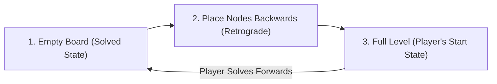
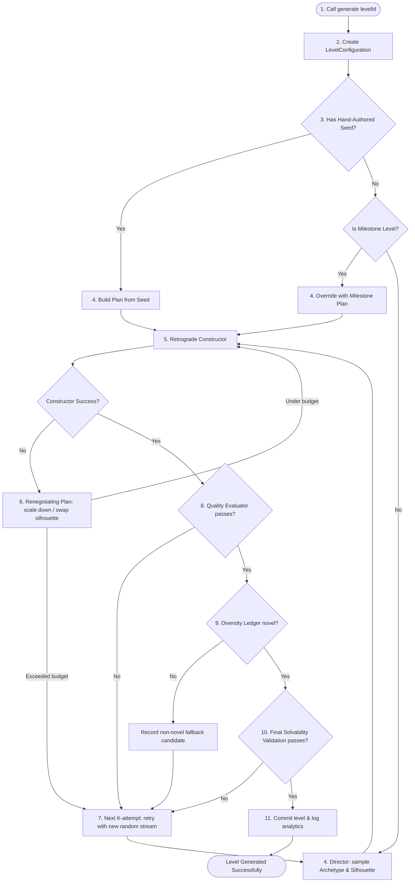

# Procedural Level Generation Strategy: "Unbound"

This document provides an in-depth architectural and mathematical breakdown of the level generation strategy in **Unbound** (formerly Chain Pop). The system generates deterministic, visually diverse, and mathematically guaranteed deadlock-free puzzle boards.

---

## 1. Core Philosophy: Retrograde Construction

The core challenge of procedural puzzle design is ensuring **solvability** without burning CPU cycles on exhaustive solver search (which is an NP-complete search space for large grids). 

Unbound solves this by generating levels **backwards**—from an empty board outward to the initial state.



### The Monotonicity Principle
The mathematical guarantee of solvability rests on the **Monotonicity of Ray Obstacles**:
* Placing a node on a cell blocks any ray crossing that cell.
* Conversely, removing a node only **frees** ray trajectories; it can never introduce a block.
* If a direction's ray is clear when placed during the backward construction step, it is guaranteed to be clear when the player encounters it in the forward solution step.

By constructing levels in reverse order, **deadlocks are mathematically impossible**. The last node placed during generation is the first node the player extracts.

---

## 2. The Generation Pipeline

When generating a level, [LevelGenerator](file:///Users/bvamsi139/Documents/AI%20projects/game/hybrid/chain-pop/lib/game/levels/generation/level_generator.dart) executes a multi-stage pipeline:



---

## 3. Detailed Pipeline Steps

### Step 1: Configuration & Milestone Identification
The generator constructs a [LevelConfiguration](file:///Users/bvamsi139/Documents/AI%20projects/game/hybrid/chain-pop/lib/game/levels/generation/level_configuration.dart) determining grid dimensions, target node count, and difficulty parameter bands based on the `levelId`. 
* Special **hand-authored levels** (opening levels 1–10) or **milestones** (Diamond, Ring) are mapped directly to preset [LevelSeed](file:///Users/bvamsi139/Documents/AI%20projects/game/hybrid/chain-pop/lib/game/levels/generation/level_seed.dart) records.
* **Milestone levels** occur every 25th level (for Medium/Hard modes) and trigger specific rules (e.g. `maxDensity` or `sparseSniper` plans).

### Step 2: The Director's Plan
If no seed dictates the layout, the [Director](file:///Users/bvamsi139/Documents/AI%20projects/game/hybrid/chain-pop/lib/game/levels/generation/director.dart) samples a plan:
1. **Archetype Sampling**: Selects one of the 5 archetypes based on difficulty-weighted probability distributions (see Section 6).
2. **Silhouette Sampling**: Selects a preferred shape template (e.g. Archipelago, Diamond, Cross, Corridor).
3. **Scorer Weight Initialization**: Configures linear scoring coefficients and softmax temperature.
4. **Motif Pre-Reservation**: Places structural "motif" transactions (e.g., escape chords or diamonds) on the board before the main construction runs.

### Step 3: Retrograde Constructor Execution
The [RetrogradeConstructor](file:///Users/bvamsi139/Documents/AI%20projects/game/hybrid/chain-pop/lib/game/levels/generation/retrograde_constructor.dart) populates the silhouette cell-by-cell in reverse removal order.
* **Rollbacks**: If the constructor dead-ends (zero cells have clear directions), it pops the last $N$ (default: 3) placements, blacklists the dead-end cell for that step, and retries. 
* **Renegotiation**: If the constructor exceeds its consecutive rollback depth (5) or total rollback limit (20), control returns to the Director to "renegotiate." The Director relaxes density by 10% or swaps to an alternative silhouette within the same archetype family and retries.

### Step 4: Quality Evaluation (The K-Retry Loop)
To ensure the level matches the target difficulty band, the generator evaluates the candidate level using [DifficultyProfile](file:///Users/bvamsi139/Documents/AI%20projects/game/hybrid/chain-pop/lib/game/levels/generation/difficulty_profile.dart) parameters. The system runs up to $K = 8$ retries of the retrograde constructor to find an "in-band" candidate. It checks:
* **Average Branching Factor**: Measure of layout density/freedom (number of legal taps available to the player on average).
* **Wave Depth**: Number of parallel extraction rounds required to clear the board.
* **Min/Max Chain Lengths**: Limits on chain lengths to avoid linear, boring corridors.

### Step 5: Diversity Ledger Gating
To prevent the feeling of "authored-rinse-repeat," candidate levels are converted into a **23-bit fingerprint** capturing structural features. The [DiversityLedger](file:///Users/bvamsi139/Documents/AI%20projects/game/hybrid/chain-pop/lib/game/levels/generation/diversity_ledger.dart) rejects the candidate if its Hamming distance is $< 5$ (or $< 8$ if they share the same visual shape family) compared to any level in the last-20 emission window.
* If the $K$-loop exhausts and only out-of-band or non-novel candidates were generated, the system falls back to emitting the best available out-of-band novel level (to prevent crashing).

---

## 4. Retrograde Constructor Mechanics

The constructor builds the board outward, starting with adjacent cells to maintain spatial cohesion.

### Frontier Expansion
The [FrontierSet](file:///Users/bvamsi139/Documents/AI%20projects/game/hybrid/chain-pop/lib/game/levels/generation/frontier_set.dart) tracks empty cells bordering already placed nodes.
1. The first cell is placed at a random coordinate within the silhouette.
2. The neighbors (4-connected or 8-connected depending on the archetype) of that cell are added to the active **Frontier**.
3. Candidates are only evaluated and placed on the Frontier. This prevents disconnected "floating islands" of nodes.

### Deferred Motif Injection
A **Motif Transaction** is a pre-arranged group of nodes forming a specific puzzle mechanic (e.g. a diamond intersection). Because motifs have strict directional dependencies, they cannot easily be built by the random scorer.
* **Pre-Reservation**: The Director reserves the cells and directions for the motif in the silhouette prior to construction.
* **Deferred Injection**: In the retrograde construction sequence, these reserved cells are ignored during the "bulk phase." Once the board reaches a specific occupancy threshold (typically $55\%$), the constructor enters the **Motif Phase** and injects the motif.
* **Play Order Impact**: Placing motifs *late* in retrograde construction means they are placed *early* in the player's forward play order, acting as the layout's primary obstacle or "hook."

```
Retrograde:   [1. Bulk Cell] -> [2. Bulk Cell] -> [3. Bulk Cell] -> [4. Motif Cell] -> [5. Motif Cell]
Forward Play: [5. Motif Cell] -> [4. Motif Cell] -> [3. Bulk Cell] -> [2. Bulk Cell] -> [1. Bulk Cell]
                                  ^^^^^^^^^^^^^^^^
                                  (Player solves the motif first)
```

---

## 5. Candidate Scorer and Softmax Sampling

For each cell in the Frontier, the constructor identifies all directions whose ray is clear of currently placed nodes. Each valid (cell, direction) pair is scored using [CandidateScorer](file:///Users/bvamsi139/Documents/AI%20projects/game/hybrid/chain-pop/lib/game/levels/generation/candidate_scorer.dart).

### Linear Score Function
$$S(c) = w_{fanout} \cdot F(c) + w_{mrv} \cdot M(c) - w_{isolation} \cdot I(c)$$

1. **Unlock Fanout ($F(c)$)**: Count of unplaced silhouette neighbors that will gain at least one clear ray once this cell is filled. High fanout encourages structural branching.
2. **Minimum Remaining Values ($M(c)$)**: CSP constraint heuristic. Returns $(4 - \text{clear direction count})$. This prioritizes highly constrained cells (e.g., inside corners) to fill tight pockets before they become unreachable.
3. **Isolation Penalty ($I(c)$)**: Counts empty silhouette neighbors in the 8-neighborhood. If $< 3$ neighbors are empty, a penalty is applied, preventing the constructor from sealing single-cell dead ends or producing jagged, isolated spikes.

### Softmax Probability Distribution
The scorer converts raw scores into probabilities using a softmax function:

$$P(c) = \frac{e^{\frac{S(c)}{T}}}{\sum e^{\frac{S(i)}{T}}}$$

where $T$ represents the **Softmax Temperature**:
* **Low Temperature ($T \to 0$)**: The constructor behaves deterministically, almost always choosing the highest-scoring candidate. This produces highly ordered, clean layouts.
* **High Temperature ($T \to \infty$)**: The selection approaches uniform randomness, resulting in chaotic, messy, and organic layouts.

---

## 6. The Five Generation Archetypes

To ensure variety, the Director samples from five distinct archetypes, tuning the constructor's behavior:

| Archetype | Probability (Medium) | Temperature ($T$) | Key Heuristics & Weights | Preferred Silhouettes |
| :--- | :---: | :---: | :--- | :--- |
| **Clean Authored** | 25% | `0.55` | Strong isolation penalty (`1.6`) and fanout (`1.4`). Highly structured and geometric. | Rectangle, Diamond, Cross, Ring |
| **Organic Messy** | 35% | `1.6` | High temperature. Relaxed isolation penalty (`0.9`) and fanout (`0.9`). Chaotic, blob-like boards. | Archipelago, Asymmetric, Organic Blob |
| **Strong Motif** | 20% | `0.9` | Reserves 1–2 atomic motifs (e.g. Staircase, Escape Chord) that form the core puzzle sequence. | Corridor, Archipelago, Organic Blob |
| **Relaxed Free Flow** | 15% | `1.2` | Broad branching factor, low density, low pressure gameplay. | Rectangle, Organic Blob, Corridor |
| **Experimental** | 5% | `2.0` | Inverted unlock weights (`-0.4`) OR uses a legacy greedy construction path to generate "happy accidents." | Archipelago, Asymmetric, Corridor |

---

## 7. Diversity Ledger Fingerprinting

The 23-bit fingerprint ensures visual and logical variety by packing level properties into a single integer:

| Bit Range | Size | Property | Description |
| :--- | :---: | :--- | :--- |
| `[0..2]` | 3 bits | `SilhouetteId` | Geometrical shape identifier (8 options) |
| `[3..4]` | 2 bits | `WaveDepth` | Grouped into buckets (`1–2`, `3–4`, `5–6`, `7+` waves) |
| `[5..6]` | 2 bits | `AverageBF` | Average Branching Factor (`<2`, `2–3.5`, `3.5–5`, `>5`) |
| `[7..9]` | 3 bits | `DominantMotifId` | Active motif block index (0 = none) |
| `[10..13]` | 4 bits | `DirectionHistogram` | 1 bit per cardinal direction, set when direction comprises $> 30\%$ of nodes |
| `[14..22]` | 9 bits | `SpatialDensity` | 3x3 grid density. 1 bit per quadrant, set when quadrant is $> 50\%$ occupied |
| `[23..25]` | 3 bits | `VisualFamily` | Visual groupings (e.g. archipelago vs symmetric) |

---

## 8. Milestone and Seed Levels

To keep campaign progression exciting, the generator introduces special milestone rules and hand-authored seeds:

* **Max Density Milestones (Level mod 100 == 50)**: Disables sparse configurations, forcing target node counts to fill up to $100\%$ of allowable silhouette slots.
* **Sparse Sniper Milestones (Level mod 100 == 0)**: Forces node density down to $\sim 45\%$ of target counts on larger grids, creating sniper-style puzzles with long sightlines.
* **Hand-Authored Seed Registry**: Opening levels (1–10) and complex structural milestones (e.g. Ring, Diamond) bypass procedural sampling and pull static templates from `seedRegistry` (mapping specific motifs, layouts, and constraints).
