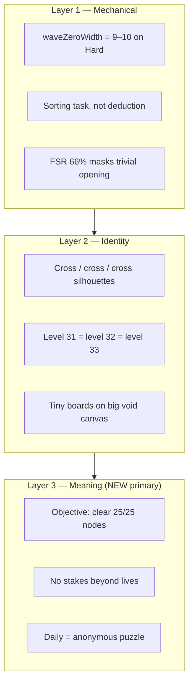
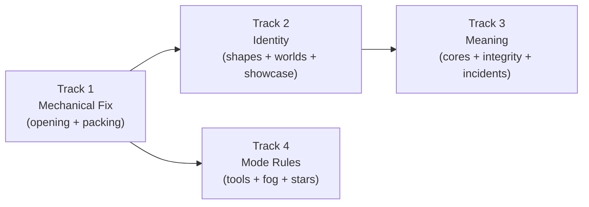
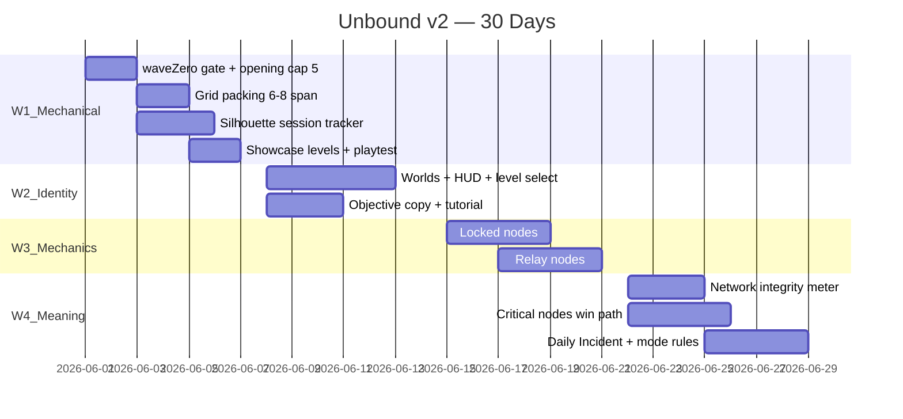

# Unbound Master Gameplay Strategy (v2)

**Project:** chain-pop (Unbound: Arrow Puzzle)  
**Repo:** `/Users/bvamsi139/Documents/AI projects/game/hybrid/chain-pop`  
**Date:** May 2026  
**Status:** Plan — supersedes v1  
**Inputs incorporated:** `new inputs.md`, live snapshot telemetry, codebase review  

---

## Table of contents

1. [The core problem (revised)](#1-the-core-problem-revised)
2. [What the code actually ships](#2-what-the-code-actually-ships)
3. [North star: systems, not boards](#3-north-star-systems-not-boards)
4. [Strategy architecture](#4-strategy-architecture)
5. [30-day execution plan](#5-30-day-execution-plan)
6. [Detailed workstreams](#6-detailed-workstreams)
7. [What to build, defer, and stop](#7-what-to-build-defer-and-stop)
8. [Success metrics](#8-success-metrics)
9. [Key files reference](#9-key-files-reference)

---

## 1. The core problem (revised)

### 1.1 The wrong question

Previous plans (including v1) mostly asked:

> *"How do we generate better levels?"*

The real question is:

> *"Why would someone care about solving level 37 instead of closing the app?"*

### 1.2 Three stacked failures

Chain Pop does not have **one** problem. It has three, stacked:



| Layer | What players feel | What telemetry says | Gap |
|-------|-------------------|---------------------|-----|
| **Mechanical** | "I'll just start clicking" | FSR 66%, in-band 10/10 | Evaluator blind to turn-one width |
| **Identity** | "Another cross blob" | Silhouette varies in bits | Cross/ring/diamond share `geometricLattice` family |
| **Meaning** | "Anonymous puzzle #38" | 25/25 nodes cleared | No objective, no system, no story |

**Fixing Layer 1 alone** (opening 3–5) makes puzzles tighter but still anonymous.  
**Fixing Layer 2 alone** (prettier shapes) on 9-wide openings still feels like sorting.  
**Layer 3** is what turns retention from "one more puzzle" into "one more incident."

### 1.3 The category mistake

| Sudoku model (current) | System model (target) |
|------------------------|----------------------|
| Every board is the content | The **situation** is the content |
| Win = clear all cells | Win = **restore the network** |
| Wrong tap = lose a heart | Wrong tap = **destabilize the system** |
| Level 37 | **Cascade Reactor — Critical** |
| Daily Puzzle | **Network Incident — May 30** |

Reference comps: **Mini Metro**, **Into the Breach**, **Slay the Spire** — not Sudoku.

### 1.4 One-sentence diagnosis

> Chain Pop has learned how to generate solvable puzzles, but it has not learned how to generate **memorable situations** — and the opening still permits mindless tapping.

---

## 2. What the code actually ships

### 2.1 Mechanical layer (verified May 2026)

**Live snapshot** (`dense_strategy_snapshot_test.dart`):

| Metric | Hard L30–39 | Daily sample | Player experience |
|--------|-------------|--------------|-------------------|
| `wavesProfile[0]` | **9–10** | **11–15** | Trivial turn-one choice |
| `opening` | 9.2 avg | 13+ avg | Passes evaluator anyway |
| FSR | 66% | 70%+ | Misleading — later waves narrow |
| `inBand` | 10/10 | mostly true | Generator thinks it succeeded |
| `fill` | ~33% | ~35% | Sparse, zoomed-out boards |
| Grid | 9×9 | 9×9 | Nodes scatter; tiles shrink |

**Root cause in code:**

```dart
// retrograde_constructor.dart
static const Map<DifficultyTier, int> _maxOpeningByTier = {
  DifficultyTier.hard: 9,      // permits 9-wide openings
  DifficultyTier.expert: 15,   // Daily leaks to 14–15 openings
};
```

Daily Expert uses `_maxOpeningByTier.expert = 15` while Hard campaign uses 9 — same `_enforceOpeningTarget` path, different caps. Daily is **worse** than Hard on turn one.

FSR at 66% is a **false positive**: profile `[9, 8, 2, 2, 1, 1]` scores well because waves 3–7 are narrow, not because turn one requires thought.

### 2.2 Identity layer (verified)

- **8 silhouettes** exist (`silhouettes.dart`) but cross, ring, diamond, rectangle share `SilhouetteVisualFamily.geometricLattice` — diversity ledger treats them as distinct IDs but players read them as **the same cross-family blob**.
- **CascadeHub motif** is mandatory-first for Hard/Expert (`director.dart` `_reserveMotifs`) — when nodes are sparse on 9×9, the generator **must** inject plus-shape hubs to pass difficulty checks.
- Hard grid clamp: **7–10** span (`level_configuration.dart:357`) — loose canvas forces scatter + motif spam.
- `PhaseProgressBar` exists but HUD uses plain progress bar (`game_header_hud.dart`).
- `useDenseValidationSeeds = true` pins L30–39 to dev seeds — not representative of ship state.

### 2.3 Meaning layer (verified — absent)

| System | Status |
|--------|--------|
| Win condition | Clear **all** nodes only |
| Critical / core nodes | None |
| Network integrity / stability | None |
| Named incidents / objectives | None |
| World-linked mechanics | None |
| Expert fog-of-war | None |

Current loop:

```text
Open level → see 25 arrows → find legal moves → clear board → repeat
```

Even at opening = 3 and FSR = 90%, this remains **anonymous puzzle #N** without Layer 3.

---

## 3. North star: systems, not boards

### 3.1 Player fantasy

> *"I'm restoring a failing network — each tap commits, wrong routes destabilize the system, and when the cores come back online the whole grid cascades free."*

### 3.2 Reframed win condition

**Current:**

```text
Clear 25/25 nodes → Win
```

**Target (phased):**

```text
Restore 3 Core nodes → Win
(infrastructure nodes optional / auto-clear on cascade)
```

Phase 1 ships **visual + copy** framing ("Restore Cascade Reactor"). Phase 3 ships **mechanical** critical-node win condition.

### 3.3 Reframed failure / pressure

**Current:** wrong tap → jam → lose heart (generic mobile puzzle)

**Target:** wrong tap → jam → **network integrity −8%** → critical node harder to reach → timer pressure rises

Integrity is additive to lives — not a replacement in v1. Lives stay for familiarity; integrity creates **story**.

### 3.4 Mode identity (perception-based difficulty)

| Mode | Fantasy | Opening | Tools | Visibility |
|------|---------|---------|-------|------------|
| Easy | Learn the network | 6–10 | Glow, ray preview, ghost hint, 2 undo | Full board |
| Medium | Route planning | 5–8 | Ray preview, 2 undo | Full board |
| Hard | Commit under pressure | **3–5** | No preview, 1 undo | Full board |
| Expert / Daily | Critical incident | **3–5** | No preview, 0–1 undo | **Fog: local neighborhood only** (Phase 4) |

Difficulty comes from **perception and stakes**, not only generator complexity.

### 3.5 Daily = Network Incident

**Current:** "Daily Puzzle — May 30"

**Target:**

```text
NETWORK INCIDENT
May 30, 2026
Restore the Cascade Reactor
Severity: Critical
Global completion: 18%    ← local placeholder until backend
```

Same generated board. Completely different motivation.

---

## 4. Strategy architecture

Four tracks, **priority reordered** after `new inputs.md` review:



| Track | Purpose | % of 30-day effort |
|-------|---------|-------------------|
| **1 — Mechanical fix** | Stop mindless turn-one tapping; pack grids | 25% |
| **2 — Identity** | Memorable shapes, worlds, boss puzzles | 35% |
| **3 — Meaning** | Systems to care about | 25% |
| **4 — Mode rules** | Per-mode tools + stars + onboarding | 15% |

**Deferred (do not start in 30 days):**

- Partial-order / DAG validator
- Convergence hub enforcement (maxHub ≥ 3 gates)
- Deep FSR / unlockSpike metric tuning
- Full topological spatial grafting architecture (evaluate after grid packing results)
- Zen mode, Challenge Run (post-30-day)

---

## 5. 30-day execution plan

### Week 1 — Stop the bleeding (Mechanical + Identity foundation)

**Goal:** Turn-one feels tactical; shapes stop repeating; dev seeds off.

| Day | Deliverable | Files |
|-----|-------------|-------|
| 1 | Add `waveZeroWidth` to metrics; failing Hard/Daily snapshot asserts | `metrics.dart`, `difficulty_profile.dart`, `dense_strategy_snapshot_test.dart` |
| 1 | `_maxOpeningByTier`: hard **5**, expert **5** (fixes Daily leak) | `retrograde_constructor.dart` |
| 1 | `firstLegalMoveCount` Hard/Expert band: **3–5** | `difficulty_profile.dart` |
| 2 | Strengthen `_enforceOpeningTarget`: multi-flip, reject if wave-zero > 5 | `retrograde_constructor.dart` |
| 2 | Wire `PhaseProgressBar` into HUD | `game_header_hud.dart` |
| 2 | `useDenseValidationSeeds = false` | `seed_registry.dart` |
| 3 | **Grid packing**: Hard clamp **6–8** span; node-aware `_calculatePackedGridSpan` | `level_configuration.dart` |
| 3–4 | **Silhouette session tracker**: penalize consecutive `geometricLattice` family | new `silhouette_session_tracker.dart`, `level_generator.dart`, extend `diversity_ledger.dart` |
| 3–4 | De-escalate mandatory CascadeHub: try 45% not always-first | `director.dart` |
| 4–5 | **6 showcase levels** (L30, 35, 40, 50, 75, 100) — hand-authored, wave-zero ≤ 4 | `showcase_levels.dart`, `seed_registry.dart` |
| 5 | Playtest cohort (5 people): "Does opening feel tactical or confusing?" | manual |

**Week 1 exit gates:**

```text
Hard/Daily waveZeroWidth avg ≤ 5
Hard grid span mostly 6×6 – 8×8
No 3 consecutive geometricLattice silhouettes in L30–50 session sim
Showcase levels completable in 3–5 min with 2+ retries
```

**Do NOT yet:** disable ray preview on Hard (wait for Week 1 playtest).

---

### Week 2 — Identity & framing (Worlds + objectives)

**Goal:** Levels have names, places, and stated purpose.

| Deliverable | Detail | Files |
|-------------|--------|-------|
| **World registry** | Gateway / Lockdown / Relay Storm / Labyrinth (25 levels each) | `world_registry.dart` |
| HUD world label | `THE LOCK · 38` not just `HARD` | `game_header_hud.dart` |
| Level select thumbnails | Silhouette preview + world tint on cards | `level_select_screen.dart` |
| **Objective copy layer** | Per-world mission strings ("Restore uplink", "Clear the vault") | `world_registry.dart`, `game_screen.dart` |
| Boss badges | mod-25 levels marked | `level_select_screen.dart` |
| First-launch tutorial funnel | Auto-start, skippable | `main_menu_screen.dart`, persistence |
| Fix tutorial copy | Remove "glowing arrow" | `game_screen.dart` |

**Week 2 exit gate:** Playtesters can name the world they're in after 5 levels; level cards distinguishable at a glance.

---

### Week 3 — New mechanics (Locked + Relay)

**Goal:** Hard introduces decision patterns Medium doesn't have.

| Deliverable | Detail | Files |
|-------------|--------|-------|
| `NodeKind` enum | `normal`, `locked`, `relay` | `level.dart` |
| **Locked nodes** | Extract blocked until 4-neighbors cleared; visible 🔒 | `level_solver.dart`, `node_component.dart` |
| **Relay nodes** | On extract, rotate row 90° CW | solver, component, generator hooks |
| World-gated rollout | Lockdown world (L26+) → locked; Relay Storm (L51+) → relay | `world_registry.dart`, `director.dart` |
| Generator integration | 1–2 locked/relay per Hard board after L45 | `motifs.dart`, `retrograde_constructor.dart` |
| 4 more showcase levels | Teach locked (L45) and relay (L55) | `showcase_levels.dart` |

**Week 3 exit gate:** Players describe levels ("the vault one", "the spinner") not numbers.

---

### Week 4 — Meaning systems (Integrity + Daily Incident)

**Goal:** Player cares about the outcome, not just clearing tiles.

| Deliverable | Detail | Files |
|-------------|--------|-------|
| **Network integrity meter** | Starts 100%; jam −8%; optional wrong-order −3% (non-jam) | `chain_pop_game.dart`, HUD widget |
| Integrity consequences | Below 70%: timer runs 1.25×; below 50%: hint disabled | `game_timer_controller.dart` |
| **Critical nodes (Phase A)** | 3 nodes marked CORE; HUD shows `Cores: 0/3`; win when cores extracted | `level.dart`, generator marks cores, `level_solver.dart` |
| **Daily Incident UI** | Rename flow, incident card, severity badge | `daily_challenge_calendar_screen.dart`, `game_screen.dart`, `win_panel.dart` |
| Local completion stat | Placeholder "18% cleared today" (SharedPreferences cohort sim) | `daily_challenge.dart` |
| **Mode tool restrictions** | Hard: no ray preview, 1 undo; Expert/Daily: 0 free undo | `game_screen.dart`, ad policies |
| Star system | ★ clear, ★★ ≤1 jam, ★★★ 0 jams + par time | `difficulty.dart`, `game_flow_controller.dart`, `win_panel.dart` |
| Progression map | World map screen (simple linear unlock visual) | new `world_map_screen.dart` or enhanced level select |

**Week 4 exit gate:**

```text
Hard time-on-level ≥ 2.5 min (toward 3–5)
Attempt-to-clear ≥ 1.8×
5/5 playtesters describe Daily as "incident" not "puzzle"
"Almost had it" on ≥ 60% of first failures
```

---

### 30-day timeline



---

## 6. Detailed workstreams

### 6.1 Track 1 — Mechanical fix (must do first)

#### 6.1.1 Wave-zero gate

Add to `LevelMetrics`:

```dart
int get waveZeroWidth =>
    wavePeelingProfile.isEmpty ? 0 : wavePeelingProfile.first;
```

Gate in `DifficultyProfile.passes()` for Hard and Expert:

```dart
if (metrics.waveZeroWidth < 3 || metrics.waveZeroWidth > 5) return false;
```

**Why this matters:** Only fix that converts "which of 9 do I click?" into "which of 4 do I commit to?"

**Caveat from inputs:** Opening = 3–5 does not automatically mean strategic — three symmetric options feel restrictive, not deep. **Week 1 playtest required** before tool restrictions.

#### 6.1.2 Opening compression

```dart
// retrograde_constructor.dart — target values
_maxOpeningByTier:  { hard: 5, expert: 5, medium: 8, easy: 10 }
_minOpeningByTier:  { hard: 3, expert: 3, medium: 4, easy: 5 }
```

Update `_enforceOpeningTarget` to:
- Flip multiple nodes per pass
- Validate with `computeWavePeelingProfile`, not ID-order free count only
- Reject candidate if still > 5 after 20 attempts

#### 6.1.3 Grid packing (spatial grafting — lightweight version)

**Problem:** 25 nodes on 9×9 → 33% fill → nodes scatter → CascadeHub spam → tiny tiles.

**Fix in `level_configuration.dart`:**

```dart
int _packedSpanForNodes(int nodes, DifficultyMode mode) {
  if (mode == DifficultyMode.hard) {
    if (nodes <= 20) return 6;
    if (nodes <= 25) return 7;
    if (nodes <= 32) return 8;
    return 8;
  }
  // existing easy/medium logic
}

// Hard clamp: 6–8 (was 7–10)
```

**Expected outcomes:**

| Metric | Before | After |
|--------|--------|-------|
| Grid | 9×9 | 6×6 – 8×8 |
| Fill | ~33% | **48–58%** |
| Tile screen presence | ~40% viewport | **75–85%** |
| CascadeHub dependency | mandatory | organic blocking |

Full "graft micro-matrix into asymmetric silhouette" (`silhouette_mesh.dart` from inputs) is **optional Phase 5** — try grid packing first; it may achieve 80% of the benefit.

#### 6.1.4 Silhouette session diversity

**Problem:** Diversity ledger tracks silhouette ID but groups cross/ring/diamond as one visual family — consecutive **geometricLattice** boards feel identical.

**New: `silhouette_session_tracker.dart`**

- Track last 5 emitted `SilhouetteVisualFamily` values (not just ID)
- Apply score penalty in K-loop ranking: `−2.5 × consecutiveGeometricMatches`
- Boost organic / archipelago / corridor when geometric streak ≥ 2

**Also:** Reduce CascadeHub always-first placement to weighted 45% (`director.dart`).

**Target:** geometricLattice streak ≤ 2 in any 10-level Hard session.

---

### 6.2 Track 2 — Identity (highest retention ROI)

#### 6.2.1 Showcase levels (non-negotiable)

Procedural volume is for retention; **hand-authored moments** are for memory.

| Level | World | Name | Silhouette | Teach |
|-------|-------|------|------------|-------|
| 30 | Gateway | **First Fork** | Hourglass | Two paths, one dead |
| 35 | Gateway | **The Spiral** | Organic | Non-cross identity |
| 40 | Lockdown | **The Vault** | Ring + lock cluster | Chokepoint cascade |
| 45 | Lockdown | **Seal Breaker** | Diamond | First locked nodes |
| 50 | Lockdown | **Boss: Gridlock** | Crescent | Milestone |
| 55 | Relay Storm | **Phase Shift** | Zigzag | First relay |
| 75 | Relay Storm | **Boss: Overload** | Archipelago | Mixed mechanics |
| 100 | Labyrinth | **Boss: Blackout** | Asymmetric | Everything combined |

Each must: `waveZeroWidth ≤ 4`, solvable 3–5 min, 2+ retries, quotable name.

#### 6.2.2 Worlds as mechanic curriculum

| World | Levels | Introduces | Palette |
|-------|--------|------------|---------|
| **Gateway** | 1–25 | Core extract loop, tight openings | Cyan |
| **Lockdown** | 26–50 | Locked nodes, vault motifs | Amber |
| **Relay Storm** | 51–75 | Relay nodes, rotation planning | Green |
| **Labyrinth** | 76–100 | Mixed systems, fog preview | Purple |

Players learn **systems**, not level numbers.

#### 6.2.3 Presentation (lightweight — not a full reskin)

Priority order:

1. Silhouette thumbnails on level select (**identity**)
2. World name in HUD (**context**)
3. Mission string per level (**purpose**)
4. Pop trail + jam pulse (**juice** — after above)

Defer full "Signal Network" asset pass until Week 4 if schedule tight.

---

### 6.3 Track 3 — Meaning (the differentiator)

#### 6.3.1 Critical nodes (win condition evolution)

**Phase A (Week 4):** Generator marks 3 nodes `isCore: true`. HUD: `Cores: 0/3`. Win when all cores extracted (infra nodes may remain — auto-cascade clear on last core).

**Phase B (post-30-day):** Infra nodes optional; clearing infra raises integrity but isn't required.

Implementation:

```dart
// level.dart
class NodeData {
  // existing fields...
  final bool isCore;
}
```

Generator: pick 3 nodes with high CUD depth or lock-cluster adjacency as cores.

#### 6.3.2 Network integrity

New HUD element: `Integrity: 87%`

| Event | Delta |
|-------|-------|
| Jam (blocked extract) | −8% |
| Extract infra out of "recommended" order | −3% (optional Week 4+) |
| Core restored | +5% |
| Win | pulse to 100% |

| Integrity | Effect |
|-------------|--------|
| 100–70% | Normal |
| 69–50% | Timer 1.25× speed |
| < 50% | Visual static on board edge; hints cost double |

Creates **story** without removing lives:

```text
Wrong move → network destabilizes → critical node harder to reach
```

#### 6.3.3 Daily Incident package

| Element | Current | Target |
|---------|---------|--------|
| Calendar cell | Date + star | Date + silhouette + severity color |
| Pre-game | "Daily Challenge" | Incident briefing card |
| In-game HUD | `0/25 nodes` | `Cores: 0/3 · Integrity: 100%` |
| Win | Generic panel | "Incident resolved · May 30" + share card |
| Streak | None | Consecutive days counter |

Backend for global completion % is optional — local cohort estimate acceptable for v1.

---

### 6.4 Track 4 — Mode rules & retention

#### 6.4.1 Tool restrictions (Week 4, after playtest)

| Tool | Easy | Medium | Hard | Expert/Daily |
|------|------|--------|------|--------------|
| Ray preview | ✓ | ✓ | ✗ | ✗ |
| Free undo | 2 | 2 | 1 | 0 |
| Ghost hint | ✓ | ✗ | ✗ | ✗ |
| Extractable glow | Setting | ✗ | ✗ | ✗ |

**Sequencing rule:** Enable only after Week 1 playtest confirms opening 3–5 feels like **tension**, not **confusion**.

#### 6.4.2 Stars (wire existing dead code)

| Star | Criteria |
|------|----------|
| ★ | Complete objective (cores or full clear during transition) |
| ★★ | ≤ 1 jam |
| ★★★ | 0 jams + under par time |

Show on level select card pre-play.

#### 6.4.3 Onboarding

- First launch → tutorial (skippable step 0)
- Tutorial-only glow via `_extractableIds`
- Post-tutorial → Easy L1 with coaching overlay

#### 6.4.4 Expert fog (Phase 5 — post-30-day)

Only nodes within Manhattan distance 2 of last extraction fully visible. Rest dimmed 60%. Daily Incident severity: **Critical** uses fog.

---

## 7. What to build, defer, and stop

### 7.1 Build (30 days)

| Priority | Item |
|----------|------|
| P0 | `waveZeroWidth` gate + opening cap 5 (Hard + Daily) |
| P0 | Grid packing 6–8 span |
| P0 | Silhouette session family tracker |
| P0 | 6–10 showcase / boss levels |
| P1 | Worlds + HUD + level select identity |
| P1 | Locked + relay node types |
| P1 | Network integrity meter |
| P1 | Critical nodes win path |
| P1 | Daily Incident framing |
| P2 | Mode tool restrictions (after playtest) |
| P2 | Stars with par time |
| P2 | Progression map |

### 7.2 Defer (until 30-day metrics hit)

| Item | Why defer |
|------|-----------|
| Partial-order / DAG validator | Generator healthy enough; adds risk without proven player demand |
| Convergence hub gates (maxHub ≥ 3) | Grid packing may create organic hubs |
| `unlockSpikeCount`, deep FSR tuning | Metrics players don't remember |
| Full `silhouette_mesh.dart` grafting | Try packing first |
| Zen / Challenge Run modes | After core loop proven |
| Expert fog-of-war | Week 5+ |
| Backend global daily stats | Placeholder OK for v1 |

### 7.3 Stop doing

| Stop | Why |
|------|-----|
| Treating FSR 66% as success | Opening still 9–10 wide |
| `maxOpening = 9` Hard / `15` Expert | Permits sorting-task openings |
| Mandatory CascadeHub first | Causes cross/plus monotony on sparse grids |
| Metric-only optimization sprints | Doesn't create memory |
| Ray preview removal before playtest | May feel punishing not strategic |
| Partial-order validator now | Over-engineering before identity lands |
| `useDenseValidationSeeds = true` in prod | Masks real pipeline |
| "Clear 25/25" as only win framing | No meaning |

---

## 8. Success metrics

### 8.1 Generation CI (automated)

| Metric | Hard/Daily target | Notes |
|--------|-------------------|-------|
| `waveZeroWidth` | **3–5** | Primary mechanical gate |
| Grid span | **6–8** | Packed canvas |
| Fill on packed grid | **48–58%** | Organic blocking |
| geometricLattice streak | **≤ 2 in 10 levels** | Session sim test |
| CascadeHub placement rate | **< 50%** of Hard boards | Down from ~100% mandatory |
| In-band rate | **≥ 70%** | After tighter gates |
| Fallback rate | **< 5%** | |

**Deprioritized gates:** maxHub, unlockSpikeCount, crunchPick floors — monitor, don't block CI.

### 8.2 Player metrics (instrument Week 1)

| Metric | Baseline (est.) | 30-day target |
|--------|-----------------|---------------|
| Hard time-on-level | ~90s | **≥ 2.5 min** (→ 3–5 by day 60) |
| Attempt-to-clear | ~1.2× | **≥ 1.8×** |
| "Can name last level" (playtest) | ~0% | **≥ 60%** |
| Daily return D1 | baseline | **+5%** |
| Tutorial completion | low | **≥ 70%** |
| "Almost had it" first fail | unknown | **≥ 60%** |

### 8.3 Qualitative scorecard (5 playtesters × 4 checkpoints)

Score 1–5 each week on:

1. **Opening clarity** — "I knew where to start"
2. **Board identity** — "This looked different from the last one"
3. **Stakes** — "I cared about the outcome"
4. **Retry desire** — "I wanted one more try"

Metrics alone cannot answer #3 and #4.

---

## 9. Key files reference

### Generation (Track 1)

| Purpose | Path |
|---------|------|
| Opening cap | `lib/game/levels/generation/retrograde_constructor.dart` |
| Wave-zero metric | `lib/game/levels/generation/metrics.dart` |
| Evaluator bands | `lib/game/levels/generation/difficulty_profile.dart` |
| Grid packing | `lib/game/levels/generation/level_configuration.dart` |
| Silhouette families | `lib/game/levels/generation/silhouettes.dart` |
| Diversity / shape streak | `lib/game/levels/generation/diversity_ledger.dart` |
| CascadeHub placement | `lib/game/levels/generation/director.dart` |
| K-loop ship gate | `lib/game/levels/generation/level_generator.dart` |
| Showcase seeds | `lib/game/levels/seeds/showcase_levels.dart` (new) |
| Seed registry | `lib/game/levels/seeds/seed_registry.dart` |

### Identity & meaning (Tracks 2–3)

| Purpose | Path |
|---------|------|
| World definitions | `lib/game/world_registry.dart` (new) |
| Node kinds / cores | `lib/game/levels/level.dart` |
| Integrity + cores runtime | `lib/game/chain_pop_game.dart` |
| HUD | `lib/screens/game/widgets/game_header_hud.dart` |
| Phase bar | `lib/screens/game/widgets/phase_progress_bar.dart` |
| Daily incident | `lib/screens/daily_challenge_calendar_screen.dart` |
| Level select | `lib/screens/level_select_screen.dart` |

### Tests

```bash
# Baseline + gates
flutter test test/game/levels/generation/dense_strategy_snapshot_test.dart

# Full generation
flutter test test/game/levels/generation/

# Solvability
flutter test test/deadlock_test.dart
```

---

## Appendix A — v1 plan changes

| v1 item | v2 disposition | Reason (from inputs) |
|---------|----------------|----------------------|
| waveZeroWidth gate | **Keep — P0** | Unanimous high-impact |
| Partial-order validator | **Defer** | Premature; generator adequate |
| Convergence hubs / maxHub | **Defer** | Grid packing may suffice |
| Signal Network full reskin | **Lighten** | Shape identity > color reskin |
| Metric obsession (unlockSpike etc.) | **Deprioritize** | Players don't remember metrics |
| Worlds + showcase | **Elevate to P0/P1** | Creates memory |
| Critical nodes + integrity | **Add — new** | Meaning layer |
| Daily Incident | **Add — new** | Retention > Daily Puzzle |
| Grid packing | **Add — P0** | Fixes scatter + cross spam |
| Silhouette session tracker | **Add — P0** | Fixes cross repetition |
| Tool restrictions Week 1 | **Move to Week 4** | After playtest validates opening |
| Expert fog | **Phase 5** | Perception difficulty |

---

## Appendix B — The one sentence plan

> Stop generating anonymous puzzles. **Compress the opening**, **pack the grid**, **vary the shapes**, **name the worlds**, **mark the cores**, and **frame each day as an incident** — because the generator is already good enough to support systems; it was never the whole problem.

---

*Next update: after Week 1 playtest + snapshot baseline with opening cap 5 and grid packing enabled.*
